-   [Setup](#setup)
-   [Aims](#aims)
-   [Substudy 1A: TCI-PDI Questionnaire Validation](#substudy-1a-tci-pdi-questionnaire-validation)
    -   [Psychometric Validation: TCIPDI\_long](#psychometric-validation-tcipdi_long)
        -   [Correlation Matrix](#correlation-matrix)
        -   [Reliability v1](#reliability-v1)
        -   [Scale Revisions](#scale-revisions)
        -   [Reliability v2](#reliability-v2)
        -   [Factor Analysis](#factor-analysis)
    -   [Psychometric Validation: TCIPDI\_short](#psychometric-validation-tcipdi_short)
        -   [Reliability](#reliability)
        -   [Factor Analysis](#factor-analysis-1)
    -   [Correlation between scales](#correlation-between-scales)
    -   [Conclusion](#conclusion)
    -   [Summary Statistics](#summary-statistics)
-   [Substudy 1B: Relationship of the TCI-PDI to the PDI Questionnaire](#substudy-1b-relationship-of-the-tci-pdi-to-the-pdi-questionnaire)
    -   [Summary Statistics](#summary-statistics-1)
    -   [Reliability](#reliability-1)
        -   [PDI](#pdi)
        -   [TCIPDI-Long](#tcipdi-long)
        -   [TCIPDI-Short](#tcipdi-short)
    -   [i. TCI-PDI - Long and Short](#i.-tci-pdi---long-and-short)
    -   [ii. Correlation of the TCI-PDI with the PDI](#ii.-correlation-of-the-tci-pdi-with-the-pdi)
-   [Substudy 1C: Relationship of TCI-PDI Questionnaire with D1 Receptor binding](#substudy-1c-relationship-of-tci-pdi-questionnaire-with-d1-receptor-binding)
    -   [*1. Including everyone, and correcting for Age and Sex*](#including-everyone-and-correcting-for-age-and-sex)
    -   [*2. Excluding women, and correcting for Age*](#excluding-women-and-correcting-for-age)
    -   [*3. Excluding old, and correcting for Gender*](#excluding-old-and-correcting-for-gender)
    -   [*4. Excluding women and old men, and no correction*](#excluding-women-and-old-men-and-no-correction)
    -   [Table for Publication](#table-for-publication)
    -   [Figure for summary](#figure-for-summary)
    -   [Summary Statistics](#summary-statistics-2)
-   [Substudy 2: Replication of TCIPDI Finding](#substudy-2-replication-of-tcipdi-finding)
    -   [TCIPDI Reliability](#tcipdi-reliability)
    -   [Summary Statistics](#summary-statistics-3)
    -   [Replication Bayes Factor](#replication-bayes-factor)
        -   [Publication Scatterplots](#publication-scatterplots)
    -   [DLPFC](#dlpfc)
    -   [Striatum](#striatum)
-   [Prior Selection: Studies 3-4](#prior-selection-studies-3-4)
    -   [Priors for the relationship of D1 Receptor BP<sub>ND</sub> with age](#priors-for-the-relationship-of-d1-receptor-bpnd-with-age)
        -   [DLPFC Decreases:](#dlpfc-decreases)
        -   [Striatal Decreases:](#striatal-decreases)
    -   [Priors for the relationship of D1 Receptor BP<sub>ND</sub> with measures of psychosis proneness](#priors-for-the-relationship-of-d1-receptor-bpnd-with-measures-of-psychosis-proneness)
        -   [Literature Priors](#literature-priors)
    -   [Prior for the relationship of PDI Score with Years](#prior-for-the-relationship-of-pdi-score-with-years)
-   [Substudy 3: Relationship of TCI-PDI Questionnaire with Online PDI Questionnaire](#substudy-3-relationship-of-tci-pdi-questionnaire-with-online-pdi-questionnaire)
    -   [Age Effects](#age-effects)
    -   [Relationship between PDI Scores and D1 Receptor BP<sub>ND</sub>](#relationship-between-pdi-scores-and-d1-receptor-bpnd)
    -   [Variables for the Models](#variables-for-the-models)
    -   [DLPFC : decrease Model](#dlpfc-decrease-model)
    -   [DLPFC : increase Model](#dlpfc-increase-model)
    -   [Model Comparison](#model-comparison)
    -   [DLPFC: Parameter Estimation](#dlpfc-parameter-estimation)
        -   [Publication Figure](#publication-figure)
    -   [STR: Decrease Model](#str-decrease-model)
    -   [STR: Parameter Estimation](#str-parameter-estimation)
        -   [Publication Figure](#publication-figure-1)
    -   [Publication Parameter Estimation Summary](#publication-parameter-estimation-summary)
        -   [DLPFC](#dlpfc-1)
        -   [STR](#str)
-   [Substudy 4: Bayesian estimation of the relationship between D1 Receptor BP<sub>ND</sub> and PDI scores](#substudy-4-bayesian-estimation-of-the-relationship-between-d1-receptor-bpnd-and-pdi-scores)
    -   [Publication Figure](#publication-figure-2)
-   [Summary values of study](#summary-values-of-study)
-   [Distributions of scales](#distributions-of-scales)

This is the analysis for the preprint "Dopamine D1 receptor availability is not associated with delusional ideation measures of psychosis proneness". Some of the data is considered sensitive, and it will not be possible for it to be shared openly due to regulatory restrictions. We are currently in discussions with the institution to ask whether the current interpretation of the regulation can or will be changed. I will upload as much of the data as I can before submission.

Another little note: I spotted a couple of small errors in the code following submission to bioRxiv. Some of the values differ at a decimal point or two from the current version on bioRxiv, but the conclusions are unchanged.

Setup
=====

``` r
library(tidyverse)
```

    ## -- Attaching packages ------------------------------------------------------------------------------------------------------------------------------------- tidyverse 1.2.1 --

    ## v ggplot2 2.2.1     v purrr   0.2.4
    ## v tibble  1.4.2     v dplyr   0.7.4
    ## v tidyr   0.8.0     v stringr 1.2.0
    ## v readr   1.1.1     v forcats 0.3.0

    ## Warning: package 'ggplot2' was built under R version 3.4.4

    ## -- Conflicts ---------------------------------------------------------------------------------------------------------------------------------------- tidyverse_conflicts() --
    ## x dplyr::filter() masks stats::filter()
    ## x dplyr::lag()    masks stats::lag()

``` r
library(broom)
```

    ## Warning: package 'broom' was built under R version 3.4.4

``` r
library(readxl)
library(knitr)
library(ggplot2)
library(pander)
library(R2jags)
```

    ## Loading required package: rjags

    ## Loading required package: coda

    ## Linked to JAGS 4.2.0

    ## Loaded modules: basemod,bugs

    ## 
    ## Attaching package: 'R2jags'

    ## The following object is masked from 'package:coda':
    ## 
    ##     traceplot

``` r
library(truncnorm)
library(polspline)
library(stringr)
library(viridis)
```

    ## Warning: package 'viridis' was built under R version 3.4.4

    ## Loading required package: viridisLite

``` r
library(RColorBrewer)
library(psych)
```

    ## 
    ## Attaching package: 'psych'

    ## The following objects are masked from 'package:ggplot2':
    ## 
    ##     %+%, alpha

``` r
library(stringr)
library(ggridges)
```

    ## Warning: package 'ggridges' was built under R version 3.4.4

``` r
library(forcats)
# library(bayesplot)
# bayesplot::color_scheme_set("viridis")

distroplot_norm <- function(fitobject, variable.name, priormean, priorsd, nbin=50) {
  
  samples <- tibble(Posterior = as.numeric(fitobject$BUGSoutput$sims.list[[variable.name]]))
  
  parameters <- fitobject$model$data()
  
  priormean_val <- ifelse(is.character(priormean), parameters[[priormean]], priormean)
  priorsd_val <- ifelse(is.character(priorsd), parameters[[priorsd]], priorsd)
  
  out <- ggplot(samples, aes(x=Posterior)) +
    geom_histogram(aes(y = ..density.., colour="Posterior"), bins=nbin, fill="white") +
    stat_function(fun = dnorm, args = list(mean = priormean_val, sd=priorsd_val), aes(colour='Prior'), size=2) +
    stat_function(fun = dnorm, args = list(mean = priormean_val, sd=priorsd_val), color="white", size=1) +
    geom_line(aes(y = ..density.., colour="Posterior"), size=2, stat="density") +
    geom_line(aes(y = ..density..), colour="white", size=1, stat="density") +
    geom_vline(xintercept=mean(samples$Posterior), linetype = "dashed", size=1) +
    scale_colour_viridis(begin=0,direction=1, end=0.66, discrete=T, 'Distribution') + 
    expand_limits(x=c(priormean_val - priorsd_val, priormean_val + priorsd_val)) +
    labs(y='Probability Density', x='Parameter Value')
  
  return(out)
  
}

set.seed(12345)
```

Aims
====

This study aims to evaluate the relationship between D1 Receptor BP<sub>ND</sub> evaluated using \[11C\]SCH-23390 and measures of delusional proneness. We also aimed to validate a potential alternative scale to measure delusional proneness using items from the TCI Spiritual Acceptance subscale, many of whose items are relatively similar to items belonging to the PDI scale.

Substudy 1A: TCI-PDI Questionnaire Validation
=============================================

We aimed to select questions from the TCI Spiritual Acceptance scale which were more indicative of psychotic proneness, in a manner similar to the Peters Delusion Inventory. Items were first selected from the scale which sounded like PDI items (i.e. showed face validity). They were then psychometrically evaluated in an independent data set of 132 individuals. In the end, we came up with two alternative implementations of a TCI-psychotic proneness scale: one longer but less specific (aiming for maximising reliability), and one shorter but more specific (aiming for maximising validity), and their psychometric validity was assessed.

``` r
TCIdf<-read.csv('../RawData_Clean/tcivalidation_data.csv')

psych::describe(TCIdf$Age)
```

    ##    vars   n  mean   sd median trimmed   mad min max range  skew kurtosis
    ## X1    1 132 47.94 16.1     50   47.88 19.27  22  76    54 -0.04    -1.25
    ##     se
    ## X1 1.4

``` r
table(TCIdf$Sex)
```

    ## 
    ## Kvinna Man    
    ##     72     60

``` r
tcipdiLong_items <- c(6, 15, 38, 51, 56, 76, 77, 97, 116, 175, 194, 200, 208, 220) # This list revised: see later --> -56 and -220
tcipdiLong_items <- str_pad(tcipdiLong_items, 3, 'left', '0')

tcipdiShort_items <- c(56, 76, 77, 97, 116, 175, 200, 208)
tcipdiShort_items <- str_pad(tcipdiShort_items, 3, 'left', '0')

TCIPDIdf <- TCIdf %>%
  select(IdNR, Time_Stamp, Age, one_of(paste0('TCI', tcipdiLong_items))) %>%
  mutate(TCI220 = 1+(TCI220*-1)) # Reversed

TCIPDI_Longdf_items <- TCIPDIdf %>%
  select(starts_with('TCI'))

TCIPDI_Shortdf_items <- TCIPDI_Longdf_items %>%
  select(one_of(paste0('TCI', tcipdiShort_items)))
```

Psychometric Validation: TCIPDI\_long
-------------------------------------

This scale corresponds to a longer, and slightly less specific list of questions, but for which we focus on attaining high psychometric reliability.

### Correlation Matrix

``` r
cormatrix <- cor(TCIPDI_Longdf_items)
cormatrix <- ifelse(cormatrix!=1, cormatrix, NA)
knitr::kable(cormatrix[,1:7])
```

|        |     TCI006|     TCI015|     TCI038|     TCI051|      TCI056|      TCI076|      TCI077|
|--------|----------:|----------:|----------:|----------:|-----------:|-----------:|-----------:|
| TCI006 |         NA|  0.1407123|  0.2693123|  0.2131602|   0.1413524|   0.3268344|   0.2903800|
| TCI015 |  0.1407123|         NA|  0.2053818|  0.2802713|   0.2228490|   0.3149965|   0.1797491|
| TCI038 |  0.2693123|  0.2053818|         NA|  0.2392834|   0.1328656|   0.2147594|   0.3099255|
| TCI051 |  0.2131602|  0.2802713|  0.2392834|         NA|   0.0986258|   0.3716854|   0.1599805|
| TCI056 |  0.1413524|  0.2228490|  0.1328656|  0.0986258|          NA|  -0.0187317|   0.1673320|
| TCI076 |  0.3268344|  0.3149965|  0.2147594|  0.3716854|  -0.0187317|          NA|   0.4253850|
| TCI077 |  0.2903800|  0.1797491|  0.3099255|  0.1599805|   0.1673320|   0.4253850|          NA|
| TCI097 |  0.4889012|  0.3026364|  0.3591673|  0.3341594|   0.0790569|   0.4738791|   0.4466853|
| TCI116 |  0.3290430|  0.0874600|  0.4411737|  0.1890352|   0.1760289|   0.2010563|   0.2822369|
| TCI175 |  0.3042237|  0.1883185|  0.1882128|  0.2287911|   0.4372397|   0.1964713|   0.3292691|
| TCI194 |  0.3991289|  0.2759269|  0.2429846|  0.1475861|  -0.0063969|   0.3085506|   0.3173005|
| TCI200 |  0.4093284|  0.3143016|  0.1616869|  0.2913232|   0.1316561|   0.4837438|   0.3752411|
| TCI208 |  0.4569381|  0.2828508|  0.1673006|  0.2584778|  -0.0537222|   0.3832537|   0.3634029|
| TCI220 |  0.1918661|  0.0026393|  0.2737303|  0.0793308|   0.0965234|  -0.0261163|  -0.0076912|

``` r
knitr::kable(cormatrix[,8:14])
```

|        |     TCI097|     TCI116|     TCI175|      TCI194|     TCI200|      TCI208|      TCI220|
|--------|----------:|----------:|----------:|-----------:|----------:|-----------:|-----------:|
| TCI006 |  0.4889012|  0.3290430|  0.3042237|   0.3991289|  0.4093284|   0.4569381|   0.1918661|
| TCI015 |  0.3026364|  0.0874600|  0.1883185|   0.2759269|  0.3143016|   0.2828508|   0.0026393|
| TCI038 |  0.3591673|  0.4411737|  0.1882128|   0.2429846|  0.1616869|   0.1673006|   0.2737303|
| TCI051 |  0.3341594|  0.1890352|  0.2287911|   0.1475861|  0.2913232|   0.2584778|   0.0793308|
| TCI056 |  0.0790569|  0.1760289|  0.4372397|  -0.0063969|  0.1316561|  -0.0537222|   0.0965234|
| TCI076 |  0.4738791|  0.2010563|  0.1964713|   0.3085506|  0.4837438|   0.3832537|  -0.0261163|
| TCI077 |  0.4466853|  0.2822369|  0.3292691|   0.3173005|  0.3752411|   0.3634029|  -0.0076912|
| TCI097 |         NA|  0.3122683|  0.3756396|   0.6169805|  0.6084870|   0.5566427|   0.1424425|
| TCI116 |  0.3122683|         NA|  0.5170547|   0.2272688|  0.1891416|   0.1231770|   0.2555544|
| TCI175 |  0.3756396|  0.5170547|         NA|   0.1604633|  0.3084311|   0.1487772|   0.1504377|
| TCI194 |  0.6169805|  0.2272688|  0.1604633|          NA|  0.5036974|   0.4083669|   0.1306943|
| TCI200 |  0.6084870|  0.1891416|  0.3084311|   0.5036974|         NA|   0.4641922|   0.1357681|
| TCI208 |  0.5566427|  0.1231770|  0.1487772|   0.4083669|  0.4641922|          NA|   0.1448983|
| TCI220 |  0.1424425|  0.2555544|  0.1504377|   0.1306943|  0.1357681|   0.1448983|          NA|

By looking at the average correlation strengths, we can ascertain which items are least correlated with the rest:

``` r
kable(sort(colMeans(cormatrix, na.rm = T)))
```

|        |          x|
|--------|----------:|
| TCI220 |  0.1207752|
| TCI056 |  0.1234368|
| TCI015 |  0.2152380|
| TCI051 |  0.2224392|
| TCI038 |  0.2465988|
| TCI116 |  0.2561922|
| TCI175 |  0.2717946|
| TCI077 |  0.2799382|
| TCI076 |  0.2812129|
| TCI208 |  0.2849659|
| TCI194 |  0.2871194|
| TCI006 |  0.3047062|
| TCI200 |  0.3366922|
| TCI097 |  0.3920728|

From this, we can see that items 220 and 56 are the least related to the rest of the items.

### Reliability v1

We use Cronbach's *α* as a measure of internal consistency to measure the reliability of the scale

``` r
psych::alpha(TCIPDI_Longdf_items)
```

    ## 
    ## Reliability analysis   
    ## Call: psych::alpha(x = TCIPDI_Longdf_items)
    ## 
    ##   raw_alpha std.alpha G6(smc) average_r S/N   ase mean   sd
    ##       0.82      0.83    0.86      0.26 4.9 0.023 0.29 0.24
    ## 
    ##  lower alpha upper     95% confidence boundaries
    ## 0.77 0.82 0.86 
    ## 
    ##  Reliability if an item is dropped:
    ##        raw_alpha std.alpha G6(smc) average_r S/N alpha se
    ## TCI006      0.80      0.81    0.85      0.25 4.4    0.026
    ## TCI015      0.81      0.82    0.85      0.27 4.7    0.024
    ## TCI038      0.81      0.82    0.85      0.26 4.6    0.024
    ## TCI051      0.81      0.82    0.85      0.26 4.7    0.024
    ## TCI056      0.82      0.84    0.86      0.28 5.1    0.023
    ## TCI076      0.81      0.82    0.84      0.26 4.5    0.025
    ## TCI077      0.80      0.82    0.85      0.26 4.5    0.025
    ## TCI097      0.79      0.80    0.83      0.24 4.0    0.026
    ## TCI116      0.81      0.82    0.84      0.26 4.5    0.025
    ## TCI175      0.80      0.82    0.84      0.26 4.5    0.025
    ## TCI194      0.81      0.82    0.84      0.25 4.4    0.025
    ## TCI200      0.80      0.81    0.84      0.25 4.2    0.025
    ## TCI208      0.80      0.82    0.84      0.25 4.4    0.025
    ## TCI220      0.83      0.84    0.86      0.28 5.1    0.022
    ## 
    ##  Item statistics 
    ##          n raw.r std.r r.cor r.drop mean   sd
    ## TCI006 132  0.64  0.63  0.60   0.54 0.38 0.49
    ## TCI015 132  0.46  0.49  0.42   0.36 0.19 0.39
    ## TCI038 132  0.57  0.54  0.49   0.45 0.51 0.50
    ## TCI051 132  0.50  0.50  0.43   0.38 0.30 0.46
    ## TCI056 132  0.34  0.33  0.26   0.22 0.24 0.43
    ## TCI076 132  0.57  0.60  0.56   0.49 0.14 0.34
    ## TCI077 132  0.60  0.59  0.55   0.49 0.42 0.49
    ## TCI097 132  0.76  0.78  0.79   0.71 0.17 0.37
    ## TCI116 132  0.58  0.55  0.52   0.47 0.47 0.50
    ## TCI175 132  0.59  0.58  0.55   0.50 0.23 0.43
    ## TCI194 132  0.58  0.61  0.58   0.50 0.13 0.34
    ## TCI200 132  0.65  0.69  0.67   0.59 0.11 0.32
    ## TCI208 132  0.60  0.60  0.57   0.49 0.33 0.47
    ## TCI220 132  0.36  0.33  0.24   0.22 0.48 0.50
    ## 
    ## Non missing response frequency for each item
    ##           0    1 miss
    ## TCI006 0.62 0.38    0
    ## TCI015 0.81 0.19    0
    ## TCI038 0.49 0.51    0
    ## TCI051 0.70 0.30    0
    ## TCI056 0.76 0.24    0
    ## TCI076 0.86 0.14    0
    ## TCI077 0.58 0.42    0
    ## TCI097 0.83 0.17    0
    ## TCI116 0.53 0.47    0
    ## TCI175 0.77 0.23    0
    ## TCI194 0.87 0.13    0
    ## TCI200 0.89 0.11    0
    ## TCI208 0.67 0.33    0
    ## TCI220 0.52 0.48    0

### Scale Revisions

From the above analysis, we can see that the reliability is reasonably good, but that the removal of items 56 and 220 would actually cause an increase in the reliability, despite there being one fewer item in the scale (Cronbach's *α* is usually higher with more items), as well as an increase in the average iter-item correlation strength. For 220, this could very well be due to this being a reversed item. For this reason, we remove these two items from our considerations:

``` r
TCIPDI_Longdf_items <- TCIPDI_Longdf_items %>%
  select(-TCI056, -TCI220)
```

We therefore examine the reliability of our revised scale:

### Reliability v2

``` r
psych::alpha(TCIPDI_Longdf_items)
```

    ## 
    ## Reliability analysis   
    ## Call: psych::alpha(x = TCIPDI_Longdf_items)
    ## 
    ##   raw_alpha std.alpha G6(smc) average_r S/N   ase mean   sd
    ##       0.83      0.84    0.86      0.31 5.4 0.021 0.28 0.26
    ## 
    ##  lower alpha upper     95% confidence boundaries
    ## 0.79 0.83 0.88 
    ## 
    ##  Reliability if an item is dropped:
    ##        raw_alpha std.alpha G6(smc) average_r S/N alpha se
    ## TCI006      0.82      0.83    0.85      0.31 4.9    0.024
    ## TCI015      0.83      0.84    0.86      0.33 5.3    0.022
    ## TCI038      0.83      0.84    0.85      0.32 5.2    0.022
    ## TCI051      0.83      0.84    0.86      0.32 5.2    0.022
    ## TCI076      0.82      0.83    0.85      0.30 4.8    0.023
    ## TCI077      0.82      0.83    0.85      0.31 4.9    0.023
    ## TCI097      0.80      0.81    0.83      0.28 4.4    0.025
    ## TCI116      0.83      0.84    0.85      0.32 5.2    0.022
    ## TCI175      0.82      0.84    0.85      0.32 5.1    0.023
    ## TCI194      0.82      0.83    0.84      0.31 4.9    0.023
    ## TCI200      0.82      0.82    0.84      0.30 4.7    0.024
    ## TCI208      0.82      0.83    0.85      0.31 4.9    0.023
    ## 
    ##  Item statistics 
    ##          n raw.r std.r r.cor r.drop mean   sd
    ## TCI006 132  0.65  0.64  0.59   0.54 0.38 0.49
    ## TCI015 132  0.47  0.49  0.41   0.37 0.19 0.39
    ## TCI038 132  0.55  0.52  0.46   0.42 0.51 0.50
    ## TCI051 132  0.51  0.51  0.44   0.39 0.30 0.46
    ## TCI076 132  0.62  0.65  0.61   0.55 0.14 0.34
    ## TCI077 132  0.63  0.62  0.57   0.51 0.42 0.49
    ## TCI097 132  0.79  0.81  0.82   0.74 0.17 0.37
    ## TCI116 132  0.57  0.54  0.49   0.44 0.47 0.50
    ## TCI175 132  0.55  0.54  0.50   0.45 0.23 0.43
    ## TCI194 132  0.61  0.63  0.60   0.53 0.13 0.34
    ## TCI200 132  0.67  0.70  0.68   0.60 0.11 0.32
    ## TCI208 132  0.63  0.63  0.60   0.52 0.33 0.47
    ## 
    ## Non missing response frequency for each item
    ##           0    1 miss
    ## TCI006 0.62 0.38    0
    ## TCI015 0.81 0.19    0
    ## TCI038 0.49 0.51    0
    ## TCI051 0.70 0.30    0
    ## TCI076 0.86 0.14    0
    ## TCI077 0.58 0.42    0
    ## TCI097 0.83 0.17    0
    ## TCI116 0.53 0.47    0
    ## TCI175 0.77 0.23    0
    ## TCI194 0.87 0.13    0
    ## TCI200 0.89 0.11    0
    ## TCI208 0.67 0.33    0

The reliability is now improved, and we can use this scale.

### Factor Analysis

Now we check whether one factor is sufficient to explain the variance of this new longer scale.

``` r
fit_long <- factanal(TCIPDI_Longdf_items, 1, rotation="varimax")
print(fit_long, digits=2, sort=TRUE)
```

    ## 
    ## Call:
    ## factanal(x = TCIPDI_Longdf_items, factors = 1, rotation = "varimax")
    ## 
    ## Uniquenesses:
    ## TCI006 TCI015 TCI038 TCI051 TCI076 TCI077 TCI097 TCI116 TCI175 TCI194 
    ##   0.65   0.84   0.83   0.83   0.65   0.70   0.27   0.84   0.81   0.57 
    ## TCI200 TCI208 
    ##   0.49   0.60 
    ## 
    ## Loadings:
    ##  [1] 0.59 0.59 0.55 0.85 0.65 0.71 0.63 0.40 0.41 0.41 0.40 0.43
    ## 
    ##                Factor1
    ## SS loadings       3.91
    ## Proportion Var    0.33
    ## 
    ## Test of the hypothesis that 1 factor is sufficient.
    ## The chi square statistic is 107.22 on 54 degrees of freedom.
    ## The p-value is 2.22e-05

``` r
fit_long <- factanal(TCIPDI_Longdf_items, 2, rotation="varimax")
print(fit_long, digits=2, sort=TRUE)
```

    ## 
    ## Call:
    ## factanal(x = TCIPDI_Longdf_items, factors = 2, rotation = "varimax")
    ## 
    ## Uniquenesses:
    ## TCI006 TCI015 TCI038 TCI051 TCI076 TCI077 TCI097 TCI116 TCI175 TCI194 
    ##   0.64   0.83   0.75   0.84   0.64   0.70   0.28   0.00   0.68   0.57 
    ## TCI200 TCI208 
    ##   0.46   0.56 
    ## 
    ## Loadings:
    ##        Factor1 Factor2
    ## TCI006 0.51    0.31   
    ## TCI076 0.57    0.18   
    ## TCI097 0.80    0.28   
    ## TCI194 0.63    0.20   
    ## TCI200 0.71    0.16   
    ## TCI208 0.66           
    ## TCI116         1.00   
    ## TCI175 0.25    0.51   
    ## TCI015 0.40           
    ## TCI038 0.25    0.43   
    ## TCI051 0.37    0.18   
    ## TCI077 0.48    0.27   
    ## 
    ##                Factor1 Factor2
    ## SS loadings       3.22    1.83
    ## Proportion Var    0.27    0.15
    ## Cumulative Var    0.27    0.42
    ## 
    ## Test of the hypothesis that 2 factors are sufficient.
    ## The chi square statistic is 55.47 on 43 degrees of freedom.
    ## The p-value is 0.0963

We can therefore conclude that one factor is insufficient to explain the data, but that the null hypothesis cannot be rejected for two factors.

Psychometric Validation: TCIPDI\_short
--------------------------------------

### Reliability

The short list contains the items which we believed to be the most specific items. This scale is therefore likely to be less reliable, but hopefully shows more content validity. First we assess the reliability to see whether it is sufficient for this scale to be informative.

``` r
psych::alpha(TCIPDI_Shortdf_items)
```

    ## 
    ## Reliability analysis   
    ## Call: psych::alpha(x = TCIPDI_Shortdf_items)
    ## 
    ##   raw_alpha std.alpha G6(smc) average_r S/N   ase mean   sd
    ##       0.76      0.78     0.8       0.3 3.5 0.031 0.26 0.26
    ## 
    ##  lower alpha upper     95% confidence boundaries
    ## 0.7 0.76 0.82 
    ## 
    ##  Reliability if an item is dropped:
    ##        raw_alpha std.alpha G6(smc) average_r S/N alpha se
    ## TCI056      0.78      0.80    0.80      0.36 3.9    0.029
    ## TCI076      0.74      0.75    0.77      0.30 3.0    0.035
    ## TCI077      0.72      0.74    0.77      0.29 2.9    0.037
    ## TCI097      0.71      0.72    0.74      0.27 2.6    0.039
    ## TCI116      0.75      0.77    0.78      0.32 3.3    0.033
    ## TCI175      0.72      0.74    0.75      0.29 2.9    0.037
    ## TCI200      0.73      0.73    0.76      0.28 2.7    0.036
    ## TCI208      0.75      0.76    0.78      0.31 3.1    0.033
    ## 
    ##  Item statistics 
    ##          n raw.r std.r r.cor r.drop mean   sd
    ## TCI056 132  0.40  0.38  0.26   0.20 0.24 0.43
    ## TCI076 132  0.60  0.63  0.56   0.47 0.14 0.34
    ## TCI077 132  0.70  0.68  0.61   0.54 0.42 0.49
    ## TCI097 132  0.75  0.77  0.76   0.65 0.17 0.37
    ## TCI116 132  0.60  0.56  0.47   0.40 0.47 0.50
    ## TCI175 132  0.68  0.66  0.62   0.54 0.23 0.43
    ## TCI200 132  0.67  0.71  0.67   0.57 0.11 0.32
    ## TCI208 132  0.60  0.60  0.53   0.42 0.33 0.47
    ## 
    ## Non missing response frequency for each item
    ##           0    1 miss
    ## TCI056 0.76 0.24    0
    ## TCI076 0.86 0.14    0
    ## TCI077 0.58 0.42    0
    ## TCI097 0.83 0.17    0
    ## TCI116 0.53 0.47    0
    ## TCI175 0.77 0.23    0
    ## TCI200 0.89 0.11    0
    ## TCI208 0.67 0.33    0

As expected, this scale is less reliable, but its reliability is still sufficiently high that we can use the scale.

### Factor Analysis

Now we check whether one factor is sufficient to explain the variance of this new shorter scale.

``` r
fit_short <- factanal(TCIPDI_Shortdf_items, 1, rotation="varimax")
print(fit_short, digits=2, sort=TRUE)
```

    ## 
    ## Call:
    ## factanal(x = TCIPDI_Shortdf_items, factors = 1, rotation = "varimax")
    ## 
    ## Uniquenesses:
    ## TCI056 TCI076 TCI077 TCI097 TCI116 TCI175 TCI200 TCI208 
    ##   0.98   0.63   0.66   0.32   0.86   0.79   0.48   0.62 
    ## 
    ## Loadings:
    ## [1] 0.60 0.58 0.83 0.72 0.62 0.15 0.38 0.46
    ## 
    ##                Factor1
    ## SS loadings       2.67
    ## Proportion Var    0.33
    ## 
    ## Test of the hypothesis that 1 factor is sufficient.
    ## The chi square statistic is 72.25 on 20 degrees of freedom.
    ## The p-value is 7.77e-08

``` r
fit_short <- factanal(TCIPDI_Shortdf_items, 2, rotation="varimax")
print(fit_short, digits=2, sort=TRUE)
```

    ## 
    ## Call:
    ## factanal(x = TCIPDI_Shortdf_items, factors = 2, rotation = "varimax")
    ## 
    ## Uniquenesses:
    ## TCI056 TCI076 TCI077 TCI097 TCI116 TCI175 TCI200 TCI208 
    ##   0.78   0.61   0.67   0.32   0.70   0.09   0.47   0.54 
    ## 
    ## Loadings:
    ##        Factor1 Factor2
    ## TCI076  0.62          
    ## TCI077  0.52    0.24  
    ## TCI097  0.79    0.22  
    ## TCI200  0.71    0.17  
    ## TCI208  0.68          
    ## TCI116  0.23    0.50  
    ## TCI175  0.22    0.93  
    ## TCI056          0.47  
    ## 
    ##                Factor1 Factor2
    ## SS loadings       2.34    1.48
    ## Proportion Var    0.29    0.18
    ## Cumulative Var    0.29    0.48
    ## 
    ## Test of the hypothesis that 2 factors are sufficient.
    ## The chi square statistic is 12.67 on 13 degrees of freedom.
    ## The p-value is 0.474

We can therefore conclude that one factor is insufficient to explain the data, but that the null hypothesis cannot be rejected for two factors.

Correlation between scales
--------------------------

The correlation between scores from the two scales are as follows:

``` r
long_scores <- rowMeans(TCIPDI_Longdf_items)
short_scores <- rowMeans(TCIPDI_Shortdf_items)

cor(long_scores, short_scores)
```

    ## [1] 0.9333224

As expected, the two scales are highly correlated, R = 0.93.

Conclusion
----------

We have developed two sufficiently reliable scales; one of which is more reliable, and the other likely showing higher content validity. To decide which to prefer, we aimed to evaluate this by assessing the correlation of scores with PDI scores.

Summary Statistics
------------------

``` r
head(TCIdf[,1:4])
```

    ##       IdNR          Time_Stamp Age    Sex
    ## 1 Subj_001 1999-07-07 07:03:39  75 Man   
    ## 2 Subj_002 1999-07-07 07:30:18  73 Kvinna
    ## 3 Subj_003 1999-09-02 11:01:05  72 Man   
    ## 4 Subj_004 1999-09-02 11:58:00  76 Kvinna
    ## 5 Subj_005 1999-09-02 14:03:22  75 Kvinna
    ## 6 Subj_006 1999-09-02 15:22:06  74 Man

``` r
describe(TCIdf[,3])
```

    ##    vars   n  mean   sd median trimmed   mad min max range  skew kurtosis
    ## X1    1 132 47.94 16.1     50   47.88 19.27  22  76    54 -0.04    -1.25
    ##     se
    ## X1 1.4

``` r
table(TCIdf[,4])
```

    ## 
    ## Kvinna Man    
    ##     72     60

Substudy 1B: Relationship of the TCI-PDI to the PDI Questionnaire
=================================================================

``` r
alldata <- read.csv('../RawData_Clean/all_data.csv')

D1S_PDI_TCI <- alldata %>%
  filter(!is.na(TCIPDI_long), !is.na(PDI), Study=='D1S') %>%
  filter(Region == 'DLPFC_46' | is.na(Region)) %>%
  filter(PETNo == 1 | is.na(PETNo)) %>%
  filter(SubjName != 'ivhe')    # missing second page of answers
```

Summary Statistics
------------------

``` r
kable(psych::describe(select(D1S_PDI_TCI, starts_with('TCIPDI'), PDI, Age)), digits = 2)
```

|               |  vars|    n|   mean|    sd|  median|  trimmed|   mad|    min|    max|  range|  skew|  kurtosis|    se|
|---------------|-----:|----:|------:|-----:|-------:|--------:|-----:|------:|------:|------:|-----:|---------:|-----:|
| TCIPDI\_long  |     1|   27|   3.11|  3.04|    2.00|     2.91|  2.97|   0.00|   9.00|   9.00|  0.58|     -1.24|  0.59|
| TCIPDI\_short |     2|   27|   1.81|  1.90|    1.00|     1.61|  1.48|   0.00|   6.00|   6.00|  0.80|     -0.54|  0.37|
| PDI           |     3|   27|   3.54|  3.08|    3.00|     3.22|  2.97|   0.00|  12.60|  12.60|  0.92|      0.73|  0.59|
| Age           |     4|   22|  25.97|  3.11|   24.88|    25.52|  2.20|  21.78|  34.96|  13.18|  1.27|      1.22|  0.66|

Reliability
-----------

### PDI

``` r
D1S_PDI_TCI %>%
  select(starts_with('PDI_Q')) %>%
  filter(!is.na(rowMeans(., na.rm = F))) %>%
  psych::alpha()
```

    ## Warning in psych::alpha(.): Item = PDI_Q2 had no variance and was deleted

    ## Warning in psych::alpha(.): Item = PDI_Q12 had no variance and was deleted

    ## Warning in cor.smooth(r): Matrix was not positive definite, smoothing was
    ## done

    ## Warning in psych::alpha(.): Some items were negatively correlated with the total scale and probably 
    ## should be reversed.  
    ## To do this, run the function again with the 'check.keys=TRUE' option

    ## Some items ( PDI_Q4 PDI_Q16 PDI_Q17 PDI_Q18 ) were negatively correlated with the total scale and 
    ## probably should be reversed.  
    ## To do this, run the function again with the 'check.keys=TRUE' option

    ## Warning in cor.smooth(R): Matrix was not positive definite, smoothing was
    ## done

    ## In smc, the correlation matrix was not invertible, smc's returned as 1s

    ## Warning in cor.smooth(R): Matrix was not positive definite, smoothing was
    ## done

    ## Warning in cor.smooth(R): Matrix was not positive definite, smoothing was
    ## done

    ## In smc, the correlation matrix was not invertible, smc's returned as 1s

    ## Warning in cor.smooth(R): Matrix was not positive definite, smoothing was
    ## done

    ## Warning in cor.smooth(R): Matrix was not positive definite, smoothing was
    ## done

    ## Warning in cor.smooth(R): Matrix was not positive definite, smoothing was
    ## done

    ## Warning in cor.smooth(R): Matrix was not positive definite, smoothing was
    ## done

    ## Warning in cor.smooth(R): Matrix was not positive definite, smoothing was
    ## done

    ## Warning in cor.smooth(R): Matrix was not positive definite, smoothing was
    ## done

    ## Warning in cor.smooth(R): Matrix was not positive definite, smoothing was
    ## done

    ## In smc, the correlation matrix was not invertible, smc's returned as 1s

    ## Warning in cor.smooth(R): Matrix was not positive definite, smoothing was
    ## done

    ## Warning in cor.smooth(R): Matrix was not positive definite, smoothing was
    ## done

    ## Warning in cor.smooth(R): Matrix was not positive definite, smoothing was
    ## done

    ## Warning in cor.smooth(R): Matrix was not positive definite, smoothing was
    ## done

    ## Warning in cor.smooth(R): Matrix was not positive definite, smoothing was
    ## done

    ## In smc, the correlation matrix was not invertible, smc's returned as 1s

    ## Warning in cor.smooth(R): Matrix was not positive definite, smoothing was
    ## done

    ## Warning in cor.smooth(R): Matrix was not positive definite, smoothing was
    ## done

    ## 
    ## Reliability analysis   
    ## Call: psych::alpha(x = .)
    ## 
    ##   raw_alpha std.alpha G6(smc) average_r S/N   ase mean   sd
    ##       0.68      0.64    0.95     0.087 1.8 0.088 0.17 0.13
    ## 
    ##  lower alpha upper     95% confidence boundaries
    ## 0.5 0.68 0.85 
    ## 
    ##  Reliability if an item is dropped:
    ##         raw_alpha std.alpha G6(smc) average_r S/N alpha se
    ## PDI_Q1       0.66      0.63    1.00     0.086 1.7    0.091
    ## PDI_Q3       0.64      0.62    0.94     0.082 1.6    0.097
    ## PDI_Q4       0.68      0.65    0.95     0.095 1.9    0.086
    ## PDI_Q5       0.68      0.66    1.00     0.096 1.9    0.088
    ## PDI_Q6       0.66      0.62    0.94     0.084 1.7    0.092
    ## PDI_Q7       0.61      0.59    0.93     0.074 1.4    0.109
    ## PDI_Q8       0.67      0.63    0.93     0.086 1.7    0.090
    ## PDI_Q9       0.66      0.62    0.92     0.084 1.6    0.092
    ## PDI_Q10      0.66      0.63    0.94     0.087 1.7    0.092
    ## PDI_Q11      0.69      0.66    0.94     0.099 2.0    0.085
    ## PDI_Q13      0.65      0.61    0.93     0.081 1.6    0.094
    ## PDI_Q14      0.66      0.63    1.00     0.087 1.7    0.092
    ## PDI_Q15      0.65      0.61    0.94     0.080 1.6    0.093
    ## PDI_Q16      0.69      0.65    0.95     0.092 1.8    0.082
    ## PDI_Q17      0.68      0.66    0.94     0.099 2.0    0.086
    ## PDI_Q18      0.68      0.66    0.94     0.097 1.9    0.086
    ## PDI_Q19      0.67      0.64    0.94     0.091 1.8    0.089
    ## PDI_Q20      0.63      0.59    1.00     0.073 1.4    0.101
    ## PDI_Q21      0.66      0.62    0.94     0.082 1.6    0.093
    ## 
    ##  Item statistics 
    ##          n raw.r std.r r.cor r.drop  mean   sd
    ## PDI_Q1  26 0.454  0.38 0.338  0.275 0.462 0.51
    ## PDI_Q3  26 0.559  0.49 0.461  0.406 0.346 0.49
    ## PDI_Q4  26 0.151  0.20 0.165  0.045 0.077 0.27
    ## PDI_Q5  26 0.209  0.18 0.170  0.104 0.077 0.27
    ## PDI_Q6  26 0.432  0.43 0.404  0.290 0.192 0.40
    ## PDI_Q7  26 0.720  0.66 0.646  0.600 0.538 0.51
    ## PDI_Q8  26 0.358  0.38 0.394  0.239 0.115 0.33
    ## PDI_Q9  26 0.437  0.44 0.444  0.309 0.154 0.37
    ## PDI_Q10 26 0.382  0.37 0.350  0.286 0.077 0.27
    ## PDI_Q11 26 0.093  0.12 0.122 -0.013 0.077 0.27
    ## PDI_Q13 26 0.480  0.49 0.503  0.357 0.154 0.37
    ## PDI_Q14 26 0.382  0.38 0.389  0.286 0.077 0.27
    ## PDI_Q15 26 0.480  0.52 0.517  0.357 0.154 0.37
    ## PDI_Q16 26 0.287  0.25 0.210  0.096 0.385 0.50
    ## PDI_Q17 26 0.065  0.11 0.088 -0.012 0.038 0.20
    ## PDI_Q18 26 0.065  0.16 0.135 -0.012 0.038 0.20
    ## PDI_Q19 26 0.225  0.28 0.286  0.150 0.038 0.20
    ## PDI_Q20 26 0.650  0.68 0.699  0.554 0.154 0.37
    ## PDI_Q21 26 0.465  0.47 0.485  0.402 0.038 0.20
    ## 
    ## Non missing response frequency for each item
    ##            0    1 miss
    ## PDI_Q1  0.54 0.46    0
    ## PDI_Q3  0.65 0.35    0
    ## PDI_Q4  0.92 0.08    0
    ## PDI_Q5  0.92 0.08    0
    ## PDI_Q6  0.81 0.19    0
    ## PDI_Q7  0.46 0.54    0
    ## PDI_Q8  0.88 0.12    0
    ## PDI_Q9  0.85 0.15    0
    ## PDI_Q10 0.92 0.08    0
    ## PDI_Q11 0.92 0.08    0
    ## PDI_Q13 0.85 0.15    0
    ## PDI_Q14 0.92 0.08    0
    ## PDI_Q15 0.85 0.15    0
    ## PDI_Q16 0.62 0.38    0
    ## PDI_Q17 0.96 0.04    0
    ## PDI_Q18 0.96 0.04    0
    ## PDI_Q19 0.96 0.04    0
    ## PDI_Q20 0.85 0.15    0
    ## PDI_Q21 0.96 0.04    0

### TCIPDI-Long

``` r
D1S_PDI_TCI %>%
  select(one_of(paste0('TCI', tcipdiLong_items))) %>%
  psych::alpha(na.rm = T)
```

    ## Warning in psych::alpha(., na.rm = T): Some items were negatively correlated with the total scale and probably 
    ## should be reversed.  
    ## To do this, run the function again with the 'check.keys=TRUE' option

    ## Some items ( TCI220 ) were negatively correlated with the total scale and 
    ## probably should be reversed.  
    ## To do this, run the function again with the 'check.keys=TRUE' option

    ## 
    ## Reliability analysis   
    ## Call: psych::alpha(x = ., na.rm = T)
    ## 
    ##   raw_alpha std.alpha G6(smc) average_r S/N   ase mean   sd
    ##       0.74      0.75    0.93      0.18   3 0.064 0.29 0.21
    ## 
    ##  lower alpha upper     95% confidence boundaries
    ## 0.62 0.74 0.87 
    ## 
    ##  Reliability if an item is dropped:
    ##        raw_alpha std.alpha G6(smc) average_r S/N alpha se
    ## TCI006      0.71      0.72    0.92      0.17 2.6    0.073
    ## TCI015      0.74      0.75    0.92      0.19 3.0    0.064
    ## TCI038      0.72      0.73    0.93      0.18 2.8    0.069
    ## TCI051      0.71      0.72    0.91      0.16 2.6    0.070
    ## TCI056      0.73      0.74    0.92      0.18 2.8    0.065
    ## TCI076      0.69      0.70    0.91      0.16 2.4    0.077
    ## TCI077      0.73      0.74    0.93      0.18 2.8    0.068
    ## TCI097      0.70      0.72    0.90      0.16 2.5    0.073
    ## TCI116      0.74      0.75    0.92      0.18 2.9    0.065
    ## TCI175      0.74      0.74    0.91      0.18 2.9    0.065
    ## TCI194      0.68      0.70    0.88      0.15 2.3    0.082
    ## TCI200      0.70      0.71    0.90      0.16 2.4    0.074
    ## TCI208      0.70      0.71    0.91      0.16 2.5    0.075
    ## TCI220      0.83      0.83    0.93      0.27 4.8    0.048
    ## 
    ##  Item statistics 
    ##         n raw.r std.r r.cor r.drop mean   sd
    ## TCI006 27  0.61  0.59  0.57   0.49 0.37 0.49
    ## TCI015 27  0.33  0.34  0.31   0.20 0.19 0.40
    ## TCI038 27  0.53  0.50  0.44   0.39 0.48 0.51
    ## TCI051 27  0.60  0.62  0.62   0.50 0.19 0.40
    ## TCI056 27  0.43  0.47  0.43   0.30 0.22 0.42
    ## TCI076 27  0.74  0.73  0.73   0.64 0.33 0.48
    ## TCI077 27  0.51  0.48  0.42   0.36 0.44 0.51
    ## TCI097 27  0.66  0.65  0.65   0.58 0.19 0.40
    ## TCI116 27  0.36  0.39  0.36   0.23 0.19 0.40
    ## TCI175 27  0.37  0.41  0.41   0.27 0.11 0.32
    ## TCI194 26  0.82  0.79  0.82   0.75 0.31 0.47
    ## TCI200 27  0.69  0.70  0.70   0.62 0.15 0.36
    ## TCI208 27  0.70  0.68  0.69   0.62 0.19 0.40
    ## TCI220 27 -0.56 -0.57 -0.60  -0.66 0.70 0.47
    ## 
    ## Non missing response frequency for each item
    ##           0    1 miss
    ## TCI006 0.63 0.37 0.00
    ## TCI015 0.81 0.19 0.00
    ## TCI038 0.52 0.48 0.00
    ## TCI051 0.81 0.19 0.00
    ## TCI056 0.78 0.22 0.00
    ## TCI076 0.67 0.33 0.00
    ## TCI077 0.56 0.44 0.00
    ## TCI097 0.81 0.19 0.00
    ## TCI116 0.81 0.19 0.00
    ## TCI175 0.89 0.11 0.00
    ## TCI194 0.69 0.31 0.04
    ## TCI200 0.85 0.15 0.00
    ## TCI208 0.81 0.19 0.00
    ## TCI220 0.30 0.70 0.00

### TCIPDI-Short

``` r
D1S_PDI_TCI %>%
  select(one_of(paste0('TCI', tcipdiShort_items))) %>%
  psych::alpha()
```

    ## 
    ## Reliability analysis   
    ## Call: psych::alpha(x = .)
    ## 
    ##   raw_alpha std.alpha G6(smc) average_r S/N   ase mean   sd
    ##       0.71      0.71    0.84      0.24 2.5 0.085 0.23 0.24
    ## 
    ##  lower alpha upper     95% confidence boundaries
    ## 0.54 0.71 0.88 
    ## 
    ##  Reliability if an item is dropped:
    ##        raw_alpha std.alpha G6(smc) average_r S/N alpha se
    ## TCI056      0.69      0.69    0.81      0.24 2.2    0.089
    ## TCI076      0.65      0.66    0.75      0.21 1.9    0.105
    ## TCI077      0.71      0.71    0.85      0.26 2.5    0.086
    ## TCI097      0.67      0.68    0.81      0.23 2.1    0.097
    ## TCI116      0.71      0.71    0.82      0.26 2.5    0.086
    ## TCI175      0.71      0.72    0.77      0.27 2.5    0.087
    ## TCI200      0.64      0.65    0.79      0.21 1.8    0.105
    ## TCI208      0.66      0.67    0.77      0.22 2.0    0.102
    ## 
    ##  Item statistics 
    ##         n raw.r std.r r.cor r.drop mean   sd
    ## TCI056 27  0.53  0.56  0.50   0.34 0.22 0.42
    ## TCI076 27  0.70  0.69  0.69   0.53 0.33 0.48
    ## TCI077 27  0.53  0.48  0.36   0.29 0.44 0.51
    ## TCI097 27  0.61  0.60  0.56   0.45 0.19 0.40
    ## TCI116 27  0.46  0.48  0.40   0.27 0.19 0.40
    ## TCI175 27  0.41  0.45  0.43   0.26 0.11 0.32
    ## TCI200 27  0.71  0.73  0.68   0.60 0.15 0.36
    ## TCI208 27  0.66  0.64  0.64   0.52 0.19 0.40
    ## 
    ## Non missing response frequency for each item
    ##           0    1 miss
    ## TCI056 0.78 0.22    0
    ## TCI076 0.67 0.33    0
    ## TCI077 0.56 0.44    0
    ## TCI097 0.81 0.19    0
    ## TCI116 0.81 0.19    0
    ## TCI175 0.89 0.11    0
    ## TCI200 0.85 0.15    0
    ## TCI208 0.81 0.19    0

i. TCI-PDI - Long and Short
---------------------------

The long and short versions of the TCI-PDI scales should be correlated with one another. The short scale consists mostly of items which also belong to the longer scale, so this is to be expected.

``` r
cor.test(D1S_PDI_TCI$TCIPDI_long, D1S_PDI_TCI$TCIPDI_short)
```

    ## 
    ##  Pearson's product-moment correlation
    ## 
    ## data:  D1S_PDI_TCI$TCIPDI_long and D1S_PDI_TCI$TCIPDI_short
    ## t = 13.874, df = 25, p-value = 3.016e-13
    ## alternative hypothesis: true correlation is not equal to 0
    ## 95 percent confidence interval:
    ##  0.8727821 0.9729496
    ## sample estimates:
    ##       cor 
    ## 0.9407711

``` r
D1S_PDI_TCI_summary <- D1S_PDI_TCI %>%
  group_by(TCIPDI_short, TCIPDI_long) %>%
  summarise(nScores = length(TCIPDI_long))

a <- ggplot(data=D1S_PDI_TCI_summary, aes(x=TCIPDI_long, y=TCIPDI_short)) + 
  geom_point(aes(size=nScores)) + geom_smooth(method="lm")
b <- ggplot(data=D1S_PDI_TCI, aes(x=TCIPDI_long)) + geom_histogram()
c <- ggplot(data=D1S_PDI_TCI, aes(x=TCIPDI_short)) + geom_histogram()
gridExtra::grid.arrange(a,b,c,ncol=3)
```

    ## `stat_bin()` using `bins = 30`. Pick better value with `binwidth`.
    ## `stat_bin()` using `bins = 30`. Pick better value with `binwidth`.

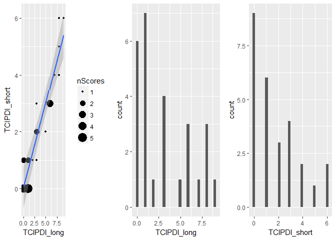

In conclusion, these two scales are significantly correlated with one another, with a Pearson's R = 0.94

ii. Correlation of the TCI-PDI with the PDI
-------------------------------------------

Next, in order to assess the validity of the TCI-PDI scales, we compare scores on these scales with scores on the PDI questionnaire. This comparison is important as it determines which of the TCI-PDI scales we will use in the rest of the studies in this paper.

``` r
tcipdi_pdi <- D1S_PDI_TCI %>%
  select(SubjName, starts_with('TCIPDI'), PDI) %>%
  gather(TCIPDIversion, Score, -SubjName, -PDI) %>%
  group_by(TCIPDIversion) %>%
  summarise(R = cor(PDI, Score))
pandoc.table(tcipdi_pdi)
```

<table style="width:33%;">
<colgroup>
<col width="22%" />
<col width="11%" />
</colgroup>
<thead>
<tr class="header">
<th align="center">TCIPDIversion</th>
<th align="center">R</th>
</tr>
</thead>
<tbody>
<tr class="odd">
<td align="center">TCIPDI_long</td>
<td align="center">0.4648</td>
</tr>
<tr class="even">
<td align="center">TCIPDI_short</td>
<td align="center">0.6393</td>
</tr>
</tbody>
</table>

Using only the questionnaires completed by participants who also completed PET, the correlations are as follows:

``` r
tcipdi_pdi <- D1S_PDI_TCI %>%
  filter(!is.na(bp)) %>%
  select(SubjName, starts_with('TCIPDI'), PDI) %>%
  gather(TCIPDIversion, Score, -SubjName, -PDI) %>%
  group_by(TCIPDIversion) %>%
  summarise(R = cor(PDI, Score))
pandoc.table(tcipdi_pdi)
```

    ## 
    ## ------------------------
    ##  TCIPDIversion     R    
    ## --------------- --------
    ##   TCIPDI_long    0.3915 
    ## 
    ##  TCIPDI_short    0.6899 
    ## ------------------------

Below I show the relationships between the plots. Due to both scales being discrete, the third plot on the right is the same as the second, but with slightly jittered points.

``` r
D1S_PDI_TCI <- D1S_PDI_TCI %>%
  mutate(PET = ifelse(is.na(bp), 'No', 'Yes'))

a <- ggplot(data=D1S_PDI_TCI, aes(x=TCIPDI_long, y=PDI)) + 
  geom_point(aes(colour=PET)) + 
  geom_smooth(method="lm")
b <- ggplot(data=D1S_PDI_TCI, aes(x=TCIPDI_short, y=PDI)) + 
  geom_point(aes(colour=PET)) + 
  geom_smooth(method="lm")
c <- ggplot(data=D1S_PDI_TCI, aes(x=TCIPDI_short, y=PDI)) + 
  geom_jitter(width=0.25, height=0.25, aes(colour=PET))
gridExtra::grid.arrange(a,b,c,ncol=3)
```

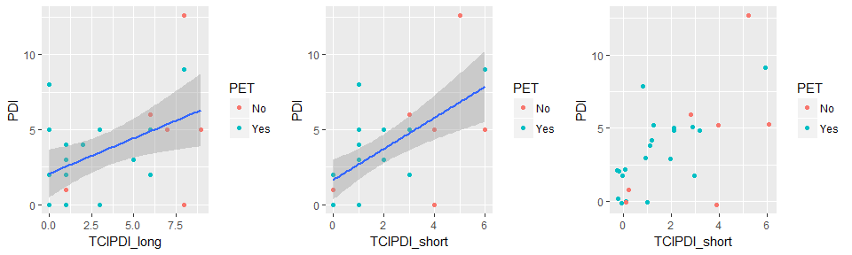

As we can see here, the short version of the TCI-PDI scale is more closely associated with PDI scores in this data set. We will therefore make use of the TCIPDI\_short scale for the remainder of this study.

In order to estimate predicted PDI scores from one scale to the other, I fit a linear regression model:

``` r
tcipdi_parameters <- D1S_PDI_TCI %>%
  do(tidy(lm(PDI ~ TCIPDI_short, data=.)))
kable(tcipdi_parameters, digits = c(2,2,2,2,4))
```

| term          |  estimate|  std.error|  statistic|  p.value|
|:--------------|---------:|----------:|----------:|--------:|
| (Intercept)   |      1.66|       0.65|       2.56|   0.0170|
| TCIPDI\_short |      1.04|       0.25|       4.16|   0.0003|

Substudy 1C: Relationship of TCI-PDI Questionnaire with D1 Receptor binding
===========================================================================

``` r
tcipdi_dadb_d1 <- alldata %>%
  filter(Study=='DADB', !is.na(TCIPDI_long), !is.na(bp))
```

We assessed whether there was a relationship between our newly developed TCI-PDI questionnaire and D1 receptor binding in an exploratory pilot study. Our primary region of interest was the dorsolateral prefrontal cortex as this region has frequently been found to be associated with psychosis and traits associated with proneness to develop psychosis. We also included the striatum as a highly reliable region to test for specificity.

In the database, there are 24 individuals who completed the TCI questionnaire at the time of their PET measurement. The database consists mostly of men, and mostly of young men (i.e. aged 20-35). The demographics of our sample were as follows:

``` r
tcipdi_dadb_d1 <- tcipdi_dadb_d1 %>%
  mutate(oldyoung=ifelse(Age < 40, 'young', 'old'))


tcipdi_dadb_d1_dlpfc <- tcipdi_dadb_d1 %>% 
  filter(Region=='DLPFC_46')

pandoc.table(table(tcipdi_dadb_d1_dlpfc$Sex, tcipdi_dadb_d1_dlpfc$oldyoung))
```

<table style="width:36%;">
<colgroup>
<col width="18%" />
<col width="8%" />
<col width="9%" />
</colgroup>
<thead>
<tr class="header">
<th align="center"> </th>
<th align="center">old</th>
<th align="center">young</th>
</tr>
</thead>
<tbody>
<tr class="odd">
<td align="center"><strong>female</strong></td>
<td align="center">2</td>
<td align="center">6</td>
</tr>
<tr class="even">
<td align="center"><strong>male</strong></td>
<td align="center">3</td>
<td align="center">13</td>
</tr>
</tbody>
</table>

``` r
pandoc.table(psych::describe(tcipdi_dadb_d1_dlpfc$Age), split.table=Inf)
```

<table style="width:100%;">
<colgroup>
<col width="8%" />
<col width="6%" />
<col width="4%" />
<col width="7%" />
<col width="6%" />
<col width="8%" />
<col width="8%" />
<col width="7%" />
<col width="7%" />
<col width="7%" />
<col width="7%" />
<col width="7%" />
<col width="9%" />
<col width="5%" />
</colgroup>
<thead>
<tr class="header">
<th align="center"> </th>
<th align="center">vars</th>
<th align="center">n</th>
<th align="center">mean</th>
<th align="center">sd</th>
<th align="center">median</th>
<th align="center">trimmed</th>
<th align="center">mad</th>
<th align="center">min</th>
<th align="center">max</th>
<th align="center">range</th>
<th align="center">skew</th>
<th align="center">kurtosis</th>
<th align="center">se</th>
</tr>
</thead>
<tbody>
<tr class="odd">
<td align="center"><strong>X1</strong></td>
<td align="center">1</td>
<td align="center">24</td>
<td align="center">35.02</td>
<td align="center">19.2</td>
<td align="center">25.74</td>
<td align="center">32.27</td>
<td align="center">2.839</td>
<td align="center">22.88</td>
<td align="center">76.48</td>
<td align="center">53.6</td>
<td align="center">1.338</td>
<td align="center">-0.1432</td>
<td align="center">3.92</td>
</tr>
</tbody>
</table>

``` r
tcipdi_dadb_d1_dlpfc_answers <- tcipdi_dadb_d1_dlpfc %>%
  select(one_of(paste0('TCI', tcipdiShort_items)))

(pdi_d1s_reliability <- alpha(tcipdi_dadb_d1_dlpfc_answers))
```

    ## 
    ## Reliability analysis   
    ## Call: alpha(x = tcipdi_dadb_d1_dlpfc_answers)
    ## 
    ##   raw_alpha std.alpha G6(smc) average_r S/N  ase mean   sd
    ##       0.65      0.66    0.82      0.19 1.9 0.11 0.29 0.24
    ## 
    ##  lower alpha upper     95% confidence boundaries
    ## 0.45 0.65 0.86 
    ## 
    ##  Reliability if an item is dropped:
    ##        raw_alpha std.alpha G6(smc) average_r S/N alpha se
    ## TCI056      0.66      0.68    0.84      0.23 2.1    0.103
    ## TCI076      0.67      0.67    0.82      0.23 2.1    0.100
    ## TCI077      0.71      0.69    0.84      0.24 2.3    0.088
    ## TCI097      0.51      0.52    0.69      0.13 1.1    0.152
    ## TCI116      0.59      0.59    0.75      0.17 1.4    0.128
    ## TCI175      0.61      0.63    0.78      0.19 1.7    0.120
    ## TCI200      0.64      0.64    0.79      0.21 1.8    0.114
    ## TCI208      0.53      0.54    0.73      0.15 1.2    0.146
    ## 
    ##  Item statistics 
    ##         n raw.r std.r r.cor r.drop  mean   sd
    ## TCI056 24  0.35  0.36  0.20  0.156 0.167 0.38
    ## TCI076 24  0.41  0.38  0.28  0.169 0.333 0.48
    ## TCI077 24  0.30  0.30  0.15  0.039 0.458 0.51
    ## TCI097 24  0.83  0.84  0.90  0.734 0.250 0.44
    ## TCI116 24  0.66  0.65  0.65  0.462 0.458 0.51
    ## TCI175 24  0.58  0.55  0.51  0.389 0.250 0.44
    ## TCI200 24  0.43  0.49  0.44  0.304 0.083 0.28
    ## TCI208 24  0.78  0.78  0.82  0.649 0.292 0.46
    ## 
    ## Non missing response frequency for each item
    ##           0    1 miss
    ## TCI056 0.83 0.17    0
    ## TCI076 0.67 0.33    0
    ## TCI077 0.54 0.46    0
    ## TCI097 0.75 0.25    0
    ## TCI116 0.54 0.46    0
    ## TCI175 0.75 0.25    0
    ## TCI200 0.92 0.08    0
    ## TCI208 0.71 0.29    0

``` r
(pdi_d1s_reliability_long <- tcipdi_dadb_d1_dlpfc %>%
  select(one_of(paste0('TCI', tcipdiLong_items))) %>% 
  alpha())
```

    ## Warning in alpha(.): Item = TCI015 had no variance and was deleted

    ## Warning in alpha(.): Some items were negatively correlated with the total scale and probably 
    ## should be reversed.  
    ## To do this, run the function again with the 'check.keys=TRUE' option

    ## Some items ( TCI051 TCI077 TCI220 ) were negatively correlated with the total scale and 
    ## probably should be reversed.  
    ## To do this, run the function again with the 'check.keys=TRUE' option

    ## 
    ## Reliability analysis   
    ## Call: alpha(x = .)
    ## 
    ##   raw_alpha std.alpha G6(smc) average_r S/N ase mean   sd
    ##       0.64      0.67    0.89      0.13   2 0.1 0.32 0.19
    ## 
    ##  lower alpha upper     95% confidence boundaries
    ## 0.43 0.64 0.84 
    ## 
    ##  Reliability if an item is dropped:
    ##        raw_alpha std.alpha G6(smc) average_r S/N alpha se
    ## TCI006      0.61      0.64    0.84      0.13 1.8    0.117
    ## TCI038      0.60      0.63    0.85      0.12 1.7    0.120
    ## TCI051      0.66      0.69    0.90      0.16 2.2    0.097
    ## TCI056      0.63      0.66    0.88      0.14 1.9    0.107
    ## TCI076      0.64      0.67    0.88      0.14 2.0    0.103
    ## TCI077      0.68      0.69    0.87      0.16 2.2    0.094
    ## TCI097      0.55      0.58    0.82      0.10 1.4    0.135
    ## TCI116      0.57      0.61    0.85      0.12 1.6    0.127
    ## TCI175      0.57      0.62    0.85      0.12 1.6    0.125
    ## TCI194      0.61      0.62    0.86      0.12 1.6    0.115
    ## TCI200      0.62      0.65    0.87      0.13 1.8    0.111
    ## TCI208      0.56      0.60    0.85      0.11 1.5    0.129
    ## TCI220      0.72      0.73    0.90      0.18 2.7    0.082
    ## 
    ##  Item statistics 
    ##         n raw.r std.r  r.cor r.drop  mean   sd
    ## TCI006 24  0.52  0.49  0.488  0.355 0.417 0.50
    ## TCI038 24  0.57  0.55  0.541  0.407 0.542 0.51
    ## TCI051 24  0.19  0.17  0.075  0.020 0.250 0.44
    ## TCI056 24  0.38  0.39  0.328  0.237 0.167 0.38
    ## TCI076 24  0.34  0.33  0.274  0.162 0.333 0.48
    ## TCI077 24  0.17  0.18  0.135 -0.027 0.458 0.51
    ## TCI097 24  0.78  0.79  0.825  0.691 0.250 0.44
    ## TCI116 24  0.65  0.64  0.645  0.505 0.458 0.51
    ## TCI175 24  0.66  0.62  0.618  0.543 0.250 0.44
    ## TCI194 24  0.53  0.59  0.565  0.440 0.083 0.28
    ## TCI200 24  0.41  0.46  0.445  0.306 0.083 0.28
    ## TCI208 24  0.70  0.71  0.725  0.582 0.292 0.46
    ## TCI220 24 -0.11 -0.10 -0.186 -0.300 0.583 0.50
    ## 
    ## Non missing response frequency for each item
    ##           0    1 miss
    ## TCI006 0.58 0.42    0
    ## TCI038 0.46 0.54    0
    ## TCI051 0.75 0.25    0
    ## TCI056 0.83 0.17    0
    ## TCI076 0.67 0.33    0
    ## TCI077 0.54 0.46    0
    ## TCI097 0.75 0.25    0
    ## TCI116 0.54 0.46    0
    ## TCI175 0.75 0.25    0
    ## TCI194 0.92 0.08    0
    ## TCI200 0.92 0.08    0
    ## TCI208 0.71 0.29    0
    ## TCI220 0.42 0.58    0

Our primary group of interest was young males. Because this was an exploratory analysis, and because the numbers were so small, we made the comparison in three ways:

1.  Including everyone, and correcting for Age and Sex
2.  Excluding women, and correcting for Age
3.  Excluding older individuals, and correcting for Gender
4.  Excluding women and old men, and no correction

*1. Including everyone, and correcting for Age and Sex*
-------------------------------------------------------

``` r
everyone_models_s <- tcipdi_dadb_d1 %>%
  group_by(Region) %>%
  mutate(bp.z = scale(bp),  TCIPDI_short.z = scale(TCIPDI_short)) %>%
  do(tidy(lm(bp.z ~ TCIPDI_short.z + Sex, data=.))) %>%
  arrange(term, Region) %>%
  filter(term=='TCIPDI_short.z')
kable(everyone_models_s, digits = c(1,1,4,4,2,3))
```

| Region    | term            |  estimate|  std.error|  statistic|  p.value|
|:----------|:----------------|---------:|----------:|----------:|--------:|
| DLPFC\_46 | TCIPDI\_short.z |   -0.4884|     0.1985|      -2.46|    0.023|
| gmfslSTR  | TCIPDI\_short.z |   -0.5917|     0.1900|      -3.11|    0.005|

``` r
everyone_models_l <- tcipdi_dadb_d1 %>%
  group_by(Region) %>%
  mutate(bp.z = scale(bp), TCIPDI_long.z = scale(TCIPDI_long)) %>%
  do(tidy(lm(bp.z ~ TCIPDI_long.z + Age + Sex, data=.))) %>%
  arrange(term, Region) %>%
  filter(term=='TCIPDI_long.z')
kable(everyone_models_l, digits = c(1,1,4,4,2,3))
```

| Region    | term           |  estimate|  std.error|  statistic|  p.value|
|:----------|:---------------|---------:|----------:|----------:|--------:|
| DLPFC\_46 | TCIPDI\_long.z |   -0.2455|     0.1525|      -1.61|    0.123|
| gmfslSTR  | TCIPDI\_long.z |   -0.4738|     0.1524|      -3.11|    0.006|

*2. Excluding women, and correcting for Age*
--------------------------------------------

``` r
male_models_s <- tcipdi_dadb_d1 %>%
  filter(Sex == 'male') %>%
  group_by(Region) %>%
  mutate(bp.z = scale(bp),  TCIPDI_short.z = scale(TCIPDI_short)) %>%
  do(tidy(lm(bp.z ~ TCIPDI_short.z + Age, data=.))) %>%
  arrange(term, Region) %>%
  filter(term=='TCIPDI_short.z')
kable(male_models_s, digits = c(1,1,4,4,2,3))
```

| Region    | term            |  estimate|  std.error|  statistic|  p.value|
|:----------|:----------------|---------:|----------:|----------:|--------:|
| DLPFC\_46 | TCIPDI\_short.z |   -0.4541|     0.1780|      -2.55|    0.024|
| gmfslSTR  | TCIPDI\_short.z |   -0.5662|     0.1704|      -3.32|    0.005|

``` r
male_models_l <- tcipdi_dadb_d1 %>%
  filter(Sex == 'male') %>%
  group_by(Region) %>%
  mutate(bp.z = scale(bp), TCIPDI_long.z = scale(TCIPDI_long)) %>%
  do(tidy(lm(bp.z ~ TCIPDI_long.z + Age, data=.))) %>%
  arrange(term, Region) %>%
  filter(term=='TCIPDI_long.z')
kable(male_models_l, digits = c(1,1,4,4,2,3))
```

| Region    | term           |  estimate|  std.error|  statistic|  p.value|
|:----------|:---------------|---------:|----------:|----------:|--------:|
| DLPFC\_46 | TCIPDI\_long.z |   -0.3983|     0.1875|      -2.12|    0.053|
| gmfslSTR  | TCIPDI\_long.z |   -0.6088|     0.1581|      -3.85|    0.002|

*3. Excluding old, and correcting for Gender*
---------------------------------------------

``` r
young_models_s <- tcipdi_dadb_d1 %>%
  filter(Age >= 20 & Age <=35) %>%
  group_by(Region) %>%
  mutate(bp.z = scale(bp),  TCIPDI_short.z = scale(TCIPDI_short)) %>%
  do(tidy(lm(bp.z ~ TCIPDI_short.z + Sex, data=.))) %>%
  arrange(term, Region) %>%
  filter(term=='TCIPDI_short.z')
kable(young_models_s, digits = c(1,1,4,4,2,3))
```

| Region    | term            |  estimate|  std.error|  statistic|  p.value|
|:----------|:----------------|---------:|----------:|----------:|--------:|
| DLPFC\_46 | TCIPDI\_short.z |    -0.370|     0.2138|      -1.73|    0.103|
| gmfslSTR  | TCIPDI\_short.z |    -0.504|     0.2149|      -2.35|    0.032|

``` r
young_models_l <- tcipdi_dadb_d1 %>%
  filter(Age >= 20 & Age <=35) %>%
  group_by(Region) %>%
  mutate(bp.z = scale(bp), TCIPDI_long.z = scale(TCIPDI_long)) %>%
  do(tidy(lm(bp.z ~ TCIPDI_long.z + Sex, data=.))) %>%
  arrange(term, Region) %>%
  filter(term=='TCIPDI_long.z')
kable(young_models_l, digits = c(1,1,4,4,2,3))
```

| Region    | term           |  estimate|  std.error|  statistic|  p.value|
|:----------|:---------------|---------:|----------:|----------:|--------:|
| DLPFC\_46 | TCIPDI\_long.z |   -0.3353|     0.2177|      -1.54|    0.143|
| gmfslSTR  | TCIPDI\_long.z |   -0.5895|     0.2013|      -2.93|    0.010|

*4. Excluding women and old men, and no correction*
---------------------------------------------------

``` r
youngmale_models_s <- tcipdi_dadb_d1 %>%
  filter(Sex == 'male') %>%
  filter(Age >= 20 & Age <=35) %>%
  group_by(Region) %>%
  mutate(bp.z = scale(bp),  TCIPDI_short.z = scale(TCIPDI_short)) %>%
  do(tidy(lm(bp.z ~ TCIPDI_short.z, data=.))) %>%
  arrange(term, Region) %>%
  filter(term=='TCIPDI_short.z')
kable(youngmale_models_s, digits = c(1,1,4,4,2,3))
```

| Region    | term            |  estimate|  std.error|  statistic|  p.value|
|:----------|:----------------|---------:|----------:|----------:|--------:|
| DLPFC\_46 | TCIPDI\_short.z |   -0.5915|     0.2431|      -2.43|    0.033|
| gmfslSTR  | TCIPDI\_short.z |   -0.6817|     0.2206|      -3.09|    0.010|

``` r
youngmale_models_l <- tcipdi_dadb_d1 %>%
  filter(Sex == 'male') %>%
  filter(Age >= 20 & Age <=35) %>%
  group_by(Region) %>%
  mutate(bp.z = scale(bp), TCIPDI_long.z = scale(TCIPDI_long)) %>%
  do(tidy(lm(bp.z ~ TCIPDI_long.z, data=.))) %>%
  arrange(term, Region) %>%
  filter(term=='TCIPDI_long.z')

kable(youngmale_models_l, digits = c(1,1,4,4,2,3))
```

| Region    | term           |  estimate|  std.error|  statistic|  p.value|
|:----------|:---------------|---------:|----------:|----------:|--------:|
| DLPFC\_46 | TCIPDI\_long.z |   -0.5674|     0.2483|      -2.29|    0.043|
| gmfslSTR  | TCIPDI\_long.z |   -0.7767|     0.1899|      -4.09|    0.002|

``` r
tcipdi_dadb_d1 %>%
  filter(Sex == 'male') %>%
  filter(Age >= 20 & Age <=35) %>%
  gather(Scale,Score,TCIPDI_short, TCIPDI_long) %>%
  ggplot(., aes(y=Score, x=bp, colour=Scale)) + 
  geom_point() + geom_smooth(method="lm") + 
  xlab('BPND') + ylab('TCIPDI Score') + 
  facet_grid(~ Region, scales = 'free_x')
```

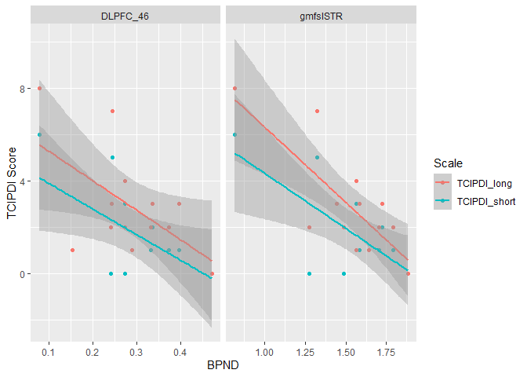

Thus we can conclude that both scales appear to be correlated with D1 BP<sub>ND</sub> in both the dorsolateral prefrontal cortex and in the striatum, according to our pilot exploratory analysis. This result appears to be strongest for the young males, who are best represented by the PET database. However, we need to confirm this result in a future sample to be sure that it is truly representative.

Below are the unstandardised estimates:

``` r
tcipdi_d1_parameters <- tcipdi_dadb_d1 %>%
  filter(Sex == 'male') %>%
  filter(Age >= 20 & Age <=35) %>%
  group_by(Region) %>%
  do(tidy(lm(bp ~ TCIPDI_short, data=.))) %>%
  arrange(Region, term)
kable(tcipdi_d1_parameters, digits = c(1,1,4,4,2,3))
```

| Region    | term          |  estimate|  std.error|  statistic|  p.value|
|:----------|:--------------|---------:|----------:|----------:|--------:|
| DLPFC\_46 | (Intercept)   |    0.3431|     0.0339|      10.13|    0.000|
| DLPFC\_46 | TCIPDI\_short |   -0.0317|     0.0130|      -2.43|    0.033|
| gmfslSTR  | (Intercept)   |    1.7032|     0.0825|      20.65|    0.000|
| gmfslSTR  | TCIPDI\_short |   -0.0980|     0.0317|      -3.09|    0.010|

Table for Publication
---------------------

``` r
library(kableExtra)

allmodels <- bind_rows(all_l = everyone_models_l, all_s = everyone_models_s, 
                       male_l = male_models_l, male_s = male_models_s, 
                       young_l = young_models_l, young_s = young_models_s,
                       youngmale_l = youngmale_models_l, youngmale_s = youngmale_models_s,
                       .id = 'id') %>%
  ungroup() %>%
  mutate(Gender = ifelse(grepl('male', .$id), 'Exclusion', 'Covariate'),
         Age    = ifelse(grepl('young', .$id), 'Exclusion', 'Covariate')) %>%
  mutate(Region = ifelse(Region=='DLPFC_46', 'DLPFC', 'Striatum'),
         term = ifelse(term=='TCIPDI_long.z', 'Long', 'Short')) %>%
  mutate(nsample = 24) %>%
  mutate(nsample = ifelse(Gender=='Exclusion', nsample-8, nsample)) %>%
  mutate(nsample = ifelse(Age=='Exclusion', nsample-4, nsample)) %>%
  mutate(nsample = ifelse(Age=='Exclusion' & Gender=='Exclusion', 13, nsample)) %>%
  select(Region, 'TCI-DI Scale'=term,Gender,Age, n=nsample,
         "beta.std"=estimate, 'P Value' = p.value) %>%
  mutate_if(is.numeric, funs(round(.,3))) %>%
  arrange(Region, -n) %>%
  select(-Region)
           
  
kable(allmodels, format='latex', caption = 'Associations between TCI-DI scores and binding potential', 
      booktabs=T, linesep = c("", "", "", "\\addlinespace")) %>%
  group_rows('DLPFC', 1,8) %>%
  group_rows('Striatum', 9,16)
```

Figure for summary
------------------

``` r
# beta_fig_data <- allmodels %>% 
#   mutate(Region = c(rep('DLPFC', 8), rep('Striatum', 8))) %>% 
#   mutate(Nudge = ifelse(Region=='DLPFC', -0.1, 0.1)) %>% 
#   arrange(desc(`TCI-DI Scale`)) %>% 
#   mutate(`TCI-DI Scale` = forcats::fct_inorder(`TCI-DI Scale`))
#   
# beta_fig <- ggplot(beta_fig_data, aes(y=beta.std, x=`TCI-DI Scale`, colour=`TCI-DI Scale`)) +
#   geom_violin(aes(fill=`TCI-DI Scale`),
#               alpha=0.2) +
#   ylim(c(-1, 0)) +
#   geom_point(position=position_nudge(x=beta_fig_data$Nudge), aes(shape=Region)) +
#   theme_bw() +
#   labs(y=expression('Standardised '~beta ~ ' Estimate')) +
#   scale_colour_manual(guide=FALSE, values = c("#85d4e3", "#e39f85")) +
#   scale_fill_manual(guide=FALSE, values = c("#85d4e3", "#e39f85"))
# 
# beta_fig_data <- allmodels %>% 
#   mutate(Region = c(rep('DLPFC', 8), rep('Striatum', 8))) %>% 
#   mutate(Nudge = ifelse(`TCI-DI Scale`=='Short', -0.1, 0.1)) %>% 
#   arrange(desc(`TCI-DI Scale`)) %>% 
#   mutate(`TCI-DI Scale` = forcats::fct_inorder(`TCI-DI Scale`))
# 
# beta_fig <- ggplot(beta_fig_data, aes(y=beta.std, x=Region, colour=Region)) +
#   geom_violin(aes(fill=Region),
#               alpha=0.2, 
#               draw_quantiles = c(0.5)) +
#   ylim(c(-1, 0)) +
#   geom_point(position=position_nudge(x=beta_fig_data$Nudge), aes(shape=`TCI-DI Scale`)) +
#   theme_bw() +
#   labs(y=expression('Standardised '~beta ~ ' Estimate')) +
#   scale_colour_manual(guide=FALSE, values = c("#85d4e3", "#e39f85")) +
#   scale_fill_manual(guide=FALSE, values = c("#85d4e3", "#e39f85"))


beta_fig_data <- allmodels %>% 
  mutate(Region = c(rep('DLPFC', 8), rep('Striatum', 8))) %>% 
  mutate(Nudge = ifelse(`TCI-DI Scale`=='Short', -0.1, 0.1)) %>% 
  arrange(desc(`TCI-DI Scale`)) %>% 
  mutate(`TCI-DI Scale` = forcats::fct_inorder(`TCI-DI Scale`)) %>% 
  mutate(xpos = ifelse(Region=='DLPFC', 0, 1)) %>% 
  mutate(xpos = xpos + ifelse(`TCI-DI Scale` == 'Short', -0.1, 0.1))

dens_n <- 25

beta_fig_densdata <- allmodels %>% 
  mutate(Region = c(rep('DLPFC', 8), rep('Striatum', 8))) %>% 
  mutate(Nudge = ifelse(`TCI-DI Scale`=='Short', -0.1, 0.1)) %>% 
  arrange(desc(`TCI-DI Scale`)) %>% 
  mutate(`TCI-DI Scale` = forcats::fct_inorder(`TCI-DI Scale`)) %>% 
  group_by(Region, `TCI-DI Scale`) %>% 
  do(data.frame(loc = density(.$beta.std, n=dens_n)$x,
                dens = density(.$beta.std, n=dens_n)$y)) %>% 
  mutate(dens = dens/(3*max(dens)))

beta_fig_densdata$dens <- ifelse(beta_fig_densdata$`TCI-DI Scale` == 'Short', 
                             beta_fig_densdata$dens * -1, beta_fig_densdata$dens)
beta_fig_densdata$dens <- ifelse(beta_fig_densdata$Region == 'Striatum', 
                             beta_fig_densdata$dens + 1, beta_fig_densdata$dens)
  

beta_fig <- ggplot(beta_fig_densdata, aes(dens, loc, fill=`TCI-DI Scale`,
                                      group = interaction(`TCI-DI Scale`, Region))) +
  geom_polygon(alpha=0.2) +
  scale_x_continuous('Region', breaks = 0:1, labels = c('DLPFC', 'Striatum')) +
  ylab(expression('Standardised '~beta ~ ' Estimate')) +
  theme_bw() +
  theme(axis.title.x = element_blank()) +
  ylim(c(-1, 0)) +
  geom_point(data=beta_fig_data, 
             #position=position_nudge(x=beta_fig_data$Nudge), 
             aes(y=beta.std, x=xpos, colour=`TCI-DI Scale`)) +
  scale_colour_manual(values = c("#85d4e3", "#e39f85")) +
  scale_fill_manual(values = c("#85d4e3", "#e39f85"))


print(beta_fig)
```

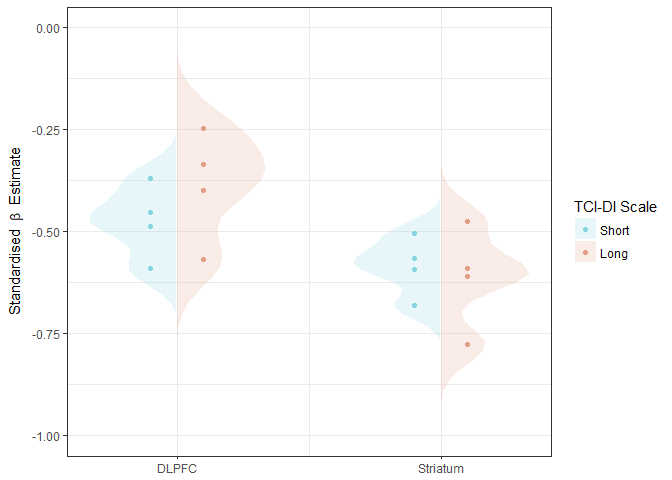

``` r
ggsave('../Figures/Beta_fig.jpg', beta_fig, width = 4, height=6)
```

Summary Statistics
------------------

``` r
DADB_summarygroup <- alldata %>%
  filter(Study=='DADB', !is.na(bp)) %>%
  filter(Region=='DLPFC_46', PETNo==1) %>% 
  select(-starts_with('PDI'), -starts_with('TCI'))

DADB_summarygroup %>% 
  select_if(is.numeric) %>% 
  describe() %>% 
  kable()
```

    ## Warning in FUN(newX[, i], ...): no non-missing arguments to min; returning
    ## Inf

    ## Warning in FUN(newX[, i], ...): no non-missing arguments to min; returning
    ## Inf

    ## Warning in FUN(newX[, i], ...): no non-missing arguments to max; returning
    ## -Inf

    ## Warning in FUN(newX[, i], ...): no non-missing arguments to max; returning
    ## -Inf

|                  |  vars|    n|          mean|            sd|        median|       trimmed|           mad|           min|           max|         range|        skew|    kurtosis|           se|
|------------------|-----:|----:|-------------:|-------------:|-------------:|-------------:|-------------:|-------------:|-------------:|-------------:|-----------:|-----------:|------------:|
| PETNo            |     1|   56|     1.0000000|     0.0000000|     1.0000000|     1.0000000|     0.0000000|     1.0000000|     1.0000000|     0.0000000|         NaN|         NaN|    0.0000000|
| bp               |     2|   56|     0.2807109|     0.1016699|     0.2944013|     0.2838536|     0.0790195|     0.0452749|     0.4712498|     0.4259749|  -0.3597929|  -0.5758678|    0.0135862|
| Age              |     3|   56|    29.2947366|    13.5889547|    25.1598174|    25.6214810|     2.4486595|    20.6490868|    76.4780822|    55.8289954|   2.6488685|   5.5177322|    1.8159005|
| InjRadioactivity |     4|   56|   303.8750000|    25.4423144|   306.0000000|   306.1304348|    20.7564000|   221.0000000|   350.0000000|   129.0000000|  -0.9513012|   1.0605296|    3.3998723|
| Age\_PDI         |     5|   41|    32.9492997|     3.2186197|    33.1088296|    32.8376994|     2.0863967|    25.4483231|    43.9397673|    18.4914442|   0.5719087|   2.0318273|    0.5026639|
| D1               |     6|   41|     1.0000000|     0.0000000|     1.0000000|     1.0000000|     0.0000000|     1.0000000|     1.0000000|     0.0000000|         NaN|         NaN|    0.0000000|
| Age\_PET         |     7|   41|    25.0394142|     2.9218345|    24.6803653|    24.7942853|     2.3271404|    20.6490868|    35.2664384|    14.6173516|   1.0855250|   2.0150681|    0.4563139|
| PET2PDI          |     8|   41|     7.9098855|     1.5634620|     8.1202493|     7.9787856|     0.7466387|     4.7474201|    12.7050210|     7.9576008|  -0.0005642|   1.4155048|    0.2441717|
| FF\_Kod          |     9|   41|  5226.4146341|  2257.9796276|  4992.0000000|  5106.6666667|  2616.7890000|  1501.0000000|  9757.0000000|  8256.0000000|   0.4056342|  -0.7218794|  352.6371727|
| SpecAc           |    10|    0|           NaN|            NA|            NA|           NaN|            NA|           Inf|          -Inf|          -Inf|          NA|          NA|           NA|
| InjMass          |    11|    0|           NaN|            NA|            NA|           NaN|            NA|           Inf|          -Inf|          -Inf|          NA|          NA|           NA|

Substudy 2: Replication of TCIPDI Finding
=========================================

We can test the reliability of our original finding using the replication Bayes Factor. First, we evaluate the reliability of our measurements of TCIPDI scores, and then we assess how the degree of replication of the original findings.

TCIPDI Reliability
------------------

To assess the reliability of the TCIPDI scale, we calculate Cronbach's *α* for this set of scores:

``` r
tcipdi_rawscores <- alldata %>%
  filter(Study=='D1S', !is.na(bp)) %>%
  filter(Region=='DLPFC_46', PETNo==1) %>%    # One response per subject
  select(one_of(paste0('TCI', tcipdiShort_items)))

(tcipdi_d1s_alpha <- alpha(tcipdi_rawscores))
```

    ## Warning in alpha(tcipdi_rawscores): Some items were negatively correlated with the total scale and probably 
    ## should be reversed.  
    ## To do this, run the function again with the 'check.keys=TRUE' option

    ## Some items ( TCI175 ) were negatively correlated with the total scale and 
    ## probably should be reversed.  
    ## To do this, run the function again with the 'check.keys=TRUE' option

    ## 
    ## Reliability analysis   
    ## Call: alpha(x = tcipdi_rawscores)
    ## 
    ##   raw_alpha std.alpha G6(smc) average_r S/N  ase mean   sd
    ##       0.61      0.65    0.81      0.19 1.8 0.13 0.17 0.19
    ## 
    ##  lower alpha upper     95% confidence boundaries
    ## 0.35 0.61 0.87 
    ## 
    ##  Reliability if an item is dropped:
    ##        raw_alpha std.alpha G6(smc) average_r S/N alpha se
    ## TCI056      0.61      0.62    0.78      0.19 1.6     0.13
    ## TCI076      0.61      0.64    0.74      0.20 1.8     0.13
    ## TCI077      0.63      0.66    0.82      0.21 1.9     0.13
    ## TCI097      0.53      0.58    0.78      0.16 1.4     0.16
    ## TCI116      0.60      0.64    0.81      0.20 1.7     0.14
    ## TCI175      0.62      0.68    0.78      0.23 2.1     0.13
    ## TCI200      0.53      0.54    0.71      0.14 1.2     0.16
    ## TCI208      0.49      0.55    0.69      0.15 1.2     0.18
    ## 
    ##  Item statistics 
    ##         n raw.r std.r r.cor r.drop mean   sd
    ## TCI056 20  0.47  0.52  0.45   0.22 0.20 0.41
    ## TCI076 20  0.47  0.45  0.43   0.22 0.20 0.41
    ## TCI077 20  0.49  0.40  0.26   0.19 0.40 0.50
    ## TCI097 20  0.65  0.65  0.58   0.48 0.15 0.37
    ## TCI116 20  0.46  0.47  0.36   0.25 0.15 0.37
    ## TCI175 20  0.25  0.32  0.26   0.11 0.05 0.22
    ## TCI200 20  0.71  0.75  0.77   0.63 0.05 0.22
    ## TCI208 20  0.75  0.73  0.75   0.61 0.15 0.37
    ## 
    ## Non missing response frequency for each item
    ##           0    1 miss
    ## TCI056 0.80 0.20    0
    ## TCI076 0.80 0.20    0
    ## TCI077 0.60 0.40    0
    ## TCI097 0.85 0.15    0
    ## TCI116 0.85 0.15    0
    ## TCI175 0.95 0.05    0
    ## TCI200 0.95 0.05    0
    ## TCI208 0.85 0.15    0

We observe a Cronbach's *α* of 0.61, which is not particularly good, but probably useable. Hopefully, with extra participants this value will increase. This means that we can proceed with this study.

Summary Statistics
------------------

``` r
D1S_summarygroup <- alldata %>%
  filter(Study=='D1S', !is.na(bp)) %>%
  filter(Region=='DLPFC_46', PETNo==1) %>% 
  select(-starts_with('PDI'), -starts_with('TCI'))

D1S_summarygroup %>% 
  select_if(is.numeric) %>% 
  describe() %>% 
  kable()
```

    ## Warning in FUN(newX[, i], ...): no non-missing arguments to min; returning
    ## Inf

    ## Warning in FUN(newX[, i], ...): no non-missing arguments to min; returning
    ## Inf

    ## Warning in FUN(newX[, i], ...): no non-missing arguments to min; returning
    ## Inf

    ## Warning in FUN(newX[, i], ...): no non-missing arguments to min; returning
    ## Inf

    ## Warning in FUN(newX[, i], ...): no non-missing arguments to min; returning
    ## Inf

    ## Warning in FUN(newX[, i], ...): no non-missing arguments to max; returning
    ## -Inf

    ## Warning in FUN(newX[, i], ...): no non-missing arguments to max; returning
    ## -Inf

    ## Warning in FUN(newX[, i], ...): no non-missing arguments to max; returning
    ## -Inf

    ## Warning in FUN(newX[, i], ...): no non-missing arguments to max; returning
    ## -Inf

    ## Warning in FUN(newX[, i], ...): no non-missing arguments to max; returning
    ## -Inf

|                  |  vars|    n|         mean|           sd|       median|      trimmed|          mad|          min|           max|         range|       skew|    kurtosis|          se|
|------------------|-----:|----:|------------:|------------:|------------:|------------:|------------:|------------:|-------------:|-------------:|----------:|-----------:|-----------:|
| PETNo            |     1|   20|    1.0000000|    0.0000000|    1.0000000|    1.0000000|    0.0000000|    1.0000000|     1.0000000|     0.0000000|        NaN|         NaN|   0.0000000|
| bp               |     2|   20|    0.3254798|    0.0514461|    0.3253767|    0.3249467|    0.0387669|    0.2247905|     0.4312079|     0.2064174|  0.0483012|  -0.2220964|   0.0115037|
| Age              |     3|   20|   25.9073238|    3.1984330|   24.8829569|   25.3863792|    2.1980230|   21.7796030|    34.9596167|    13.1800137|  1.3147735|   1.2280502|   0.7151914|
| InjRadioactivity |     4|   20|  336.1500000|   46.2706853|  331.0000000|  335.1875000|   57.0801000|  248.0000000|   417.0000000|   169.0000000|  0.0948492|  -1.1391520|  10.3464398|
| Age\_PDI         |     5|    0|          NaN|           NA|           NA|          NaN|           NA|          Inf|          -Inf|          -Inf|         NA|          NA|          NA|
| D1               |     6|    0|          NaN|           NA|           NA|          NaN|           NA|          Inf|          -Inf|          -Inf|         NA|          NA|          NA|
| Age\_PET         |     7|    0|          NaN|           NA|           NA|          NaN|           NA|          Inf|          -Inf|          -Inf|         NA|          NA|          NA|
| PET2PDI          |     8|    0|          NaN|           NA|           NA|          NaN|           NA|          Inf|          -Inf|          -Inf|         NA|          NA|          NA|
| FF\_Kod          |     9|    0|          NaN|           NA|           NA|          NaN|           NA|          Inf|          -Inf|          -Inf|         NA|          NA|          NA|
| SpecAc           |    10|   14|  548.0714286|  277.2495306|  546.0000000|  546.3333333|  240.9225000|   18.0000000|  1099.0000000|  1081.0000000|  0.0376311|  -0.5548541|  74.0980539|
| InjMass          |    11|   20|    0.5388990|    1.3714962|    0.2179905|    0.2340783|    0.1226799|    0.0924353|     6.3471478|     6.2547125|  3.7835356|  13.0870998|   0.3066759|

Replication Bayes Factor
------------------------

Having observed a significant relationship between the TCIPDI scale and D1 Receptor BP<sub>ND</sub>, but no evidence for a relationship of this magnitude using the online PDI data, we sought to attempt to replicate this finding in a similar data set. For this we can use a replication Bayes Factor.

First, we can source the relevant command directly from the website of Josine Verhagen, who created the correlation replication Bayes Factor:

``` r
source('http://www.josineverhagen.com/wp-content/uploads/2013/07/RepfunctionscorrelationFINAL1.txt')
```

The correlation Bayes Factor can be calculated directly from only the r values and the sample sizes of the two studies, since these values contain all the relevant information. Firstly, we need the r and sample size of the original study:

``` r
youngmale_models <- tcipdi_dadb_d1 %>%
  filter(Sex == 'male') %>%
  filter(Age >= 20 & Age <=35) %>%
  group_by(Region) %>%
  mutate(bp.z = scale(bp),  TCIPDI_short.z = scale(TCIPDI_short)) %>%
  do(tidy(lm(bp.z ~ TCIPDI_short.z, data=.))) %>%
  arrange(term, Region) %>%
  filter(term=='TCIPDI_short.z')

youngmale_samples <- tcipdi_dadb_d1 %>%
  filter(Sex == 'male') %>%
  filter(Age >= 20 & Age <=35) %>%
  group_by(Region) %>%
  summarise(n_subj = length(bp))

# DLPFC
(tcipdi_original_n_dlpfc <- youngmale_samples$n_subj[1])
```

    ## [1] 13

``` r
(tcipdi_original_r_dlpfc <- youngmale_models$estimate[1])
```

    ## [1] -0.5914989

``` r
# STR
(tcipdi_original_n_str <- youngmale_samples$n_subj[2])
```

    ## [1] 13

``` r
(tcipdi_original_r_str <- youngmale_models$estimate[2])
```

    ## [1] -0.681671

Now, we just need to calculate the same correlation strengths for the new data:

``` r
pers_d1s_d1 <- alldata %>%
  filter(!is.na(bp), PETNo==1) %>%
  filter(Study=='D1S', !is.na(TCIPDI_short))

youngmale_d1s_models <- pers_d1s_d1 %>%
  filter(PETNo == 1) %>%
  group_by(Region) %>%
  mutate(bp.z = scale(bp),  TCIPDI_short.z = scale(TCIPDI_short)) %>%
  do(tidy(lm(bp.z ~ TCIPDI_short.z, data=.))) %>%
  arrange(term, Region) %>%
  filter(term=='TCIPDI_short.z')
kable(youngmale_d1s_models, digits = c(1,1,4,4,2,3))
```

| Region    | term            |  estimate|  std.error|  statistic|  p.value|
|:----------|:----------------|---------:|----------:|----------:|--------:|
| DLPFC\_46 | TCIPDI\_short.z |    0.0469|     0.2354|       0.20|    0.844|
| gmfslSTR  | TCIPDI\_short.z |    0.0665|     0.2352|       0.28|    0.781|

``` r
youngmale_d1s_samples <- pers_d1s_d1 %>%
  filter(PETNo == 1) %>%
  group_by(Region) %>%
  summarise(n_subj = length(bp))

# DLPFC
(tcipdi_rep_n_dlpfc <- youngmale_d1s_samples$n_subj[1])
```

    ## [1] 20

``` r
(tcipdi_rep_r_dlpfc <- youngmale_d1s_models$estimate[1])
```

    ## [1] 0.04687635

``` r
# STR
(tcipdi_rep_n_str <- youngmale_d1s_samples$n_subj[2])
```

    ## [1] 20

``` r
(tcipdi_rep_r_str <- youngmale_d1s_models$estimate[2])
```

    ## [1] 0.06649782

We should also examine scatterplots of the relationships between these measures.

``` r
youngmale_d1s_fig <- pers_d1s_d1 %>%
  filter(PETNo == 1) %>%
  mutate(Region = gsub('DLPFC_46', 'DLPFC', Region)) %>%
  mutate(Region = gsub('gmfslSTR', 'Striatum', Region)) %>%
  ggplot(aes(x=TCIPDI_short, y=bp)) +
  facet_grid(Region ~ ., scales="free_y") +
  geom_point() +
  labs(y=expression(BP[ND]),
       x='TCIPDI Score') +
  theme_bw()
  

print(youngmale_d1s_fig)
```

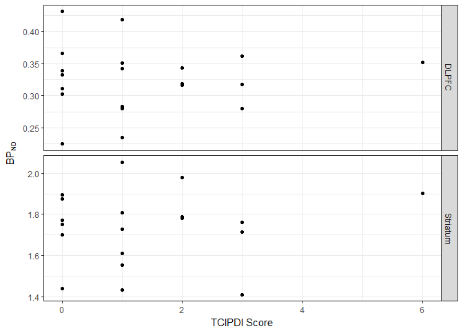

### Publication Scatterplots

``` r
tcipdi_study2 <- tcipdi_dadb_d1 %>%
  filter(Sex == 'male') %>%
  filter(Age >= 20 & Age <=35)

tcipdi_study5 <- pers_d1s_d1 %>%
  filter(PETNo == 1)

tcipdi_studies_data <- bind_rows(tcipdi_study2, tcipdi_study5) %>%
  mutate(Study = ifelse(Study=='DADB', 'Substudy 1C', 'Substudy 2')) %>%
  mutate(Region = gsub('DLPFC_46', 'DLPFC', Region)) %>%
  mutate(Region = gsub('gmfslSTR', 'Striatum', Region))

tdipdi_studies_correlations <- tcipdi_studies_data %>% 
  group_by(Study, Region) %>% 
  nest() %>% 
  mutate(r = map_dbl(data, ~cor(.x$TCIPDI_short, .x$bp))) %>% 
  select(-data) %>% 
  mutate(label=paste0('R = ',round(r, 2))) %>% 
  mutate(yspot=rep(c(0.9, 0.1), times=2))

tcipdi_studies <- ggplot(tcipdi_studies_data, aes(x=TCIPDI_short, y=bp)) +
  facet_grid(Region ~ Study, scales="free_y") +
  geom_point(shape = 21, colour = "black", fill="lightblue", size = 2, alpha=0.5) +
  labs(y=expression(BP[ND]),
       x='TCI-DI Score') +
  theme_light() +
  geom_smooth(method="lm", se=T, colour='black', alpha=0.2) +
  geom_text(data=tdipdi_studies_correlations, 
            mapping=aes(x = -Inf, y = -Inf, label = label),
            hjust   = -0.3,
            vjust   = -1.3)

tcipdi_studies
```

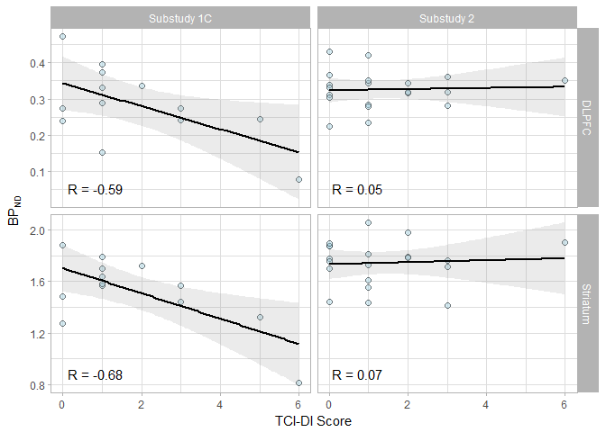

``` r
ggsave(tcipdi_studies, filename = '../Figures/Study4_scatters.jpg', 
       width = 9, height=6, dpi=900)
```

Using this information, we can calculate and plot the replication Bayes Factor.

DLPFC
-----

``` r
# Replication Bayes Factor: DLPFC
REPBF10_dlpfc <- CorrelationReplicationBF(tcipdi_original_r_dlpfc, tcipdi_original_n_dlpfc, 
                                          tcipdi_rep_r_dlpfc, tcipdi_rep_n_dlpfc)
REPBF10_dlpfc
```

    ##      BF01      BF10 
    ## 5.5254667 0.1809802

``` r
dlpfc_repbfplot <- repposteriorplot(tcipdi_original_n_dlpfc, tcipdi_original_r_dlpfc, 
                                    tcipdi_rep_n_dlpfc, tcipdi_rep_r_dlpfc)
```

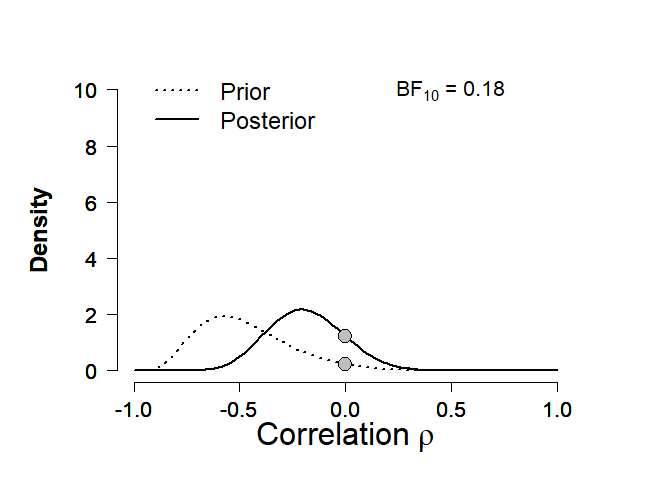

As such, we find evidence to conclude that these findings were not replicated. The null hypothesis is 5.5 times more likely. This is, according to Jeffreys' guidelines, moderate evidence in favour of the null hypothesis.

Striatum
--------

``` r
REPBF10_str <- CorrelationReplicationBF(tcipdi_original_r_str, tcipdi_original_n_str, 
                                        tcipdi_rep_r_str, tcipdi_rep_n_str)
REPBF10_str
```

    ##        BF01        BF10 
    ## 10.48680209  0.09535795

``` r
str_repbfplot <- repposteriorplot(tcipdi_original_n_str, tcipdi_original_r_str, 
                                  tcipdi_rep_n_str, tcipdi_rep_r_str)
```

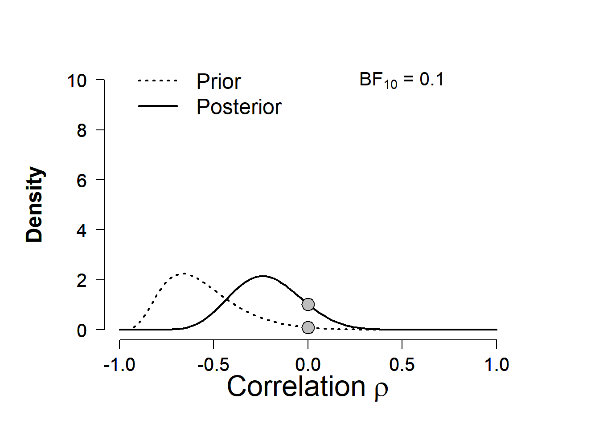

Here, though, we have found strong evidence of a lack of replication of the striatal finding. This suggests that it is likely that the original finding was spurious, as it has not stood up to our replication attempt. This is also consistent with literature, where there have not been any relationships reported between striatal D1 Receptor BP<sub>ND</sub> and schizophrenia.

Prior Selection: Studies 3-4
============================

In order to create priors for the future studies, we can use published literature as well as the values estimated above to come up with approximations. I will create priors both for the relationship of D1 receptor binding with age, as well as for the expected relationships between D1 receptor binding and scores on the PDI and the TCIPDI.

Priors for the relationship of D1 Receptor BP<sub>ND</sub> with age
-------------------------------------------------------------------

The relationship of D1 receptor BP<sub>ND</sub> using \\\[^11^C\]SCH-23390 and age has been reported on several times in the past. For the sake of time and of not including the oldest PET studies which are most prone to partial volume effects due to low resolution, we will focus on studies published within the last 20 years.

### DLPFC Decreases:

-   Wang 1998: OCC - 8% per decade (n=18)
-   Jucaite 2010: DLPFC - 23% per decade (n=30)
-   Backman 2011: DLPFC - 24% per decade (n=40)

Jucaite reported a non-linear association. For the sake of simplicity, we will assume that this trend was linear between 20 and 35 (the age inclusion criteria), and use the predicted values from the model.

``` r
jucaite_dlpfc20 <- 0.62*exp((-0.03)*20)
jucaite_dlpfc35 <- 0.62*exp((-0.03)*35)
jucaite_dlpfcmean <- Hmisc::wtd.mean(c(0.42, 0.31), c(12, 18))

(jucaite_dlpfc_difperc <- 100*abs((jucaite_dlpfc35 - jucaite_dlpfc20)/jucaite_dlpfcmean)/(1.5))   # /1.5 to account for its being 15 years.
```

    ## [1] 23.22068

``` r
dlpfcdecadevals <- c(-0.08, -0.17, -1*(jucaite_dlpfc_difperc/100))
dlpfcyearvals <- dlpfcdecadevals/10
kable(psych::describe(dlpfcyearvals), digits = 3)
```

|     |  vars|    n|    mean|     sd|  median|  trimmed|    mad|     min|     max|  range|   skew|  kurtosis|     se|
|-----|-----:|----:|-------:|------:|-------:|--------:|------:|-------:|-------:|------:|------:|---------:|------:|
| X1  |     1|    3|  -0.016|  0.008|  -0.017|   -0.016|  0.009|  -0.023|  -0.008|  0.015|  0.119|    -2.333|  0.004|

``` r
age_n <- c(19, 30, 40)
(dlpfc_age_weightedmean <- Hmisc::wtd.mean(dlpfcyearvals, age_n))
```

    ## [1] -0.01787446

``` r
(dlpfc_age_weightedsd <- sqrt(Hmisc::wtd.var(dlpfcyearvals, age_n)))
```

    ## [1] 0.007286822

Thus, we estimate that the yearly decrease for the DLPFC is of -1.8 % ± 0.7 %. These will be saved for later for use in the models.

``` r
dlpfc_age_mean = dlpfc_age_weightedmean
dlpfc_age_sd = dlpfc_age_weightedsd
```

### Striatal Decreases:

``` r
jucaite_str20 <- 1.90*exp((-0.008)*20)
jucaite_str35 <- 1.90*exp((-0.008)*35)
jucaite_strmean <- Hmisc::wtd.mean(c(1.7, 1.54), c(12, 18))

(jucaite_str_difperc <- 100*abs((jucaite_str35 - jucaite_str20) / jucaite_strmean)/1.5)   # /1.5 to account for its being 15 years.
```

    ## [1] 7.60948

-   Wang 1998: Caudate - 6.9% per decade
-   Jucaite 2010: Caudate - 7.6% per decade
-   Backman 2011: Caudate - 8% per decade

``` r
strdecadevals <- c(-0.069 , -1*(jucaite_str_difperc/100) , -0.08)
stryearvals <- strdecadevals/10
kable(psych::describe(stryearvals), digits = 3)
```

|     |  vars|    n|    mean|     sd|  median|  trimmed|    mad|     min|     max|  range|   skew|  kurtosis|   se|
|-----|-----:|----:|-------:|------:|-------:|--------:|------:|-------:|-------:|------:|------:|---------:|----:|
| X1  |     1|    3|  -0.008|  0.001|  -0.008|   -0.008|  0.001|  -0.008|  -0.007|  0.001|  0.184|    -2.333|    0|

``` r
(str_age_weightedmean <- Hmisc::wtd.mean(stryearvals, age_n))
```

    ## [1] -0.007633533

``` r
(str_age_weightedsd <- sqrt(Hmisc::wtd.var(stryearvals, age_n)))
```

    ## [1] 0.0005240318

Thus, we estimate that the yearly decrease for the striatum is of -0.8 % ± 0.05 %. These will be saved for later for use in the models.

``` r
str_age_mean = str_age_weightedmean
str_age_sd = str_age_weightedsd
```

Priors for the relationship of D1 Receptor BP<sub>ND</sub> with measures of psychosis proneness
-----------------------------------------------------------------------------------------------

This is a slightly more precarious prior to create, as this relationship has not been probed before. There have, however, been investigations of changes of the availability of D1 receptor binding in healthy controls and in schizophrenia patients, and the PDI has also been tested both in healthy controls and in delusional patients. We can use this information to come up with priors for potential effect sizes. On the other hand, though, there have been different results regarding the change in D1 Receptor BP<sub>ND</sub> in schizophrenia. Thus, we will create two priors with which to test the current relationship.

### Literature Priors

Although the relationship between D1 receptor binding assessed using PET has not been related to scores in the Peters Delusional Inventory before, we can still use the literature to derive suitable priors for this association, since there have been PET studies assessing differences between patients and controls in D1 receptor binding, and Peters compared scores on the PDI for healthy control patients and for delusional patients.

In Peters (2004), healthy control subjects were found to have a mean PDI score of 6, while delusional patients had a mean PDI score of 11. Thus, assuming that schizophrenia patients have similar PDI scores to the delusional patients, we can assume that an increase of 5 points on the PDI scale reflects the average difference in PDI scores between healthy control subjects and patients with schizophrenia.

There is some debate in the literature regarding the changes observed in PET D1 receptor binding in schizophrenia. The Chiba group in Japan has found decreases in schizophrenia patients compared to healthy controls in two studies, and using two ligands. The Columbia group in the USA has found increases in patients compared to healthy controls in two studies, using the same two ligands. The Turku group in Finland also found higher D1 receptor BP<sub>ND</sub> using \[11C\]SCH-23390 in individuals at high genetic risk for schizophrenia, however they also found that schizophrenia patients showed reductions in D1 receptor BP<sub>ND</sub> compared to healthy controls.

As such, there are a number of potential explanatory factors:

-   Antipsychotic use (likely important)
-   Radioligand (likely unimportant, though \[11C\]NNC112 has higher BP<sub>ND</sub> and thus higher signal to noise ratio in cortical regions)
-   Genetic factors

In order to estimate the change in BP<sub>ND</sub>, I will use priors consistent with both of these hypotheses, of both an increase and a decrease in D1 receptor BP<sub>ND</sub> assessed using \[11C\]SCH-23390. I use the publications which are most similar to the present analysis.

#### The Decrease Prior

-   Okubo, 1997 : This study used 2TCM, however arterial input was later shown to produce very unstable estimates for \[11C\]SCH-23390. Further, BP<sub>ND</sub> was calculated as $\\frac{k\_{3}}{k\_{4}}$, which is recommended against with even the best tracers, since these rate constants are not measured with a high degree of precision. These results are therefore likely to be extremely noisy, and unlikely to represent BP<sub>ND</sub> measured using reference tissue models.

-   Kosaka, 2010 : This study used SRTM for both NNC112, and SCH-23390. They found age correlations of R=-0.92 and R=-0.76 for the patients and controls respectively. This means that there is very little variability left in this data. They found extremely large differences , using both tracers, with six people. This seems a surprising result, and is likely a type M error.

From the these studies, the most consistent study to ours is that of Kosaka (2010), who observed a 27% reduction in patients compared to controls.

Thus the expected beta estimate for the regression is

$$\\frac{\\Delta BP\_{ND}}{\\Delta PDI} = \\frac{-0.27 \\times Mean BP\_{ND}}{5}$$

#### The Increase Prior

-   Abi-Dargham 2002 : This study examined differences between patients and controls using \[11C\]NNC112. This study found differences between patients and controls in the DLPFC, but in no other regions. They calculated BP<sub>P</sub> and BP<sub>ND</sub> , but do not report differences in V<sub>T</sub>.

-   Abi-Dargham 2012 : This paper also looked at NNC112, but with groups of both drug-free and drug-naive patients. There was a non-significant decrease observed in the drug-free patients, but a significant increase in the drug-naive patients. This was *not* observed for BP<sub>ND</sub>, but only for BP<sub>P</sub>, although this is argued to depend on there being differences in V<sub>ND</sub>. The effect was observed in all three frontal regions, which makes sense due to the intercorrelations. This study used partial volume effect correction though, but the results are not reported without.

-   Poels 2013 : This paper looked at both NNC112 and SCH23390 in patients and controls in a subset of the group used by Abi-Dargham 2012. It used BP<sub>P</sub> and BP<sub>ND</sub> for NNC, and BP<sub>ND</sub> for \[11C\]SCH-23390. NNC and SCH were found to have similar binding profiles. This paper showed different values from those of Abi-Dargham 2012, which is due to the use of partial volume effect correction. No significant differences were observed between patients and controls with either tracer. However, there were numerically higher BP<sub>P</sub> values for NNC, and BP<sub>ND</sub> values for SCH, observed in patients compared to controls. This was only observed in the drug-naive group, and no differences were observed in the drug-free group. This is the most similar study to our findings. Of note, the correlations between the binding of the two tracers was not very strong at all, between r=-0.11 to 0.72 (meaning only up to 50% of variance can be explained by the two tracers which are supposed to be measuring the same thing, and at minimum 0%), and about 20% explained variance in DLPFC. This suggests that translating the NNC112 results directly into their predicted SCH23390 differences is not really so justifiable.

From these studies, using the Poels (2013) paper, the average BP<sub>ND</sub> value for patients is 0.27, while the average BP<sub>ND</sub> value for controls is 0.20. Thus this reflects an increase of 35%. The other studies were conducted using NNC112, which makes comparison difficult.

Thus the expected beta estimate for the regression is

$$\\frac{\\Delta BP\_{ND}}{\\Delta PDI} = \\frac{0.35 \\times Mean BP\_{ND}}{5}$$

Prior for the relationship of PDI Score with Years
--------------------------------------------------

Negative relationships of the PDI21 with age have been reported in at least two large studies.

-   Peters (2004) reported a significant negative relationship between PDI scores on the 21 item scale and the age of respondents (Spearman's *ρ* = -0.24) based on a sample of 444. That it is a Spearman's *ρ* makes its interpretation slightly difficult.
-   Fonseca-Pedrero (2012) reported a significant negative relationship between PDI scores on the 21 item scale and the age of respondents (R = -0.12) based on a sample of 660. This sample is more representative of the sample which we have.

Based on these two results, the Fonseca-Pedrero result is more useful, as it is a Pearson's correlation, and also has a larger sample size. We shall use that value. We now must calculate the actual regression coefficient.

$$ r = b \\times \\frac{s\_{x}}{s\_{y}} $$
$$\\dot{.\\hspace{.03in}.}\\hspace{.3in} b = r \\times \\frac{s\_{y}}{s\_{x}} $$

$$ = -0.12 \\times \\frac{2.78}{2.6} $$
 Thus the regression coefficient is -0.128, thus over 7.8 years, PDI scores will drop by one point.

To calculate the standard error of the correlation coefficient, we use the following equation:

$$se\_{r} = \\sqrt{\\frac{1-r^{2}}{n-2}}$$

Thus the standard error is 0.039, which represents the standard deviation of the estimate of the correlation coefficient. When translated to unstandardised units, it is not symmetrical. Therefore, for simplicity, I calculate the unstandardised coefficients for the upper and lower standard errors, calculate their difference from the mean, and take the average.

Let's save these for later:

``` r
r2b_pdi <- 2.78/2.6

(pdiyear_mean <- -0.12*r2b_pdi)
```

    ## [1] -0.1283077

``` r
pdiyear_sd_r <- sqrt( (1-0.12^2)/(660-2) )
pdiyear_sd_upper <- abs(((-0.12-pdiyear_sd_r)*r2b_pdi)- pdiyear_mean)
pdiyear_sd_lower <- abs(((-0.12+pdiyear_sd_r)*r2b_pdi)- pdiyear_mean)
pdiyear_sd_mean <- (pdiyear_sd_upper + pdiyear_sd_lower)/2

(pdiyear_sd <- pdiyear_sd_mean)
```

    ## [1] 0.04138175

Substudy 3: Relationship of TCI-PDI Questionnaire with Online PDI Questionnaire
===============================================================================

Based on the relationships observed between this scale and D1 Receptor BP<sub>ND</sub> in the old database, we sought to examine this trend in a larger sample. We selected the young males from the \[11C\]SCH-23390. We defined young as being between 20 and 35 years of age at the time of PET. The PDI is the more validated scale, and thus we contacted individuals from the same database now, several years after their original PET examinations, and asked them to complete the PDI scale as an online questionnire.

First, I check that the reliability of the PDI is sufficient.

``` r
pdi_dadb <- alldata %>%
  filter(Study=='DADB') %>%
  filter(!is.na(PDI)) 

pdi_dadb_answers <- pdi_dadb %>%
  filter(!duplicated(SubjName)) %>%
  select(starts_with('PDI_Q'))
  

(DADB_PDI_reliability <- alpha(pdi_dadb_answers))
```

    ## Warning in alpha(pdi_dadb_answers): Item = PDI_Q4 had no variance and was
    ## deleted

    ## Warning in alpha(pdi_dadb_answers): Some items were negatively correlated with the total scale and probably 
    ## should be reversed.  
    ## To do this, run the function again with the 'check.keys=TRUE' option

    ## Some items ( PDI_Q2 PDI_Q14 ) were negatively correlated with the total scale and 
    ## probably should be reversed.  
    ## To do this, run the function again with the 'check.keys=TRUE' option

    ## 
    ## Reliability analysis   
    ## Call: alpha(x = pdi_dadb_answers)
    ## 
    ##   raw_alpha std.alpha G6(smc) average_r S/N   ase mean   sd
    ##       0.78      0.78    0.91      0.15 3.6 0.049 0.21 0.16
    ## 
    ##  lower alpha upper     95% confidence boundaries
    ## 0.68 0.78 0.87 
    ## 
    ##  Reliability if an item is dropped:
    ##         raw_alpha std.alpha G6(smc) average_r S/N alpha se
    ## PDI_Q1       0.75      0.77    0.89      0.15 3.3    0.055
    ## PDI_Q2       0.78      0.80    0.91      0.17 4.0    0.048
    ## PDI_Q3       0.76      0.77    0.90      0.15 3.3    0.053
    ## PDI_Q5       0.77      0.78    0.91      0.16 3.5    0.049
    ## PDI_Q6       0.76      0.77    0.90      0.15 3.3    0.054
    ## PDI_Q7       0.77      0.78    0.91      0.16 3.5    0.049
    ## PDI_Q8       0.76      0.76    0.89      0.14 3.2    0.052
    ## PDI_Q9       0.77      0.78    0.91      0.16 3.5    0.050
    ## PDI_Q10      0.75      0.75    0.89      0.14 3.0    0.055
    ## PDI_Q11      0.76      0.76    0.89      0.14 3.1    0.053
    ## PDI_Q12      0.76      0.76    0.89      0.14 3.2    0.053
    ## PDI_Q13      0.78      0.79    0.91      0.16 3.7    0.049
    ## PDI_Q14      0.80      0.80    0.91      0.17 3.9    0.044
    ## PDI_Q15      0.78      0.79    0.91      0.16 3.7    0.047
    ## PDI_Q16      0.76      0.77    0.91      0.15 3.3    0.052
    ## PDI_Q17      0.77      0.78    0.90      0.15 3.5    0.050
    ## PDI_Q18      0.77      0.78    0.91      0.16 3.6    0.050
    ## PDI_Q19      0.76      0.77    0.90      0.15 3.3    0.051
    ## PDI_Q20      0.77      0.78    0.90      0.16 3.5    0.050
    ## PDI_Q21      0.77      0.77    0.90      0.15 3.4    0.050
    ## 
    ##  Item statistics 
    ##          n   raw.r std.r  r.cor r.drop  mean   sd
    ## PDI_Q1  41  0.6466 0.564  0.558  0.543 0.488 0.51
    ## PDI_Q2  41 -0.0071 0.047 -0.018 -0.054 0.024 0.16
    ## PDI_Q3  41  0.5836 0.521  0.490  0.468 0.537 0.50
    ## PDI_Q5  41  0.3140 0.372  0.328  0.228 0.098 0.30
    ## PDI_Q6  41  0.5947 0.574  0.563  0.484 0.390 0.49
    ## PDI_Q7  41  0.4181 0.388  0.347  0.280 0.537 0.50
    ## PDI_Q8  41  0.5669 0.641  0.650  0.500 0.098 0.30
    ## PDI_Q9  41  0.4323 0.396  0.356  0.325 0.195 0.40
    ## PDI_Q10 41  0.6975 0.750  0.777  0.630 0.171 0.38
    ## PDI_Q11 41  0.6175 0.683  0.702  0.556 0.098 0.30
    ## PDI_Q12 41  0.5922 0.636  0.652  0.528 0.098 0.30
    ## PDI_Q13 41  0.2337 0.260  0.227  0.170 0.049 0.22
    ## PDI_Q14 41  0.1195 0.094  0.052 -0.021 0.293 0.46
    ## PDI_Q15 41  0.2776 0.235  0.192  0.145 0.268 0.45
    ## PDI_Q16 41  0.5486 0.522  0.482  0.442 0.268 0.45
    ## PDI_Q17 41  0.3960 0.426  0.421  0.306 0.122 0.33
    ## PDI_Q18 41  0.3784 0.346  0.312  0.273 0.171 0.38
    ## PDI_Q19 41  0.5124 0.565  0.553  0.461 0.049 0.22
    ## PDI_Q20 41  0.4060 0.367  0.360  0.309 0.146 0.36
    ## PDI_Q21 41  0.4078 0.461  0.444  0.350 0.049 0.22
    ## 
    ## Non missing response frequency for each item
    ##            0    1 miss
    ## PDI_Q1  0.51 0.49    0
    ## PDI_Q2  0.98 0.02    0
    ## PDI_Q3  0.46 0.54    0
    ## PDI_Q5  0.90 0.10    0
    ## PDI_Q6  0.61 0.39    0
    ## PDI_Q7  0.46 0.54    0
    ## PDI_Q8  0.90 0.10    0
    ## PDI_Q9  0.80 0.20    0
    ## PDI_Q10 0.83 0.17    0
    ## PDI_Q11 0.90 0.10    0
    ## PDI_Q12 0.90 0.10    0
    ## PDI_Q13 0.95 0.05    0
    ## PDI_Q14 0.71 0.29    0
    ## PDI_Q15 0.73 0.27    0
    ## PDI_Q16 0.73 0.27    0
    ## PDI_Q17 0.88 0.12    0
    ## PDI_Q18 0.83 0.17    0
    ## PDI_Q19 0.95 0.05    0
    ## PDI_Q20 0.85 0.15    0
    ## PDI_Q21 0.95 0.05    0

From this, it is concluded that the PDI is sufficiently reliable for this sample, as the Cronbach's *α* is 0.78.

Age Effects
-----------

There have been negative relationships reported between age and both D1 receptor BP<sub>ND</sub>, as well as between PDI scores. The age of the individuals when they did their PET examination is as follows:

``` r
pdi_dadb_d1 <- pdi_dadb %>%
  filter(!is.na(bp)) %>%
  select(-Age)

pdi_dadb_d1_dlpfc <- filter(pdi_dadb_d1, pdi_dadb_d1$Region=='DLPFC_46')

kable(psych::describe(pdi_dadb_d1_dlpfc$Age_PET), digits = 2)
```

|     |  vars|    n|   mean|    sd|  median|  trimmed|   mad|    min|    max|  range|  skew|  kurtosis|    se|
|-----|-----:|----:|------:|-----:|-------:|--------:|-----:|------:|------:|------:|-----:|---------:|-----:|
| X1  |     1|   41|  25.04|  2.92|   24.68|    24.79|  2.33|  20.65|  35.27|  14.62|  1.09|      2.02|  0.46|

The age of the individuals when they completed their PDI questionnaire is as follows:

``` r
kable(psych::describe(pdi_dadb_d1_dlpfc$Age_PDI), digits = 2)
```

|     |  vars|    n|   mean|    sd|  median|  trimmed|   mad|    min|    max|  range|  skew|  kurtosis|   se|
|-----|-----:|----:|------:|-----:|-------:|--------:|-----:|------:|------:|------:|-----:|---------:|----:|
| X1  |     1|   41|  32.95|  3.22|   33.11|    32.84|  2.09|  25.45|  43.94|  18.49|  0.57|      2.03|  0.5|

The number of years elapsed between their PET and PDI questionnaire is as follows:

``` r
kable(psych::describe(pdi_dadb_d1_dlpfc$PET2PDI), digits = 2)
```

|     |  vars|    n|  mean|    sd|  median|  trimmed|   mad|   min|    max|  range|  skew|  kurtosis|    se|
|-----|-----:|----:|-----:|-----:|-------:|--------:|-----:|-----:|------:|------:|-----:|---------:|-----:|
| X1  |     1|   41|  7.91|  1.56|    8.12|     7.98|  0.75|  4.75|  12.71|   7.96|     0|      1.42|  0.24|

As mentioned before, there have been relationships shown between PDI questionnaire scores and age. To test whether this was the case in our data set, we tested this relationship:

``` r
pdiage = cor(pdi_dadb_d1_dlpfc$Age_PDI, pdi_dadb_d1_dlpfc$PDI)

plot(pdi_dadb_d1_dlpfc$Age_PDI, pdi_dadb_d1_dlpfc$PDI, 
     ylab = 'PDI Score',
     xlab = 'Age at Questionnaire Completion' )
text(40, 12,paste0('R = ', round(pdiage,2)))
```

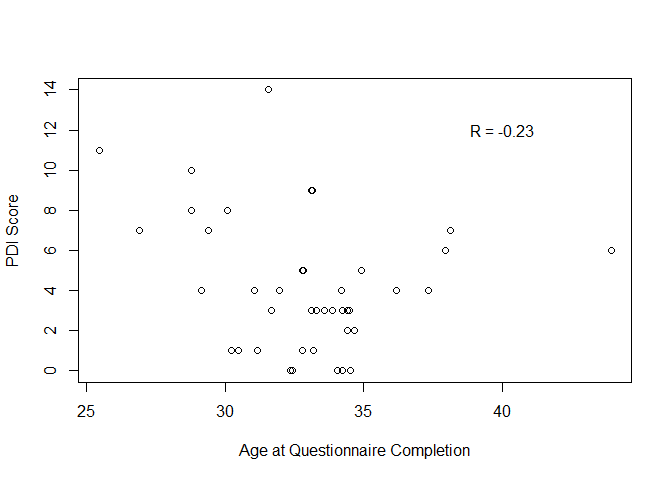

Removing the oldest individual who appears most like an outlier, the correlation strength increases slightly to R = -0.33.

We can also assess whether there is an age effect on D1 receptor BP<sub>ND</sub>

``` r
d1age = cor(pdi_dadb_d1_dlpfc$Age_PET, pdi_dadb_d1_dlpfc$bp)

plot(pdi_dadb_d1_dlpfc$Age_PET, pdi_dadb_d1_dlpfc$bp, 
     ylab = 'DLPFC BP',
     xlab = 'Age at PET Measurement' )
text(32, 0.4,paste0('R = ', round(d1age,2)))
```

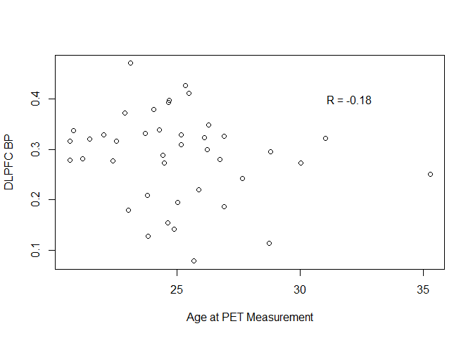

Removing the oldest individual who appears most like an outlier, the correlation strength only changes slightly to R = -0.17.

It is concluded that in our data, we observe the same relationships between both D1 Receptor BP<sub>ND</sub> and PDI, and age. This effect is not dramatic in either group due to the limited age range of individuals examined. However, it is a known effect, and is apparent in our data. In a frequentist analysis, correction for age, given the sample size, would be likely to do more harm than good. However, if we use a Bayesian approach to this issue, we can use information which we already know from previous studies to set informative priors on the effects of age on D1 Receptor BP<sub>ND</sub> as well as on PDI scores such that the values can be corrected, but that the correction is not so volatile to our small sample size.

The model which we would want to define is therefore as follows:

*B**P*<sub>*N**D*</sub> = *β*<sub>1</sub> + *β*<sub>2</sub>*P**E**T**A**g**e*.*c* + *β*<sub>3</sub>*P**E**T**P**D**I*
 where PETPDI represents individuals' PDI score at the time of the PET measurement, and PETAge.c represents the mean age of participants when they completed their PET measurement. In this way, we adjust measured BP<sub>ND</sub> values to make it as if all participants were the same age when they performed their PET measurements. We can define their PDI score at that same age (i.e. the centred age) as follows:

*P**E**T**P**D**I* = *P**D**I* × (1 − *β*<sub>4</sub>*P**D**I**A**g**e*.*c*)

where *β*<sub>4</sub> is the negative yearly change in PDI scores, and PDIAge.c is *P**D**I**A**g**e* − *M**e**a**n**P**E**T**A**g**e*, i.e. it is not centred with respect to its own mean value, but rather to the mean PET age, and thus reflects the correction of PDI scores to the adjusted PET age. In other words, if the mean PET age is 25, but a given participant was 30 at the time of PET, and 35 at the time of PDI completion, their PET score will be increased by 5 years' worth of BP<sub>ND</sub> change, and their PDI score will be adjusted by 10 years' worth of PDI change.

$$\\dot{.\\hspace{.03in}.}\\hspace{.3in} BP\_{ND} = \\beta\_{1} + \\beta\_{2}PETAge.c + \\beta\_{3}PDI - \\beta\_{3}\\beta\_{4}PDIAge.c \\times PDI$$

Relationship between PDI Scores and D1 Receptor BP<sub>ND</sub>
---------------------------------------------------------------

We tested the relationship between D1 Receptor BP<sub>ND</sub> and PDI scores. Our primary region of interest was the DLPFC. Our secondary region of interest is the striatum. Since the frontal cortex, and more specifically the dorsolateral prefrontal cortex, has previously been most related to psychosis, we can use priors derived from the literature and test the relative explanatory value of these different hypotheses.

The data is plotted below:

``` r
pdi_dadb_d1 %>%
  mutate(Region = gsub('DLPFC_46', 'DLPFC', Region)) %>%
  mutate(Region = gsub('gmfslSTR', 'Striatum', Region)) %>%
  ggplot(., aes(x=PDI, y=bp, colour=Age_PET)) + 
  geom_point() +
  ylab(expression(BP[ND])) + xlab('PDI Score') + 
  viridis::scale_color_viridis(begin=0, option = 'B') +
  facet_grid(Region ~ ., scales = 'free_y')
```

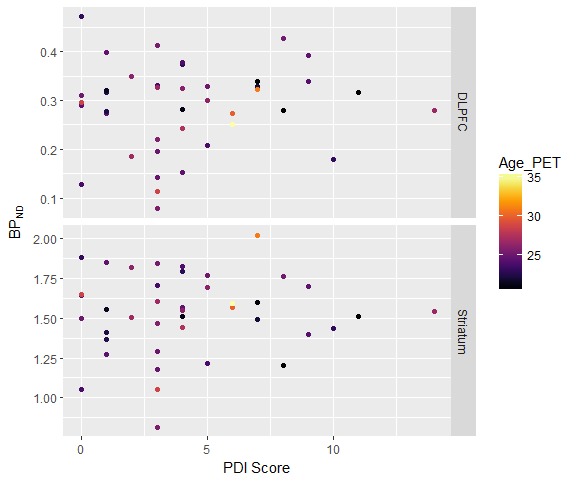

We can specify this model using JAGs. We specify the following models:

-   **DLPFC**
-   TCIPDI prior
-   decrease prior
-   increase prior

-   **Striatum**
-   TCIPDI prior

Variables for the Models
------------------------

``` r
bp_dlpfc <- pdi_dadb_d1$bp[pdi_dadb_d1$Region == 'DLPFC_46']
bp_str <- pdi_dadb_d1$bp[pdi_dadb_d1$Region == 'gmfslSTR']
n = length(pdi_dadb_d1_dlpfc$bp)
Age.c = pdi_dadb_d1_dlpfc$Age_PET - mean(pdi_dadb_d1_dlpfc$Age_PET)
PDI = pdi_dadb_d1_dlpfc$PDI
PDIAge.c = pdi_dadb_d1_dlpfc$Age_PDI - mean(pdi_dadb_d1_dlpfc$Age_PET)

beta2_dlpfc_mean <- mean(bp_dlpfc)*(dlpfc_age_mean)
beta2_dlpfc_sd   <- mean(bp_dlpfc)*(dlpfc_age_sd)

beta4_mean <- pdiyear_mean
beta4_sd   <- pdiyear_sd
```

DLPFC : decrease Model
----------------------

``` r
beta3_decrease_sd <- (0.27*mean(bp_dlpfc))/5


parameters = c('mu', 'sigma', 'beta1', 'beta2', 'beta3', 'beta4')

dlpfc_data = list("bp_dlpfc", "n", "Age.c", "PDI", "PDIAge.c",
                  "beta2_dlpfc_mean", "beta2_dlpfc_sd",
                  "beta3_decrease_sd",
                  "beta4_mean", "beta4_sd")

myinits <- list(
  list(beta1 = runif(1,-5,5),
       beta2 = rnorm(1,beta2_dlpfc_mean,1/beta2_dlpfc_sd^2),
       beta3 = -abs(rnorm(1,0,1/beta3_decrease_sd^2)),
       beta4 = -abs(rnorm(1,beta4_mean,1/beta4_sd^2)),
       sigma = runif(1,0,100)),
  list(beta1 = runif(1,-5,5),
       beta2 = rnorm(1,beta2_dlpfc_mean,1/beta2_dlpfc_sd^2),
       beta3 = -abs(rnorm(1,0,1/beta3_decrease_sd^2)),
       beta4 = -abs(rnorm(1,beta4_mean,1/beta4_sd^2)),
       sigma = runif(1,0,100)),
  list(beta1 = runif(1,-5,5),
       beta2 = rnorm(1,beta2_dlpfc_mean,1/beta2_dlpfc_sd^2),
       beta3 = -abs(rnorm(1,0,1/beta3_decrease_sd^2)),
       beta4 = -abs(rnorm(1,beta4_mean,1/beta4_sd)),
       sigma = runif(1,0,100)))
```

Setting up the model itself:

``` r
DLPFC_decrease_modelstring <- "model{
  
# Data and Likelihood
  for(i in 1:n){
    bp_dlpfc[i] ~ dnorm(mu[i], lambda)
    mu[i] <- beta1 + beta2*Age.c[i] + beta3*PDI[i] - beta3*beta4*PDIAge.c[i]*PDI[i]
  }
  
# Prior for betas
  beta1 ~ dunif( -5 , 5 )
  beta2 ~ dnorm( beta2_dlpfc_mean , pow(beta2_dlpfc_sd, -2) )
  beta3 ~ dnorm( 0 , pow(beta3_decrease_sd, -2))T(,0)
  beta4 ~ dnorm( beta4_mean , pow(beta4_sd, -2) )T(,0)
  
# Prior for the variance
  lambda <- pow(sigma, -2)  
  sigma ~ dunif(0, 100)
}"
```

And now, to run the model:

``` r
DLPFC_decrease_model <- jags(dlpfc_data, inits = myinits, parameters.to.save = parameters,
                 model.file=textConnection(DLPFC_decrease_modelstring), n.chains=3, n.iter=50000, 
         n.burnin=500, DIC=T)
```

    ## module glm loaded

    ## Compiling model graph
    ##    Resolving undeclared variables
    ##    Allocating nodes
    ## Graph information:
    ##    Observed stochastic nodes: 41
    ##    Unobserved stochastic nodes: 5
    ##    Total graph size: 369
    ## 
    ## Initializing model

To check that models fitted correctly, we can visualise the traceplots for each of the beta parameters

``` r
for(i in 1:4) {
  traceplot(DLPFC_decrease_model, varname=paste0('beta',i), ask=F)
}
```

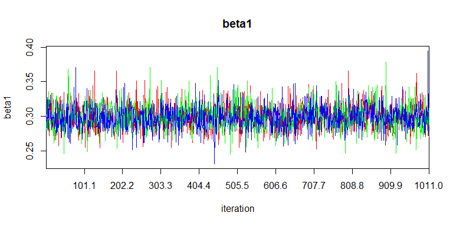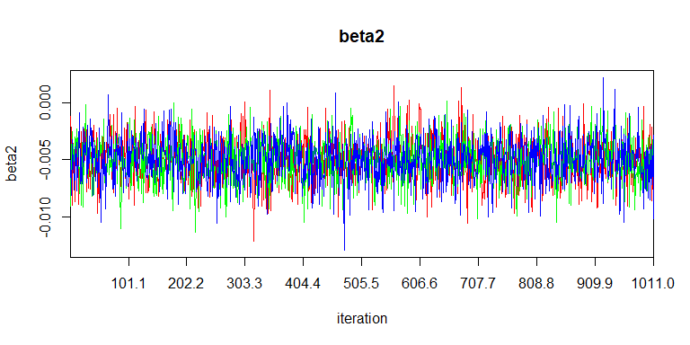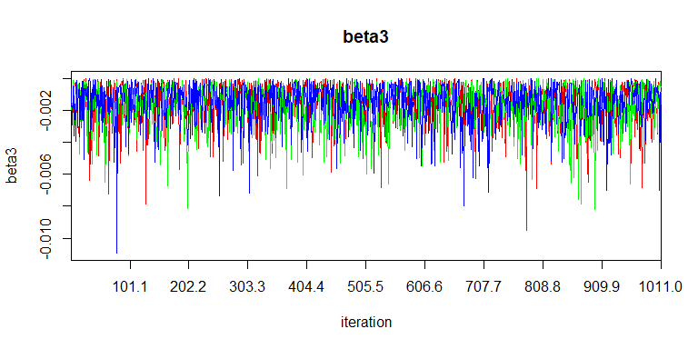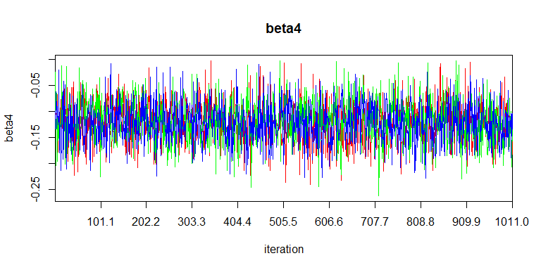

From these, it is concluded that the model performed adequately, as there is no apparent non-stationarity.

Now, we can check the correction parameters, to make sure that posterior estimates seem reasonable

``` r
betas <- data.frame(beta1 = DLPFC_decrease_model$BUGSoutput$sims.list$beta1,
                    beta2 = DLPFC_decrease_model$BUGSoutput$sims.list$beta2,
                    beta3 = DLPFC_decrease_model$BUGSoutput$sims.list$beta3,
                    beta4 = DLPFC_decrease_model$BUGSoutput$sims.list$beta4)

ggplot(betas, aes(x=beta2)) + 
  #geom_density(aes(colour = "Posterior")) +
  geom_histogram(aes(y = ..density.., colour="Posterior"), bins=50, fill="white") +
  stat_function(fun = dnorm, args = list(mean = beta2_dlpfc_mean, sd=beta2_dlpfc_sd), aes(colour='Prior')) +
  geom_vline(xintercept=mean(betas$beta2), linetype = "dashed", size=1) +
  scale_colour_brewer(palette = "Set2") +
  labs(title='Beta2 : Relationship of BP and Years',y='Probability Density')
```

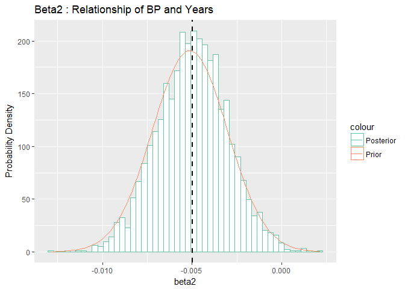

``` r
ggplot(betas, aes(x=beta4)) + 
  geom_histogram(aes(y = ..density.., colour="Posterior"), bins=50, fill="white") +
  stat_function(fun = dnorm, args = list(mean = beta4_mean, sd=beta4_sd), aes(colour='Prior')) +
  geom_vline(xintercept=mean(betas$beta4), linetype = "dashed", size=1) +
  scale_colour_brewer(palette = "Set2") +
  labs(title='Beta4 : Relationship of PDI and Years')
```

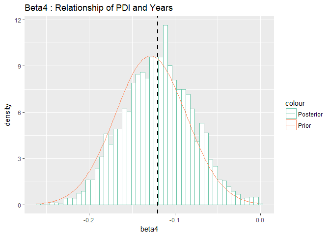

For beta3, the parameter of interest here, we wish to use the Savage Dickey approximation to calculate the Bayes factor.

``` r
fit.posterior <- logspline(betas$beta3, ubound=0)

posterior <- dlogspline(0, fit.posterior) # this gives the pdf at point delta = 0
prior     <- 2*dnorm(0,0,beta3_decrease_sd)
BF01      <- posterior/prior
BF01
```

    ## [1] 10.37175

This means that the null hypothesis is 10.37 times more likely than the alternative hypothesis given the data (and assuming equal prior model odds), that there is an effect of the size specified in the decrease prior, and that the Bayes Factor for the alternative hypothesis is 0.0964

``` r
savagedickey_dlpfc_decrease <- data.frame(
  Values = c(posterior,prior),
  Distribution = c('Posterior', 'Prior'),
  Model = 'Decrease'
)

ggplot(betas, aes(x=beta3)) + 
  geom_histogram(aes(y = ..density.., colour="Posterior"), bins=49, fill="white") +
  stat_function(fun = dtruncnorm, args = list(mean = 0, sd=beta3_decrease_sd,a=-Inf, b=0), aes(colour='Prior')) +
  scale_colour_brewer(palette = "Set2", 'Distribution') +
  xlim(c(-beta3_decrease_sd, 0)) +
  stat_function(fun = dlogspline, args=list(fit=fit.posterior), aes(colour='Posterior')) +
  geom_point(data=savagedickey_dlpfc_decrease, aes(x=0,y=Values, colour=Distribution), size=2) +
  labs(title='Beta3 : Relationship of PDI and BP',
       y='Probability Density') 
```

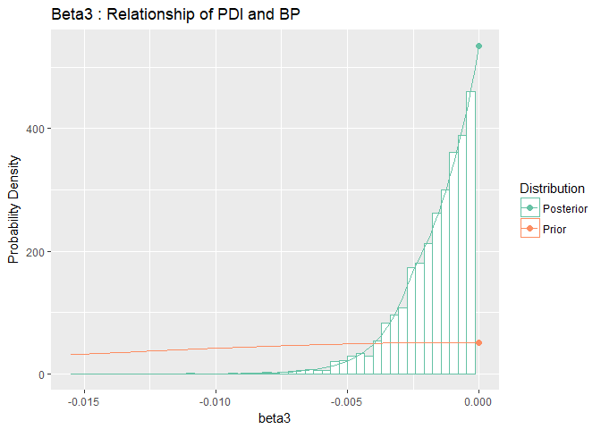

DLPFC : increase Model
----------------------

``` r
beta3_increase_sd <- (0.35*mean(bp_dlpfc))/5


parameters = c('mu', 'sigma', 'beta1', 'beta2', 'beta3', 'beta4')

dlpfc_data = list("bp_dlpfc", "n", "Age.c", "PDI", "PDIAge.c",
                  "beta2_dlpfc_mean", "beta2_dlpfc_sd",
                  "beta3_increase_sd",
                  "beta4_mean", "beta4_sd")

myinits <- list(
  list(beta1 = runif(1,-5,5),
       beta2 = rnorm(1,beta2_dlpfc_mean,1/beta2_dlpfc_sd^2),
       beta3 = -abs(rnorm(1,0,1/beta3_increase_sd^2)),
       beta4 = -abs(rnorm(1,beta4_mean,1/beta4_sd^2)),
       sigma = runif(1,0,100)),
  list(beta1 = runif(1,-5,5),
       beta2 = rnorm(1,beta2_dlpfc_mean,1/beta2_dlpfc_sd^2),
       beta3 = -abs(rnorm(1,0,1/beta3_increase_sd^2)),
       beta4 = -abs(rnorm(1,beta4_mean,1/beta4_sd^2)),
       sigma = runif(1,0,100)),
  list(beta1 = runif(1,-5,5),
       beta2 = rnorm(1,beta2_dlpfc_mean,1/beta2_dlpfc_sd^2),
       beta3 = -abs(rnorm(1,0,1/beta3_increase_sd^2)),
       beta4 = -abs(rnorm(1,beta4_mean,1/beta4_sd^2)),
       sigma = runif(1,0,100)))
```

Setting up the model itself:

``` r
DLPFC_increase_modelstring <- "model{
  
# Data and Likelihood
  for(i in 1:n){
    bp_dlpfc[i] ~ dnorm(mu[i], lambda)
    mu[i] <- beta1 + beta2*Age.c[i] + beta3*PDI[i] - beta3*beta4*PDIAge.c[i]*PDI[i]
  }
  
# Prior for betas
  beta1 ~ dunif( -5 , 5 )
  beta2 ~ dnorm( beta2_dlpfc_mean , pow(beta2_dlpfc_sd, -2) )
  beta3 ~ dnorm( 0 , pow(beta3_increase_sd, -2))T(0,)
  beta4 ~ dnorm( beta4_mean , pow(beta4_sd, -2) )T(,0)
  
# Prior for the variance
  lambda <- pow(sigma, -2)  
  sigma ~ dunif(0, 100)
}"
```

And now, to run the model:

``` r
DLPFC_increase_model <- jags(dlpfc_data, inits = myinits, parameters.to.save = parameters,
                 model.file=textConnection(DLPFC_increase_modelstring), n.chains=3, n.iter=50000, 
         n.burnin=500, DIC=T)
```

    ## Compiling model graph
    ##    Resolving undeclared variables
    ##    Allocating nodes
    ## Graph information:
    ##    Observed stochastic nodes: 41
    ##    Unobserved stochastic nodes: 5
    ##    Total graph size: 369
    ## 
    ## Initializing model

To check that models fitted correctly, we can visualise the traceplots for each of the beta parameters

``` r
for(i in 1:4) {
  traceplot(DLPFC_increase_model, varname=paste0('beta',i), ask=F)
}
```

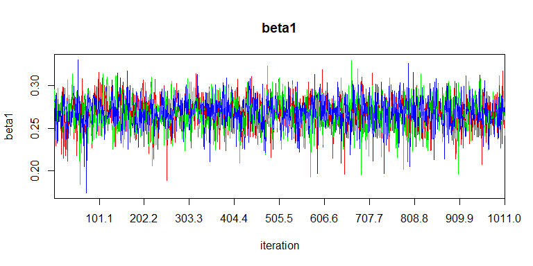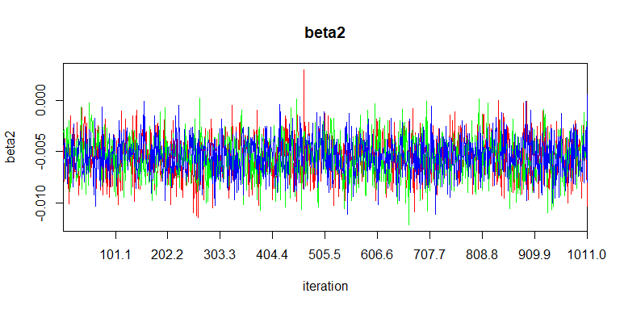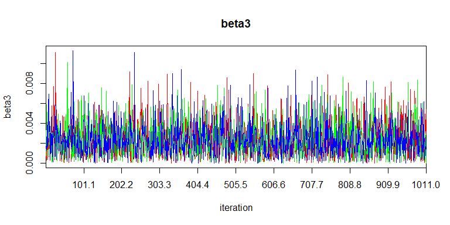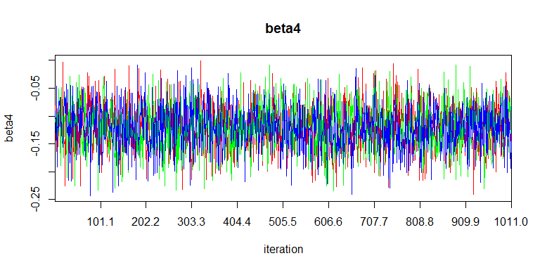

From these, it is concluded that the model performed adequately, as there is no apparent non-stationarity.

Now, we can check the correction parameters, to make sure that posterior estimates seem reasonable

``` r
betas <- data.frame(beta1 = DLPFC_increase_model$BUGSoutput$sims.list$beta1,
                    beta2 = DLPFC_increase_model$BUGSoutput$sims.list$beta2,
                    beta3 = DLPFC_increase_model$BUGSoutput$sims.list$beta3,
                    beta4 = DLPFC_increase_model$BUGSoutput$sims.list$beta4)

ggplot(betas, aes(x=beta2)) + 
  #geom_density(aes(colour = "Posterior")) +
  geom_histogram(aes(y = ..density.., colour="Posterior"), bins=50, fill="white") +
  stat_function(fun = dnorm, args = list(mean = beta2_dlpfc_mean, sd=beta2_dlpfc_sd), aes(colour='Prior')) +
  geom_vline(xintercept=mean(betas$beta2), linetype = "dashed", size=1) +
  scale_colour_brewer(palette = "Set2") +
  labs(title='Beta2 : Relationship of BP and Years',y='Probability Density')
```


``` r
ggplot(betas, aes(x=beta4)) + 
  geom_histogram(aes(y = ..density.., colour="Posterior"), bins=50, fill="white") +
  stat_function(fun = dnorm, args = list(mean = beta4_mean, sd=beta4_sd), aes(colour='Prior')) +
  geom_vline(xintercept=mean(betas$beta4), linetype = "dashed", size=1) +
  scale_colour_brewer(palette = "Set2") +
  labs(title='Beta4 : Relationship of PDI and Years')
```

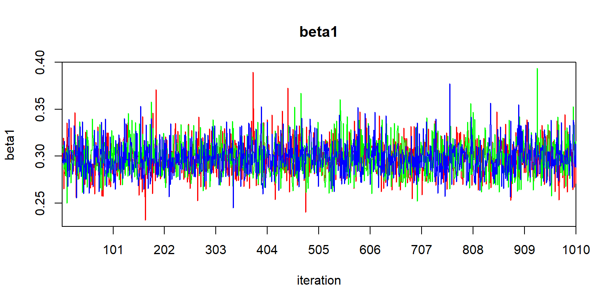

For beta3, the parameter of interest here, we wish to use the Savage Dickey approximation to calculate the Bayes factor.

``` r
fit.posterior <- logspline(betas$beta3, lbound = 0)

posterior <- dlogspline(0, fit.posterior) # this gives the pdf at point delta = 0
prior     <- 2*dnorm(0,0,beta3_increase_sd)
BF01      <- posterior/prior
BF01
```

    ## [1] 6.056305

This means that the null hypothesis is 6.06 times more likely than the alternative hypothesis, given the data, that there is an effect of the size specified in the increase prior, and that the Bayes Factor for the alternative hypothesis is 0.1651

``` r
savagedickey_dlpfc_increase <- data.frame(
  Values = c(posterior,prior),
  Distribution = c('Posterior', 'Prior'),
  Model = 'Increase'
)

ggplot(betas, aes(x=beta3)) + 
  geom_histogram(aes(y = ..density.., colour="Posterior"), bins=50, fill="white") +
  stat_function(fun = dtruncnorm, args = list(mean = 0, sd=beta3_increase_sd,a=0, b=Inf), aes(colour='Prior')) +
  scale_colour_brewer(palette = "Set2", 'Distribution') +
  xlim(c(0,beta3_increase_sd)) +
  stat_function(fun = dlogspline, args=list(fit=fit.posterior), aes(colour='Posterior')) +
  geom_point(data=savagedickey_dlpfc_increase, aes(x=0,y=Values, colour=Distribution), size=2) +
  labs(title='Beta3 : Relationship of PDI and BP',
       y='Probability Density') 
```

    ## Warning: Removed 1 rows containing missing values (geom_bar).

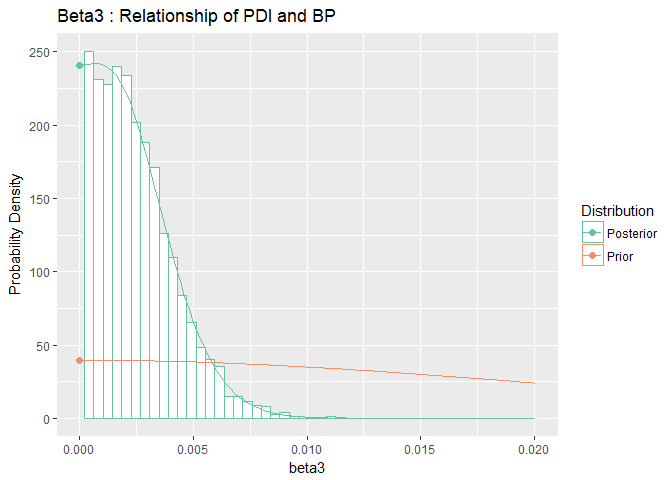

Model Comparison
----------------

Now we wish to compare all of these models

``` r
savagedickeys_dlpfc <- bind_rows(savagedickey_dlpfc_decrease,
                                 savagedickey_dlpfc_increase) %>%
  spread(Distribution, Values)
```

    ## Warning in bind_rows_(x, .id): Unequal factor levels: coercing to character

    ## Warning in bind_rows_(x, .id): binding character and factor vector,
    ## coercing into character vector

    ## Warning in bind_rows_(x, .id): binding character and factor vector,
    ## coercing into character vector

``` r
savagedickeys_dlpfc$BF01 <- savagedickeys_dlpfc$Posterior / savagedickeys_dlpfc$Prior
savagedickeys_dlpfc <- savagedickeys_dlpfc[,c(1,4)]
savagedickeys_dlpfc <- rbind(savagedickeys_dlpfc,
                             c('Null', 1))

modelcompare <- expand.grid(Model = savagedickeys_dlpfc$Model, ModelAgainst=savagedickeys_dlpfc$Model)

for(i in 1:nrow(modelcompare)) {
  modelcompare$BF[i] <- as.numeric(savagedickeys_dlpfc$BF01[savagedickeys_dlpfc$Model==as.character(modelcompare$ModelAgainst[i])]) / 
                        as.numeric(savagedickeys_dlpfc$BF01[savagedickeys_dlpfc$Model==as.character(modelcompare$Model[i])])
}

modelcompare <- spread(modelcompare, ModelAgainst, BF) %>%
  mutate_if(is.numeric, funs(round(.,2)))
pandoc.table(modelcompare)
```

<table style="width:54%;">
<colgroup>
<col width="15%" />
<col width="15%" />
<col width="15%" />
<col width="8%" />
</colgroup>
<thead>
<tr class="header">
<th align="center">Model</th>
<th align="center">Decrease</th>
<th align="center">Increase</th>
<th align="center">Null</th>
</tr>
</thead>
<tbody>
<tr class="odd">
<td align="center">Decrease</td>
<td align="center">1</td>
<td align="center">0.58</td>
<td align="center">0.1</td>
</tr>
<tr class="even">
<td align="center">Increase</td>
<td align="center">1.71</td>
<td align="center">1</td>
<td align="center">0.17</td>
</tr>
<tr class="odd">
<td align="center">Null</td>
<td align="center">10.37</td>
<td align="center">6.06</td>
<td align="center">1</td>
</tr>
</tbody>
</table>

Here we see the Bayes Factor of each model against each other. The null model is the leading model, with medium to strong evidence.

``` r
kable(modelcompare, format='latex', caption = 'Bayes Factors comparing each hypothesis (rows) against each other hypothesis (columns)', booktabs=T)
```

DLPFC: Parameter Estimation
---------------------------

An alternative way by which to have examined this relationship is to use Bayesian parameter estimation. This involves using a prior and the data itself to derive a new estimation of the plausible relationship between BP<sub>ND</sub> and PDI scores. This can be assessed using the same model as above, but using a single prior. Since the null hypothesis is more likely than any of the two alternative hypotheses, the estimate can reasonably be assumed to lie within the bounds of these priors. Thus, I use the widest of the two to define the width of the (un-truncated) normal distribution which will be our regularising prior.

``` r
beta3_parest_sd <- abs(beta3_increase_sd)


parameters = c('mu', 'sigma', 'beta1', 'beta2', 'beta3', 'beta4')

dlpfc_data = list("bp_dlpfc", "n", "Age.c", "PDI", "PDIAge.c",
                  "beta2_dlpfc_mean", "beta2_dlpfc_sd",
                  "beta3_parest_sd",
                  "beta4_mean", "beta4_sd")

myinits <- list(
  list(beta1 = runif(1,-5,5),
       beta2 = rnorm(1,beta2_dlpfc_mean,1/beta2_dlpfc_sd^2),
       beta3 = rnorm(1,0,1/beta3_parest_sd^2),
       beta4 = -abs(rnorm(1,beta4_mean,1/beta4_sd^2)),
       sigma = runif(1,0,100)),
  list(beta1 = runif(1,-5,5),
       beta2 = rnorm(1,beta2_dlpfc_mean,1/beta2_dlpfc_sd^2),
       beta3 = rnorm(1,0,1/beta3_parest_sd^2),
       beta4 = -abs(rnorm(1,beta4_mean,1/beta4_sd^2)),
       sigma = runif(1,0,100)),
  list(beta1 = runif(1,-5,5),
       beta2 = rnorm(1,beta2_dlpfc_mean,1/beta2_dlpfc_sd^2),
       beta3 = rnorm(1,0,1/beta3_parest_sd^2),
       beta4 = -abs(rnorm(1,beta4_mean,1/beta4_sd^2)),
       sigma = runif(1,0,100)))
```

Setting up the model itself:

``` r
DLPFC_parest_modelstring <- "model{
  
# Data and Likelihood
  for(i in 1:n){
    bp_dlpfc[i] ~ dnorm(mu[i], lambda)
    mu[i] <- beta1 + beta2*Age.c[i] + beta3*PDI[i] - beta3*beta4*PDIAge.c[i]*PDI[i]
  }
  
# Prior for betas
  beta1 ~ dunif( -5 , 5 )
  beta2 ~ dnorm( beta2_dlpfc_mean , pow(beta2_dlpfc_sd, -2) )
  beta3 ~ dnorm( 0 , pow(beta3_parest_sd, -2))
  beta4 ~ dnorm( beta4_mean , pow(beta4_sd, -2) )T(,0)
  
# Prior for the variance
  lambda <- pow(sigma, -2)  
  sigma ~ dunif(0, 100)
}"
```

And now, to run the model:

``` r
DLPFC_parest_model <- jags(dlpfc_data, inits = myinits, parameters.to.save = parameters,
                 model.file=textConnection(DLPFC_parest_modelstring), n.chains=3, n.iter=50000, 
         n.burnin=500, n.thin=2)
```

    ## Compiling model graph
    ##    Resolving undeclared variables
    ##    Allocating nodes
    ## Graph information:
    ##    Observed stochastic nodes: 41
    ##    Unobserved stochastic nodes: 5
    ##    Total graph size: 368
    ## 
    ## Initializing model

To check that models fitted correctly, we can visualise the traceplots for each of the beta parameters

``` r
for(i in 1:4) {
  traceplot(DLPFC_parest_model, varname=paste0('beta',i), ask=F)
}
```

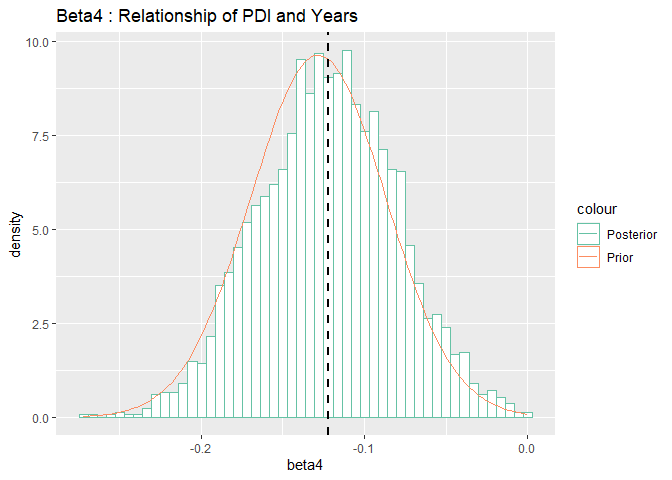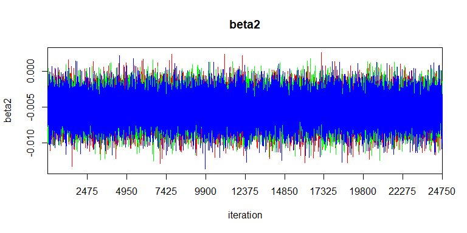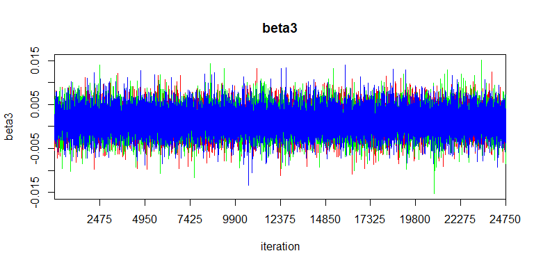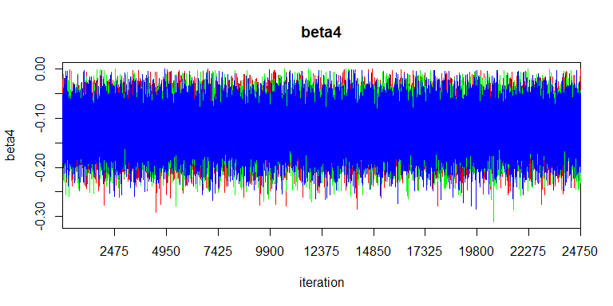

From these, it is concluded that the model performed adequately, as there is no apparent non-stationarity.

Now, we can check the correction parameters, to make sure that posterior estimates seem reasonable

``` r
betas <- data.frame(beta1 = DLPFC_parest_model$BUGSoutput$sims.list$beta1,
                    beta2 = DLPFC_parest_model$BUGSoutput$sims.list$beta2,
                    beta3 = DLPFC_parest_model$BUGSoutput$sims.list$beta3,
                    beta4 = DLPFC_parest_model$BUGSoutput$sims.list$beta4)

ggplot(betas, aes(x=beta2)) + 
  #geom_density(aes(colour = "Posterior")) +
  geom_histogram(aes(y = ..density.., colour="Posterior"), bins=50, fill="white") +
  stat_function(fun = dnorm, args = list(mean = beta2_dlpfc_mean, sd=beta2_dlpfc_sd), aes(colour='Prior')) +
  geom_vline(xintercept=mean(betas$beta2), linetype = "dashed", size=1) +
  scale_colour_brewer(palette = "Set2") +
  labs(title='Beta2 : Relationship of BP and Years',y='Probability Density')
```

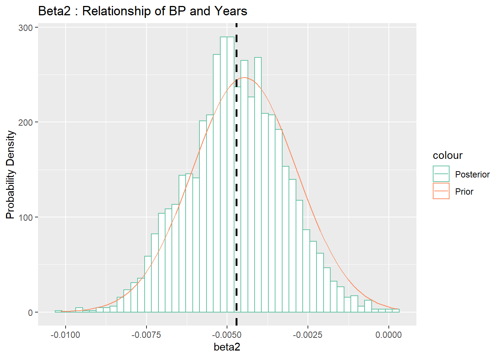

``` r
ggplot(betas, aes(x=beta4)) + 
  geom_histogram(aes(y = ..density.., colour="Posterior"), bins=50, fill="white") +
  geom_line(aes(y = ..density.., colour="Posterior"), size=2, stat="density") +
  geom_line(aes(y = ..density..), colour="white", size=1, stat="density") +
  stat_function(fun = dnorm, args = list(mean = beta4_mean, sd=beta4_sd), aes(colour='Prior'), size=2) +
  stat_function(fun = dnorm, args = list(mean = beta4_mean, sd=beta4_sd), color="white", size=1) +
  geom_vline(xintercept=mean(betas$beta4), linetype = "dashed", size=1) +
  # scale_colour_brewer(palette = "Set2") +
  scale_colour_viridis(begin=0,direction=1, end=0.66, discrete=T, 'Distribution') +
  labs(title='Beta4 : Relationship of PDI and Years')
```

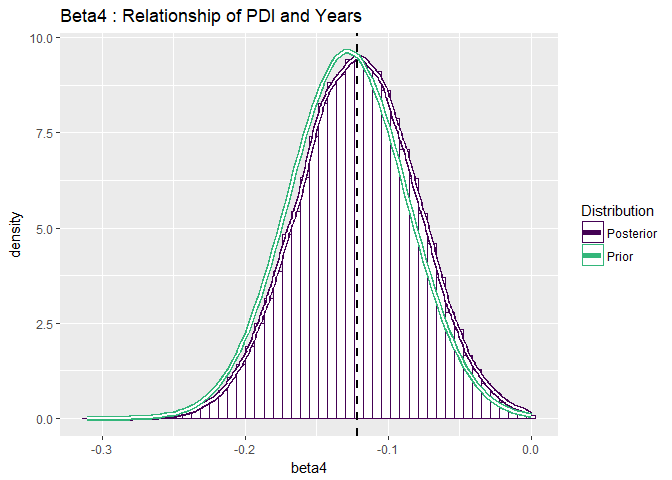

We will save the details of these posteriors for the covariates to use as priors in Substudy 6

``` r
( beta2_dlpfc_mean_update <- mean(betas$beta2) / mean(bp_dlpfc) )
```

    ## [1] -0.01845661

``` r
( beta2_dlpfc_sd_update <- sd(betas$beta2) / mean(bp_dlpfc) )
```

    ## [1] 0.006724269

``` r
( beta4_dlpfc_mean_update <- mean(betas$beta4) )
```

    ## [1] -0.1215563

``` r
( beta4_dlpfc_sd_update <- sd(betas$beta4) )
```

    ## [1] 0.04132569

For beta3, the parameter of interest here, our estimate is as follows:

``` r
beta3_parestplot <- ggplot(betas, aes(x=beta3)) + 
  geom_histogram(aes(y = ..density.., colour="Posterior"), bins=50, fill="white") +
  stat_function(fun = dnorm, args = list(mean = 0, sd=beta3_parest_sd), aes(colour='Prior')) +
  geom_vline(xintercept=mean(betas$beta3), linetype = "dashed", size=1) +
  scale_colour_brewer(palette = "Set2", "Colour") +
  lims(x=c(-beta3_parest_sd, beta3_parest_sd)) +
  labs(title='Beta3 : Relationship of PDI and Binding Potential') +
  theme_bw() +
  labs(y='Density',
       x='Parameter Value')

beta3_parestplot
```

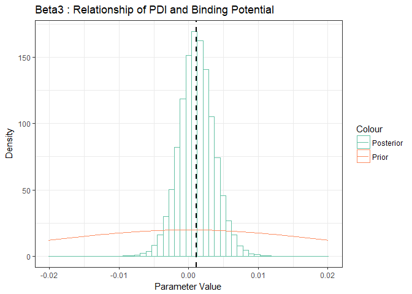

``` r
library(MCMCvis)

dlpfc_parest_summary <- as.data.frame(MCMCvis::MCMCsummary(DLPFC_parest_model, params = c('beta1', 'beta2', 'beta3', 'beta4'), digits=3))
```

### Publication Figure

``` r
scatter_parest_dlpfc <- pdi_dadb_d1 %>%
  filter(Region=='DLPFC_46') %>%
  mutate(Region = gsub('DLPFC_46', 'DLPFC', Region)) %>%
  ggplot(., aes(x=PDI, y=bp, fill=Age_PET)) + 
  #geom_point() +
  geom_point(shape = 21, colour = "black", size = 3) +
  labs(y=expression(BP[ND]), x='PDI Score') + 
  viridis::scale_fill_viridis('Age at \nPET\n') +
  theme_bw() + labs(title=bquote('Relationship between PDI Scores and DLPFC' ~ BP[ND])) +
  theme(plot.title = element_text(hjust = 0.5))

beta2_parest <- distroplot_norm(DLPFC_parest_model, 'beta2', 'beta2_dlpfc_mean', 'beta2_dlpfc_sd') + 
  guides(color=F) +
  labs(title=expression(paste('Beta2 (',BP[ND] ,' ~ Age)'))) + 
  theme_bw() +
   theme(plot.title = element_text(hjust = 0.5),
         axis.title.y=element_blank()) +
  guides(colour=FALSE)
beta3_parest <- distroplot_norm(DLPFC_parest_model, 'beta3', 0, 'beta3_parest_sd', nbin=80) + 
   labs(title=expression(paste('Beta3 (',BP[ND] ,' ~ PDI)'))) + 
   theme_bw() +
   theme(plot.title = element_text(hjust = 0.5))
beta4_parest <- distroplot_norm(DLPFC_parest_model, 'beta4', 'beta4_mean', 'beta4_sd') + 
  guides(color=F) +
  labs(title=expression(paste('Beta4 (','PDI',' ~ Age)'))) + 
   theme_bw() +
  theme(plot.title = element_text(hjust = 0.5),
        axis.title.y=element_blank()) +
  guides(colour=FALSE)


mid_l <- cowplot::align_plots(plotlist = list(scatter_parest_dlpfc, beta2_parest, 
                                              beta3_parest), align='v', axis='l')
mid_r <- cowplot::align_plots(plotlist = list(scatter_parest_dlpfc, beta4_parest + 
                                                guides(colour=FALSE),
                                              beta3_parest), align='v', axis='r')
midrow <- cowplot::plot_grid(mid_l[[2]], mid_r[[2]], rel_widths = c(0.9,1.1))

plots <- cowplot::align_plots(plotlist = list(scatter_parest_dlpfc, midrow, beta3_parest), align='v', axis='lr')


study5_dlpfc <- cowplot::plot_grid(plots[[1]], midrow, plots[[3]], ncol=1, rel_heights = c(5, 2, 4))

print(study5_dlpfc)
```

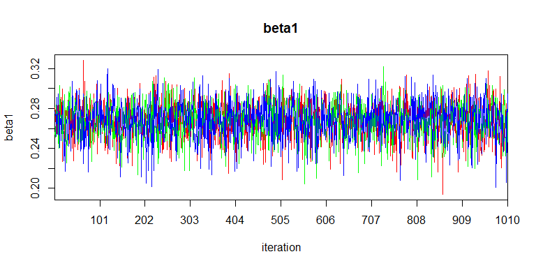

``` r
ggsave(study5_dlpfc,
  filename = '../Figures/Study5_parest_dlpfc.jpg', width = 7, height=11, dpi=600)
```

``` r
mean_dlpfc_beta3_parest <- mean(betas$beta3)
credint_dlpfc_beta3_parest <- coda::HPDinterval(coda::as.mcmc(betas$beta3), prob=0.95)
sd_dlpfc_beta3_parest <- sd(betas$beta3)

mean_beta4_parest <- mean(betas$beta4)
sd_beta4_parest <- sd(betas$beta4)
```

STR: Decrease Model
-------------------

For the striatum, we must use different priors both over beta3, but also of beta2: the relationship of BP<sub>ND</sub> with age.

``` r
beta2_str_mean <- mean(bp_str)*(str_age_mean)
beta2_str_sd   <- mean(bp_str)*(str_age_sd)

beta3_decreasestr_sd <- (0.209*mean(bp_str))/5

parameters = c('mu', 'sigma', 'beta1', 'beta2', 'beta3', 'beta4')

str_data = list("bp_str", "n", "Age.c", "PDI", "PDIAge.c",
                  "beta2_str_mean", "beta2_str_sd",
                  "beta3_decreasestr_sd",
                  "beta4_mean", "beta4_sd")

myinits <- list(
  list(beta1 = runif(1,-5,5),
       beta2 = rnorm(1,beta2_str_mean,1/beta2_str_sd^2),
       beta3 = -abs(rnorm(1,0,1/beta3_decreasestr_sd^2)),
       beta4 = -abs(rnorm(1,beta4_mean,1/beta4_sd^2)),
       sigma = runif(1,0,100)),
  list(beta1 = runif(1,-5,5),
       beta2 = rnorm(1,beta2_str_mean,1/beta2_str_sd^2),
       beta3 = -abs(rnorm(1,0,1/beta3_decreasestr_sd^2)),
       beta4 = -abs(rnorm(1,beta4_mean,1/beta4_sd^2)),
       sigma = runif(1,0,100)),
  list(beta1 = runif(1,-5,5),
       beta2 = rnorm(1,beta2_str_mean,1/beta2_str_sd^2),
       beta3 = -abs(rnorm(1,0,1/beta3_decreasestr_sd^2)),
       beta4 = -abs(rnorm(1,beta4_mean,1/beta4_sd^2)),
       sigma = runif(1,0,100)))
```

Setting up the model itself:

``` r
STR_TCIPDI_modelstring <- "model{
  
# Data and Likelihood
  for(i in 1:n){
    bp_str[i] ~ dnorm(mu[i], lambda)
    mu[i] <- beta1 + beta2*Age.c[i] + beta3*PDI[i] - beta3*beta4*PDIAge.c[i]*PDI[i]
  }
  
# Prior for betas
  beta1 ~ dunif( -5 , 5 )
  beta2 ~ dnorm( beta2_str_mean , pow(beta2_str_sd, -2) )
  beta3 ~ dnorm( 0 , pow(beta3_decreasestr_sd, -2))T(,0)
  beta4 ~ dnorm( beta4_mean , pow(beta4_sd, -2) )T(,0)
  
# Prior for the variance
  lambda <- pow(sigma, -2)  
  sigma ~ dunif(0, 100)
}"
```

And now, to run the model:

``` r
STR_TCIPDI_model <- jags(str_data, inits = myinits, parameters.to.save = parameters,
                 model.file=textConnection(STR_TCIPDI_modelstring), n.chains=3, n.iter=50000, 
         n.burnin=500, DIC=T)
```

    ## Compiling model graph
    ##    Resolving undeclared variables
    ##    Allocating nodes
    ## Graph information:
    ##    Observed stochastic nodes: 41
    ##    Unobserved stochastic nodes: 5
    ##    Total graph size: 369
    ## 
    ## Initializing model

To check that models fitted correctly, we can visualise the traceplots for each of the beta parameters

``` r
for(i in 1:4) {
  traceplot(STR_TCIPDI_model, varname=paste0('beta',i), ask=F)
}
```

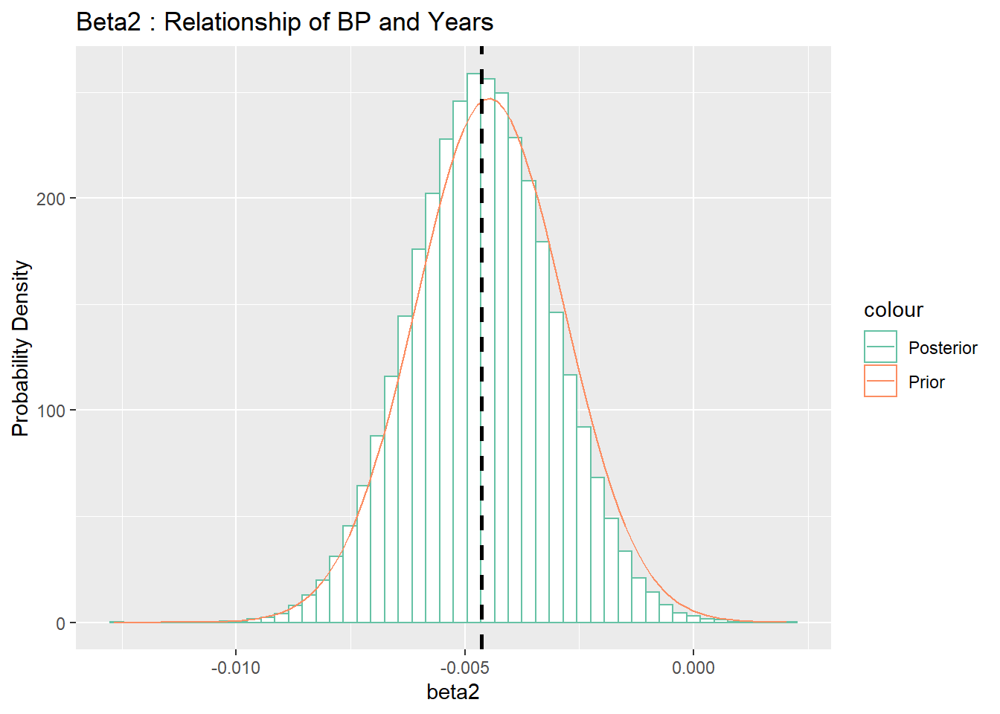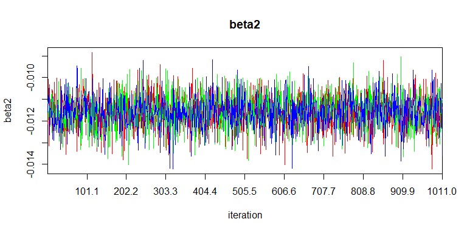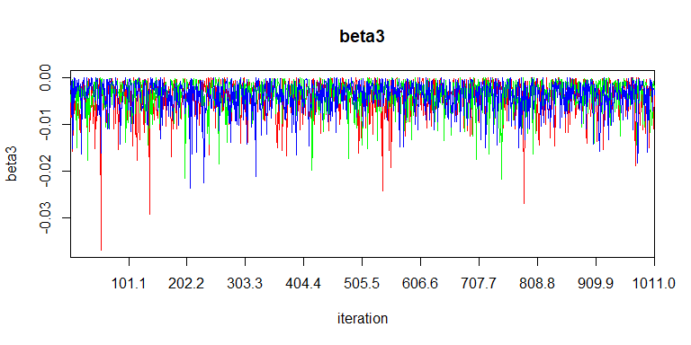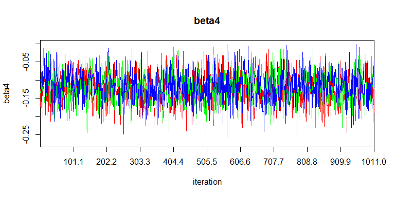

From these, it is concluded that the model performed adequately, as there is no apparent non-stationarity.

Now, we can check the correction parameters, to make sure that posterior estimates seem reasonable

``` r
betas <- data.frame(beta1 = STR_TCIPDI_model$BUGSoutput$sims.list$beta1,
                    beta2 = STR_TCIPDI_model$BUGSoutput$sims.list$beta2,
                    beta3 = STR_TCIPDI_model$BUGSoutput$sims.list$beta3,
                    beta4 = STR_TCIPDI_model$BUGSoutput$sims.list$beta4)

ggplot(betas, aes(x=beta2)) + 
  #geom_density(aes(colour = "Posterior")) +
  geom_histogram(aes(y = ..density.., colour="Posterior"), bins=50, fill="white") +
  stat_function(fun = dnorm, args = list(mean = beta2_str_mean, sd=beta2_str_sd), aes(colour='Prior')) +
  geom_vline(xintercept=mean(betas$beta2), linetype = "dashed", size=1) +
  scale_colour_brewer(palette = "Set2") +
  labs(title='Beta2 : Relationship of BP and Years',y='Probability Density')
```

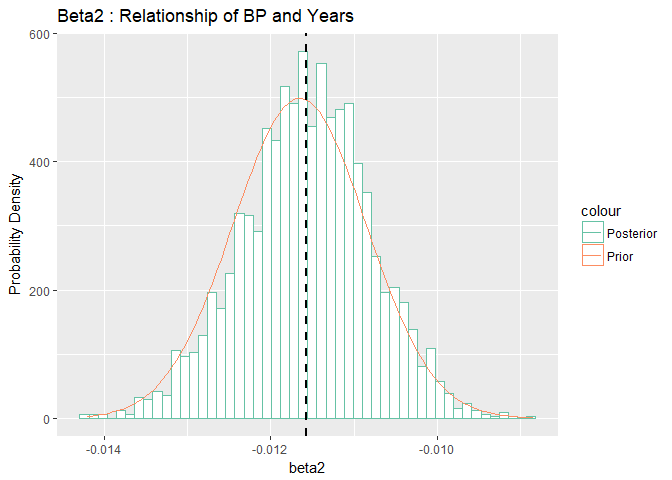

``` r
ggplot(betas, aes(x=beta4)) + 
  geom_histogram(aes(y = ..density.., colour="Posterior"), bins=50, fill="white") +
  stat_function(fun = dnorm, args = list(mean = beta4_mean, sd=beta4_sd), aes(colour='Prior')) +
  geom_vline(xintercept=mean(betas$beta4), linetype = "dashed", size=1) +
  scale_colour_brewer(palette = "Set2") +
  labs(title='Beta4 : Relationship of PDI and Years')
```

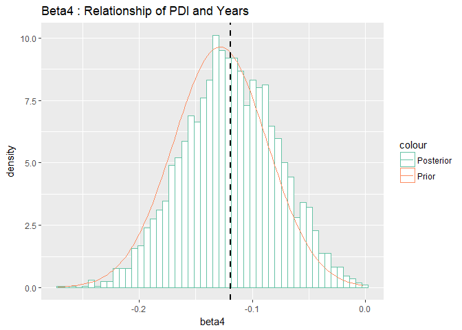

For beta3, the parameter of interest here, we wish to use the Savage Dickey approximation to calculate the Bayes factor.

``` r
fit.posterior <- logspline(betas$beta3, ubound=0)

posterior <- dlogspline(0, fit.posterior) # this gives the pdf at point delta = 0
prior     <- 2*dnorm(0,0,beta3_decreasestr_sd)
BF01      <- posterior/prior
BF01
```

    ## [1] 17.94151

This means that the null hypothesis is 17.94 times more likely than the alternative hypothesis, that there is an effect of the size specified in the decrease prior, and that the Bayes Factor for the alternative hypothesis is 0.0557

``` r
savagedickey_str_decrease <- data.frame(
  Values = c(posterior,prior),
  Distribution = c('Posterior', 'Prior'),
  Model = 'TCIPDI-Striatum'
)

ggplot(betas, aes(x=beta3)) + 
  geom_histogram(aes(y = ..density.., colour="Posterior"), bins=49, fill="white") +
  stat_function(fun = dtruncnorm, args = list(mean = 0, sd=beta3_decreasestr_sd,a=-Inf, b=0), aes(colour='Prior')) +
  scale_colour_brewer(palette = "Set2", 'Distribution') +
  xlim(c(-beta3_decreasestr_sd, 0)) +
  stat_function(fun = dlogspline, args=list(fit=fit.posterior), aes(colour='Posterior')) +
  geom_point(data=savagedickey_str_decrease, aes(x=0,y=Values, colour=Distribution), size=2) +
  labs(title='Beta3 : Relationship of PDI and BP',
       y='Probability Density') 
```

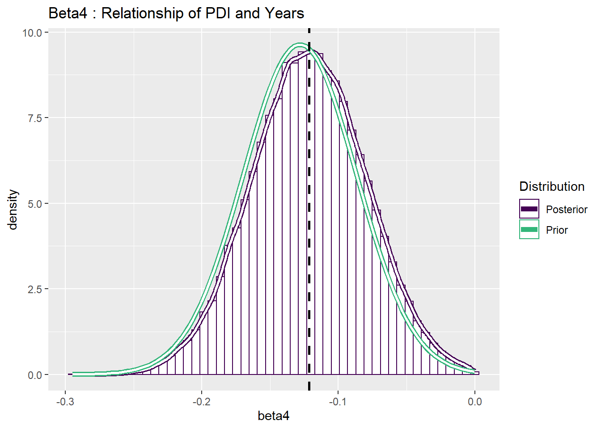

STR: Parameter Estimation
-------------------------

This is a similar procedure as for the DLPFC. Here we again use the same prior width as for the decrease comparison

``` r
beta3_pareststr_sd <- (0.209*mean(bp_str))/5

str_data = list("bp_str", "n", "Age.c", "PDI", "PDIAge.c",
                  "beta2_str_mean", "beta2_str_sd",
                  "beta3_pareststr_sd",
                  "beta4_mean", "beta4_sd")

myinits <- list(
  list(beta1 = runif(1,-5,5),
       beta2 = rnorm(1,beta2_str_mean,1/beta2_str_sd^2),
       beta3 = rnorm(1,0,1/beta3_decreasestr_sd^2),
       beta4 = -abs(rnorm(1,beta4_mean,1/beta4_sd^2)),
       sigma = runif(1,0,100)),
  list(beta1 = runif(1,-5,5),
       beta2 = rnorm(1,beta2_str_mean,1/beta2_str_sd^2),
       beta3 = rnorm(1,0,1/beta3_decreasestr_sd^2),
       beta4 = -abs(rnorm(1,beta4_mean,1/beta4_sd^2)),
       sigma = runif(1,0,100)),
  list(beta1 = runif(1,-5,5),
       beta2 = rnorm(1,beta2_str_mean,1/beta2_str_sd^2),
       beta3 = rnorm(1,0,1/beta3_decreasestr_sd^2),
       beta4 = -abs(rnorm(1,beta4_mean,1/beta4_sd^2)),
       sigma = runif(1,0,100)))
```

Setting up the model itself:

``` r
STR_parest_modelstring <- "model{
  
# Data and Likelihood
  for(i in 1:n){
    bp_str[i] ~ dnorm(mu[i], lambda)
    mu[i] <- beta1 + beta2*Age.c[i] + beta3*PDI[i] - beta3*beta4*PDIAge.c[i]*PDI[i]
  }
  
# Prior for betas
  beta1 ~ dunif( -5 , 5 )
  beta2 ~ dnorm( beta2_str_mean , pow(beta2_str_sd, -2) )
  beta3 ~ dnorm( 0 , pow(beta3_pareststr_sd, -2))
  beta4 ~ dnorm( beta4_mean , pow(beta4_sd, -2) )T(,0)
  
# Prior for the variance
  lambda <- pow(sigma, -2)  
  sigma ~ dunif(0, 100)
}"
```

And now, to run the model:

``` r
STR_parest_model <- jags(str_data, inits = myinits, parameters.to.save = parameters,
                 model.file=textConnection(STR_parest_modelstring), n.chains=3, n.iter=50000, 
         n.burnin=500, n.thin=2)
```

    ## Compiling model graph
    ##    Resolving undeclared variables
    ##    Allocating nodes
    ## Graph information:
    ##    Observed stochastic nodes: 41
    ##    Unobserved stochastic nodes: 5
    ##    Total graph size: 368
    ## 
    ## Initializing model

To check that models fitted correctly, we can visualise the traceplots for each of the beta parameters

``` r
for(i in 1:4) {
  traceplot(STR_parest_model, varname=paste0('beta',i), ask=F)
}
```

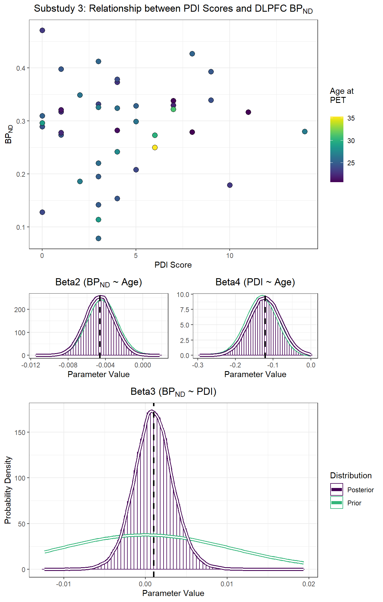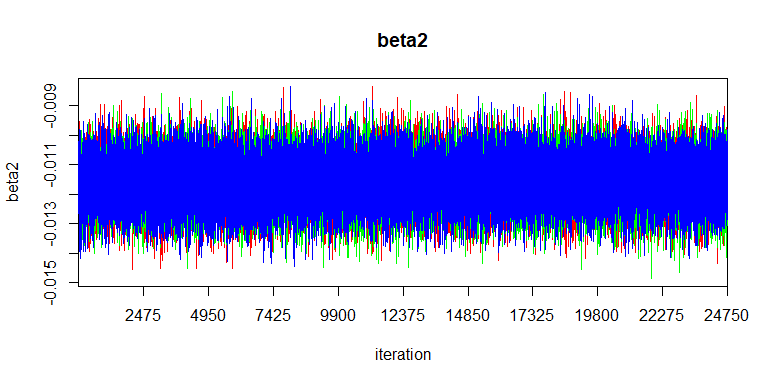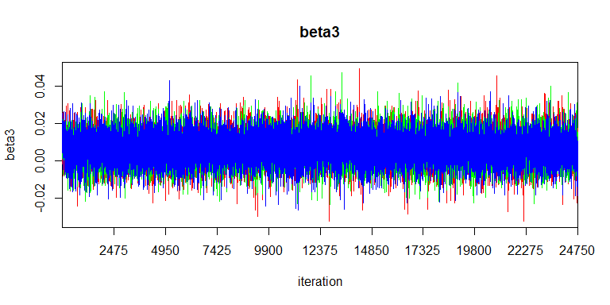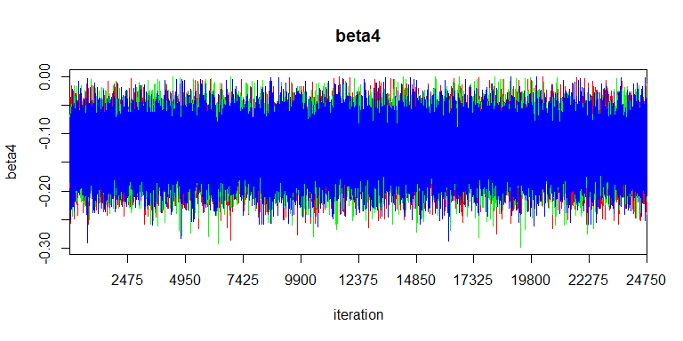

From these, it is concluded that the model performed adequately, as there is no apparent non-stationarity.

Now, we can check the correction parameters, to make sure that posterior estimates seem reasonable

``` r
betas <- data.frame(beta1 = STR_parest_model$BUGSoutput$sims.list$beta1,
                    beta2 = STR_parest_model$BUGSoutput$sims.list$beta2,
                    beta3 = STR_parest_model$BUGSoutput$sims.list$beta3,
                    beta4 = STR_parest_model$BUGSoutput$sims.list$beta4)

ggplot(betas, aes(x=beta2)) + 
  #geom_density(aes(colour = "Posterior")) +
  geom_histogram(aes(y = ..density.., colour="Posterior"), bins=50, fill="white") +
  stat_function(fun = dnorm, args = list(mean = beta2_str_mean, sd=beta2_str_sd), aes(colour='Prior')) +
  geom_vline(xintercept=mean(betas$beta2), linetype = "dashed", size=1) +
  scale_colour_brewer(palette = "Set2") +
  labs(title='Beta2 : Relationship of BP and Years',y='Probability Density')
```

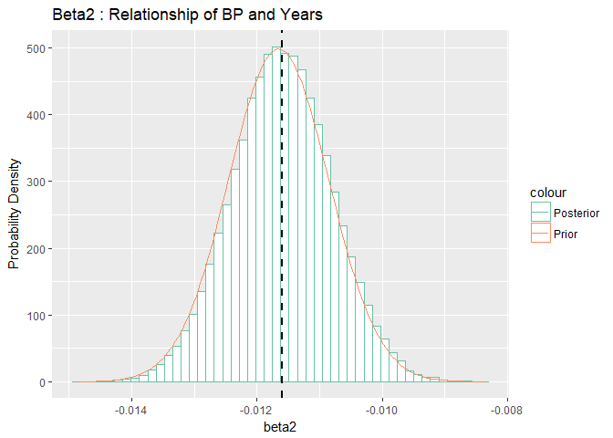

``` r
ggplot(betas, aes(x=beta4)) + 
  geom_histogram(aes(y = ..density.., colour="Posterior"), bins=50, fill="white") +
  stat_function(fun = dnorm, args = list(mean = beta4_mean, sd=beta4_sd), aes(colour='Prior')) +
  geom_vline(xintercept=mean(betas$beta4), linetype = "dashed", size=1) +
  scale_colour_brewer(palette = "Set2") +
  labs(title='Beta4 : Relationship of PDI and Years')
```

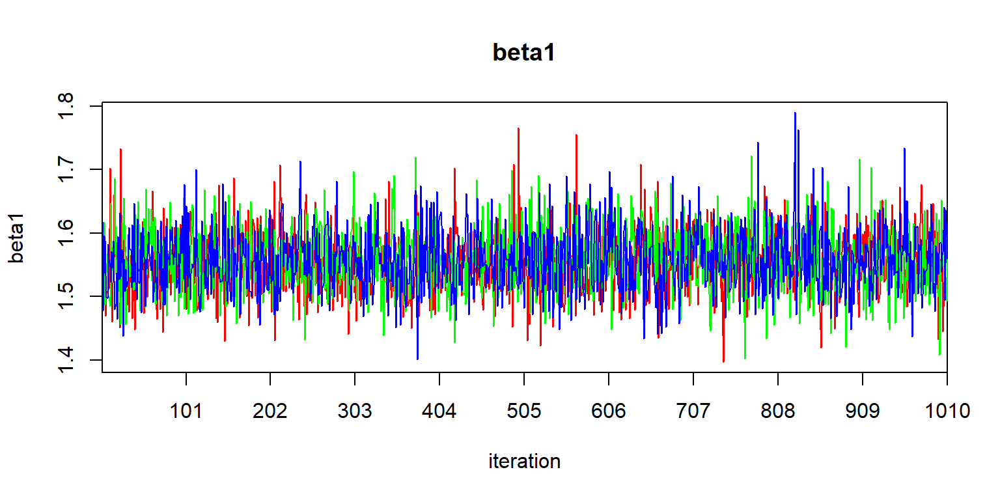

### Publication Figure

``` r
scatter_parest_str <- pdi_dadb_d1 %>%
  filter(Region=='gmfslSTR') %>%
  mutate(Region = gsub('gmfslSTR', 'Striatum', Region)) %>%
  ggplot(., aes(x=PDI, y=bp, fill=Age_PET)) + 
  #geom_point() +
  geom_point(shape = 21, colour = "black", size = 3) +
  labs(y=expression(BP[ND]), x='PDI Score') + 
  viridis::scale_fill_viridis('Age at \nPET\n') +
  theme_bw() + labs(title=bquote('Relationship between PDI Scores and Striatal' ~ BP[ND])) +
  theme(plot.title = element_text(hjust = 0.5))

beta2_parest_str <- distroplot_norm(STR_parest_model, 'beta2', 'beta2_str_mean', 'beta2_str_sd') + 
  guides(color=F) +
  labs(title=expression(paste('Beta3 (',BP[ND] ,' ~ PDI)'))) + 
   theme_bw() +
   theme(plot.title = element_text(hjust = 0.5),
         axis.title.y=element_blank()) +
  guides(colour=FALSE)
beta3_parest <- distroplot_norm(STR_parest_model, 'beta3', 0, 'beta3_pareststr_sd', nbin=80) + 
  labs(title=expression(paste('Beta3 (',BP[ND] ,' ~ PDI)'))) + 
   theme_bw() +
   theme(plot.title = element_text(hjust = 0.5))
beta4_parest <- distroplot_norm(STR_parest_model, 'beta4', 'beta4_mean', 'beta4_sd') + 
  guides(color=F) +
  labs(title=expression(paste('Beta4 (','PDI',' ~ Age)'))) + 
   theme_bw() +
  theme(plot.title = element_text(hjust = 0.5),
        axis.title.y=element_blank()) +
  guides(colour=FALSE)

# grid.arrange(scatter_parest_str, 
#              beta2_parest, 
#              beta4_parest, 
#              beta3_parest, 
#              layout_matrix = rbind(c(1,1), c(2,3), c(4,4)), 
#              widths=c(1,1), heights=c(2,1,2))
# 
# ggsave(
#   grid.arrange(scatter_parest_str, 
#              beta2_parest, 
#              beta4_parest, 
#              beta3_parest, 
#              layout_matrix = rbind(c(1,1), c(2,3), c(4,4)), 
#              widths=c(1,1), heights=c(2,1,2)),
#   filename = '../Figures/Study5_parest_str.jpg', width = 7, height=11, dpi=600)

mid_l <- cowplot::align_plots(plotlist = list(scatter_parest_str, beta2_parest, 
                                              beta3_parest), align='v', axis='l')
mid_r <- cowplot::align_plots(plotlist = list(scatter_parest_str, beta4_parest + 
                                                guides(colour=FALSE),
                                              beta3_parest), align='v', axis='r')
midrow <- cowplot::plot_grid(mid_l[[2]], mid_r[[2]], rel_widths = c(0.9,1.1))

plots <- cowplot::align_plots(plotlist = list(scatter_parest_str, midrow, beta3_parest), align='v', axis='lr')


study5_str <- cowplot::plot_grid(plots[[1]], midrow, plots[[3]], ncol=1, rel_heights = c(5, 2, 4))

print(study5_str)
```

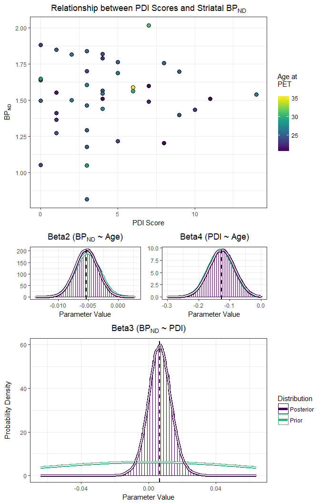

``` r
ggsave(study5_str,
  filename = '../Figures/Study5_parest_str.jpg', width = 7, height=11, dpi=600)
```

For beta3, the parameter of interest here, our estimate is as follows:

``` r
ggplot(betas, aes(x=beta3)) + 
  geom_histogram(aes(y = ..density.., colour="Posterior"), bins=50, fill="white") +
  stat_function(fun = dnorm, args = list(mean = 0, sd=beta3_pareststr_sd), aes(colour='Prior')) +
  geom_vline(xintercept=mean(betas$beta3), linetype = "dashed", size=1) +
  scale_colour_brewer(palette = "Set2") +
  lims(x=c(-beta3_pareststr_sd, beta3_pareststr_sd)) +
  labs(title='Beta3 : Relationship of PDI and BP')
```

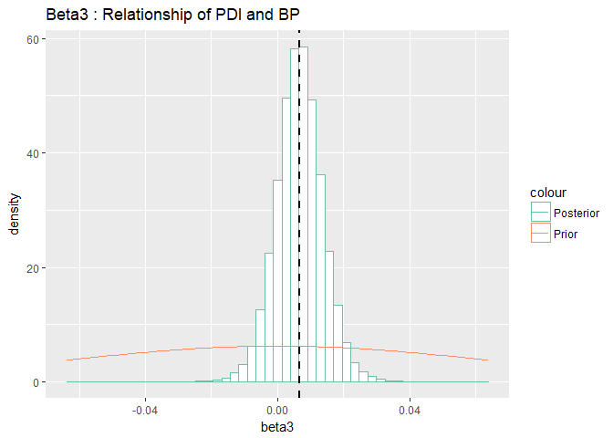

``` r
mean_str_beta3_parest <- mean(betas$beta3)
credint_str_beta3_parest <- coda::HPDinterval(coda::as.mcmc(betas$beta3), prob=0.95)
sd_str_beta3_parest <- sd(betas$beta3)
```

``` r
str_parest_summary <- as.data.frame(MCMCvis::MCMCsummary(STR_parest_model, params = c('beta1', 'beta2', 'beta3', 'beta4'), digits=3))
```

Publication Parameter Estimation Summary
----------------------------------------

``` r
parest_summary <- bind_rows(rownames_to_column(dlpfc_parest_summary), rownames_to_column(str_parest_summary)) %>%
  select(Parameter=rowname, Mean=mean, SD=sd, everything(), -`50%`) %>%
  mutate(Parameter = stringr::str_to_title(Parameter))

kable(parest_summary)
```

| Parameter |    Mean|     SD|    2.5%|   97.5%|  Rhat|
|:----------|-------:|------:|-------:|-------:|-----:|
| Beta1     |   0.278|  0.024|   0.230|   0.325|     1|
| Beta2     |  -0.005|  0.002|  -0.009|  -0.002|     1|
| Beta3     |   0.001|  0.003|  -0.004|   0.006|     1|
| Beta4     |  -0.122|  0.041|  -0.203|  -0.041|     1|
| Beta1     |   1.473|  0.069|   1.336|   1.610|     1|
| Beta2     |  -0.012|  0.001|  -0.013|  -0.010|     1|
| Beta3     |   0.007|  0.007|  -0.007|   0.021|     1|
| Beta4     |  -0.126|  0.041|  -0.206|  -0.046|     1|

``` r
parest_summarytable <- kable(parest_summary, format='latex', caption='Posterior summaries of unstandardised coefficients from parameter estimation regression models', booktab=T) %>%
  group_rows('DLPFC', 1,4) %>%
  group_rows('Striatum', 5,8)
```

### DLPFC

``` r
dlpfc_parest_accsummary <- as.data.frame(MCMCvis::MCMCsummary(DLPFC_parest_model, params = c('beta1', 'beta2', 'beta3', 'beta4'), digits=10))
str_parest_accsummary <- as.data.frame(MCMCvis::MCMCsummary(STR_parest_model, params = c('beta1', 'beta2', 'beta3', 'beta4')), digits=10)
```

Correspondingly, a change of five points on the PDI is associated with a change of 2% (-6.5 - 10.9% 95% Credible Interval), and the change across the entire scale of 21 items corresponds with a change of 8.5% (-27.5 - 45.8% Credible Interval)

### STR

Correspondingly, a change of five points on the PDI is associated with a change of 3.3% (-3.3 - 6.5% 95% Credible Interval), and the change across the entire scale of 21 items corresponds with a change of 13.8% (-13.8 - 27.5% Credible Interval)

Substudy 4: Bayesian estimation of the relationship between D1 Receptor BP<sub>ND</sub> and PDI scores
======================================================================================================

The findings in the previous study of the relationship between PDI scores and D1 receptor BP<sub>ND</sub> supported the null hypothesis when using priors to represent the effects which we might have expected from previous studies. This suggests that these hypotheses are unlikely given our data. Use of Bayes Factors comprises a model selection procedure, which, in this case supported a point null hypothesis of their being absolutely no effect in comparison to the other hypotheses.

Using a parameter estimation procedure, we can use the final dataset to obtain a posterior distribution reflecting the probability of parameter values given the data reflecting the strength of relationship between PDI scores and D1 receptor binding. Future studies of this phenomenon can then use this posterior as the prior for their investigations.

We can build on the parameter estimation performed in study 5, and use that posterior as the prior for this study.

``` r
(d1spdi_priormean <- mean_dlpfc_beta3_parest )
```

    ## [1] 0.001154109

``` r
(d1spdi_priorwidth <- sd_dlpfc_beta3_parest )
```

    ## [1] 0.00250815

``` r
(beta4_mean <- mean_beta4_parest )
```

    ## [1] -0.1215563

``` r
(beta4_width <- sd_beta4_parest )
```

    ## [1] 0.04132569

We cannot simply use this value without knowing whether the mean BP<sub>ND</sub> differs between the two samples

``` r
compareStudies <- alldata %>%
  filter(!is.na(bp), PETNo==1, Region=='DLPFC_46') %>%
  filter(Age >= 20 & Age <=35) %>%
  filter(Sex=='male')
  

ggplot(compareStudies, aes(y=bp, x=Study, colour=Study, fill=Study)) +
    geom_violin(alpha=0.5) +
    geom_point() +
    labs(y='BP',
         title='Binding Potential Distribution by Study') +
    expand_limits(y=0) + 
    stat_summary(fun.y = "mean", colour = "black", size = 2, geom = "point", shape=21)
```

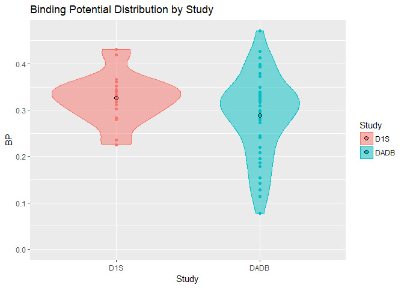

There appears to be a difference between the binding potential of the two studies. I therefore scale this prior width to the new mean.

``` r
t.test(formula=bp~Study, data=compareStudies)
```

    ## 
    ##  Welch Two Sample t-test
    ## 
    ## data:  bp by Study
    ## t = 2.0782, df = 57.787, p-value = 0.04214
    ## alternative hypothesis: true difference in means is not equal to 0
    ## 95 percent confidence interval:
    ##  0.001337395 0.071499248
    ## sample estimates:
    ##  mean in group D1S mean in group DADB 
    ##          0.3254798          0.2890614

``` r
studymeans <- compareStudies %>%
  group_by(Study) %>%
  summarise(bp=mean(bp))

meanratio <- studymeans$bp[studymeans$Study=='D1S'] /
                studymeans$bp[studymeans$Study=='DADB']

priormean_d1spdi <- d1spdi_priormean * meanratio
priorwidth_d1spdi <- d1spdi_priorwidth * meanratio
```

First, I will check that the PDI is sufficiently reliable within this sample

``` r
pdi_d1s <- alldata %>%
  filter(!is.na(bp), PETNo==1, Region=='DLPFC_46') %>%
  filter(Study=='D1S', !is.na(PDI)) %>% 
  filter(SubjName != 'ivhe')    # missing second page of answers

pdi_d1s_answers <- pdi_d1s %>%
  select(starts_with('PDI_Q'))

(pdi_d1s_reliability <- alpha(pdi_d1s_answers))
```

    ## Warning in alpha(pdi_d1s_answers): Item = PDI_Q2 had no variance and was
    ## deleted

    ## Warning in alpha(pdi_d1s_answers): Item = PDI_Q12 had no variance and was
    ## deleted

    ## Warning in alpha(pdi_d1s_answers): Item = PDI_Q19 had no variance and was
    ## deleted

    ## Warning in cor.smooth(r): Matrix was not positive definite, smoothing was
    ## done

    ## Warning in alpha(pdi_d1s_answers): Some items were negatively correlated with the total scale and probably 
    ## should be reversed.  
    ## To do this, run the function again with the 'check.keys=TRUE' option

    ## Some items ( PDI_Q4 PDI_Q11 PDI_Q15 PDI_Q16 PDI_Q17 PDI_Q18 ) were negatively correlated with the total scale and 
    ## probably should be reversed.  
    ## To do this, run the function again with the 'check.keys=TRUE' option

    ## Warning in cor.smooth(R): Matrix was not positive definite, smoothing was
    ## done

    ## Warning in cor.smooth(R): Matrix was not positive definite, smoothing was
    ## done

    ## Warning in cor.smooth(R): Matrix was not positive definite, smoothing was
    ## done

    ## Warning in cor.smooth(R): Matrix was not positive definite, smoothing was
    ## done

    ## Warning in cor.smooth(R): Matrix was not positive definite, smoothing was
    ## done

    ## Warning in cor.smooth(R): Matrix was not positive definite, smoothing was
    ## done

    ## Warning in cor.smooth(R): Matrix was not positive definite, smoothing was
    ## done

    ## Warning in cor.smooth(R): Matrix was not positive definite, smoothing was
    ## done

    ## Warning in cor.smooth(R): Matrix was not positive definite, smoothing was
    ## done

    ## Warning in cor.smooth(R): Matrix was not positive definite, smoothing was
    ## done

    ## Warning in cor.smooth(R): Matrix was not positive definite, smoothing was
    ## done

    ## Warning in cor.smooth(R): Matrix was not positive definite, smoothing was
    ## done

    ## Warning in cor.smooth(R): Matrix was not positive definite, smoothing was
    ## done

    ## Warning in cor.smooth(R): Matrix was not positive definite, smoothing was
    ## done

    ## Warning in cor.smooth(R): Matrix was not positive definite, smoothing was
    ## done

    ## Warning in cor.smooth(R): Matrix was not positive definite, smoothing was
    ## done

    ## Warning in cor.smooth(R): Matrix was not positive definite, smoothing was
    ## done

    ## Warning in cor.smooth(R): Matrix was not positive definite, smoothing was
    ## done

    ## Warning in cor.smooth(R): Matrix was not positive definite, smoothing was
    ## done

    ## Warning in cor.smooth(R): Matrix was not positive definite, smoothing was
    ## done

    ## 
    ## Reliability analysis   
    ## Call: alpha(x = pdi_d1s_answers)
    ## 
    ##   raw_alpha std.alpha G6(smc) average_r S/N ase mean   sd
    ##       0.68      0.64    0.95      0.09 1.8 0.1 0.18 0.14
    ## 
    ##  lower alpha upper     95% confidence boundaries
    ## 0.48 0.68 0.87 
    ## 
    ##  Reliability if an item is dropped:
    ##         raw_alpha std.alpha G6(smc) average_r S/N alpha se
    ## PDI_Q1       0.63      0.60    0.95     0.081 1.5    0.118
    ## PDI_Q3       0.65      0.61    0.94     0.085 1.6    0.111
    ## PDI_Q4       0.69      0.65    0.94     0.099 1.9    0.097
    ## PDI_Q5       0.68      0.65    0.94     0.100 1.9    0.100
    ## PDI_Q6       0.67      0.64    0.94     0.094 1.8    0.102
    ## PDI_Q7       0.63      0.60    0.94     0.080 1.5    0.117
    ## PDI_Q8       0.67      0.62    0.93     0.087 1.6    0.103
    ## PDI_Q9       0.66      0.61    0.92     0.085 1.6    0.106
    ## PDI_Q10      0.66      0.62    0.94     0.089 1.7    0.106
    ## PDI_Q11      0.69      0.67    0.94     0.106 2.0    0.096
    ## PDI_Q13      0.66      0.62    0.93     0.086 1.6    0.107
    ## PDI_Q14      0.66      0.62    0.94     0.088 1.6    0.106
    ## PDI_Q15      0.66      0.61    0.94     0.085 1.6    0.105
    ## PDI_Q16      0.70      0.65    0.95     0.098 1.8    0.090
    ## PDI_Q17      0.69      0.66    0.94     0.104 2.0    0.098
    ## PDI_Q18      0.69      0.66    0.94     0.102 1.9    0.097
    ## PDI_Q20      0.62      0.58    0.94     0.075 1.4    0.117
    ## PDI_Q21      0.65      0.60    0.94     0.082 1.5    0.108
    ## 
    ##  Item statistics 
    ##          n  raw.r std.r r.cor r.drop mean   sd
    ## PDI_Q1  20  0.638 0.569 0.530  0.494 0.55 0.51
    ## PDI_Q3  20  0.547 0.489 0.461  0.390 0.35 0.49
    ## PDI_Q4  20  0.162 0.198 0.171  0.041 0.10 0.31
    ## PDI_Q5  20  0.158 0.172 0.177  0.070 0.05 0.22
    ## PDI_Q6  20  0.346 0.308 0.283  0.210 0.15 0.37
    ## PDI_Q7  20  0.638 0.588 0.565  0.494 0.55 0.51
    ## PDI_Q8  20  0.364 0.432 0.444  0.252 0.10 0.31
    ## PDI_Q9  20  0.459 0.473 0.476  0.334 0.15 0.37
    ## PDI_Q10 20  0.432 0.409 0.401  0.325 0.10 0.31
    ## PDI_Q11 20 -0.028 0.051 0.052 -0.115 0.05 0.22
    ## PDI_Q13 20  0.459 0.463 0.476  0.334 0.15 0.37
    ## PDI_Q14 20  0.432 0.426 0.438  0.325 0.10 0.31
    ## PDI_Q15 20  0.459 0.473 0.459  0.334 0.15 0.37
    ## PDI_Q16 20  0.256 0.220 0.171  0.057 0.45 0.51
    ## PDI_Q17 20  0.065 0.101 0.084 -0.023 0.05 0.22
    ## PDI_Q18 20  0.065 0.146 0.127 -0.023 0.05 0.22
    ## PDI_Q20 20  0.685 0.690 0.709  0.596 0.15 0.37
    ## PDI_Q21 20  0.529 0.544 0.558  0.461 0.05 0.22
    ## 
    ## Non missing response frequency for each item
    ##            0    1 miss
    ## PDI_Q1  0.45 0.55    0
    ## PDI_Q3  0.65 0.35    0
    ## PDI_Q4  0.90 0.10    0
    ## PDI_Q5  0.95 0.05    0
    ## PDI_Q6  0.85 0.15    0
    ## PDI_Q7  0.45 0.55    0
    ## PDI_Q8  0.90 0.10    0
    ## PDI_Q9  0.85 0.15    0
    ## PDI_Q10 0.90 0.10    0
    ## PDI_Q11 0.95 0.05    0
    ## PDI_Q13 0.85 0.15    0
    ## PDI_Q14 0.90 0.10    0
    ## PDI_Q15 0.85 0.15    0
    ## PDI_Q16 0.55 0.45    0
    ## PDI_Q17 0.95 0.05    0
    ## PDI_Q18 0.95 0.05    0
    ## PDI_Q20 0.85 0.15    0
    ## PDI_Q21 0.95 0.05    0

We observe a Cronbach's *α* of 0.68. This is not particularly good, but useable. This means that we can proceed with this study.

And now to define everything for the model. Note that since everyone completed their PDI questionnaires within two weeks of their PET measurement, PDIAge.c is considered to be equal to PETAge.c. The model definition is thus as follows:

*B**P*<sub>*N**D*</sub> = *β*<sub>1</sub> + *β*<sub>2</sub>*P**E**T**A**g**e*.*c* + *β*<sub>3</sub>*P**D**I* − *β*<sub>3</sub>*β*<sub>4</sub>*P**E**T**A**g**e*.*c* × *P**D**I*

``` r
bp_dlpfc <- pdi_d1s$bp
n = nrow(pdi_d1s)
Age.c = pdi_d1s$Age - mean(pdi_d1s$Age)
PDI = pdi_d1s$PDI

beta2_dlpfc_mean <- mean(bp_dlpfc)*(beta2_dlpfc_mean_update)
beta2_dlpfc_sd   <- mean(bp_dlpfc)*(beta2_dlpfc_sd_update)

beta3_pdi_mean <- priormean_d1spdi
beta3_pdi_sd <- abs(priorwidth_d1spdi)

beta3_pdi_mean <- priormean_d1spdi
beta3_pdi_sd <- abs(priorwidth_d1spdi)

beta4_mean <- beta4_mean
beta4_sd   <- beta4_sd

parameters = c('mu', 'sigma', 'beta1', 'beta2', 'beta3', 'beta4')

dlpfc_data = list("bp_dlpfc", "n", "Age.c", "PDI",
                  "beta2_dlpfc_mean", "beta2_dlpfc_sd",
                  "beta3_pdi_mean", "beta3_pdi_sd",
                  "beta4_mean", "beta4_sd")

myinits <- list(
  list(beta1 = runif(1,-5,5),
       beta2 = rnorm(1,beta2_dlpfc_mean,1/beta2_dlpfc_sd^2),
       beta3 = rnorm(1,beta3_pdi_mean,1/beta3_pdi_sd^2),
       beta4 = rnorm(1,beta4_mean,1/beta4_sd^2),
       sigma = runif(1,0,100)),
  list(beta1 = runif(1,-5,5),
       beta2 = rnorm(1,beta2_dlpfc_mean,1/beta2_dlpfc_sd^2),
       beta3 = rnorm(1,beta3_pdi_mean,1/beta3_pdi_sd^2),
       beta4 = rnorm(1,beta4_mean,1/beta4_sd^2),
       sigma = runif(1,0,100)),
  list(beta1 = runif(1,-5,5),
       beta2 = rnorm(1,beta2_dlpfc_mean,1/beta2_dlpfc_sd^2),
       beta3 = rnorm(1,beta3_pdi_mean,1/beta3_pdi_sd^2),
       beta4 = rnorm(1,beta4_mean,1/beta4_sd^2),
       sigma = runif(1,0,100)))
```

Setting up the model itself:

``` r
DLPFC_D1SPDI_modelstring <- "model{
  
# Data and Likelihood
  for(i in 1:n){
    bp_dlpfc[i] ~ dnorm(mu[i], lambda)
    mu[i] <- beta1 + beta2*Age.c[i] + beta3*PDI[i] - beta3*beta4*Age.c[i]*PDI[i]
  }
  
# Prior for betas
  beta1 ~ dunif( -5 , 5 )
  beta2 ~ dnorm( beta2_dlpfc_mean , pow(beta2_dlpfc_sd, -2) )
  beta3 ~ dnorm( beta3_pdi_mean , pow(beta3_pdi_sd, -2))
  beta4 ~ dnorm( beta4_mean , pow(beta4_sd, -2) )T(,0)
  
# Prior for the variance
  lambda <- pow(sigma, -2)  
  sigma ~ dunif(0, 100)
}"
```

And now, to run the model:

``` r
DLPFC_D1SPDI_model <- jags(dlpfc_data, inits = myinits, parameters.to.save = parameters,
                 model.file=textConnection(DLPFC_D1SPDI_modelstring), n.chains=3, n.iter=50000, 
         n.burnin=500, DIC=T, n.thin = 2)
```

    ## Compiling model graph
    ##    Resolving undeclared variables
    ##    Allocating nodes
    ## Graph information:
    ##    Observed stochastic nodes: 20
    ##    Unobserved stochastic nodes: 5
    ##    Total graph size: 174
    ## 
    ## Initializing model

To check that models fitted correctly, we can visualise the traceplots for each of the beta parameters

``` r
for(i in 1:3) {
  traceplot(DLPFC_D1SPDI_model, varname=paste0('beta',i), ask=F)
}
```

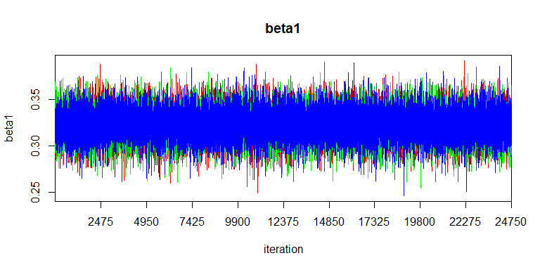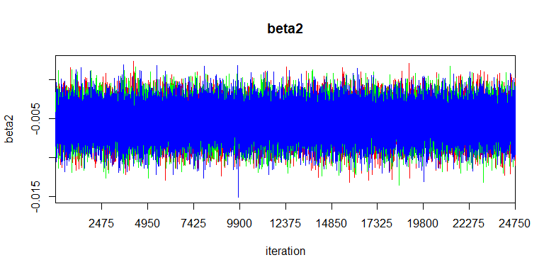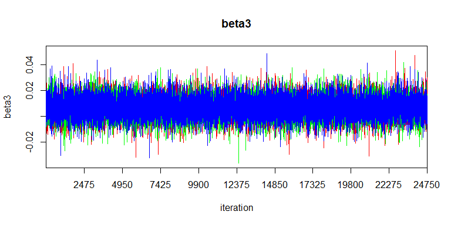

From these, it is concluded that the model performed adequately, as there is no apparent non-stationarity.

Now, we can check the correction for age, to make sure that posterior estimates seem reasonable

``` r
betas <- data.frame(beta1 = DLPFC_D1SPDI_model$BUGSoutput$sims.list$beta1,
                    beta2 = DLPFC_D1SPDI_model$BUGSoutput$sims.list$beta2,
                    beta3 = DLPFC_D1SPDI_model$BUGSoutput$sims.list$beta3,
                    beta4 = DLPFC_D1SPDI_model$BUGSoutput$sims.list$beta4)

ggplot(betas, aes(x=beta2)) + 
  #geom_density(aes(colour = "Posterior")) +
  geom_histogram(aes(y = ..density.., colour="Posterior"), bins=50, fill="white") +
  stat_function(fun = dnorm, args = list(mean = beta2_dlpfc_mean, sd=beta2_dlpfc_sd), aes(colour='Prior')) +
  geom_vline(xintercept=mean(betas$beta2), linetype = "dashed", size=1) +
  scale_colour_brewer(palette = "Set2") +
  labs(title='Beta2 : Relationship of BP and Years',y='Probability Density')
```

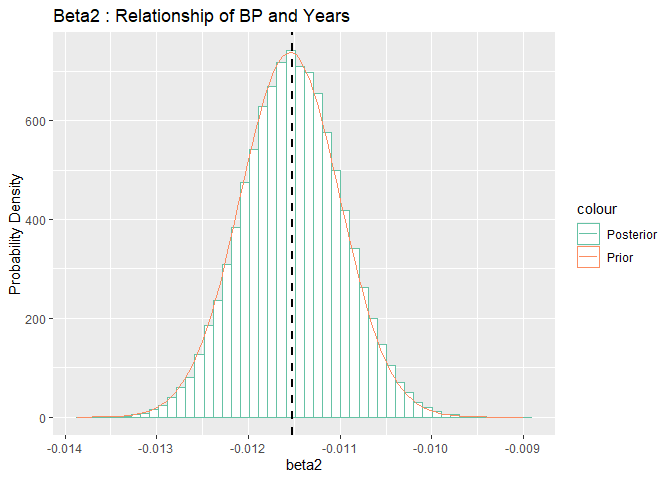

Next, we can check the posterior predictive distribution to visualise the estimated coefficient for beta4: the relationship of PDI scores and age in this group of individuals.

``` r
ggplot(betas, aes(x=beta4)) + 
  #geom_density(aes(colour = "Posterior")) +
  geom_histogram(aes(y = ..density.., colour="Posterior"), bins=50, fill="white") +
  stat_function(fun = dnorm, args = list(mean = beta4_mean, sd=beta4_sd), aes(colour='Prior')) +
  geom_vline(xintercept=mean(betas$beta4), linetype = "dashed", size=1) +
  scale_colour_brewer(palette = "Set2") +
  labs(title='Beta4: Relationship of PDI Scores and Years',y='Probability Density')
```

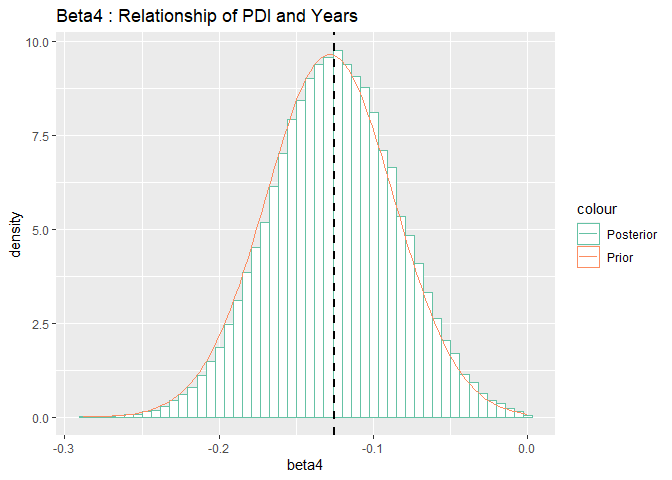

Finally, we can check the posterior predictive distribution to visualise the estimated coefficient for beta3: the relationship of BP<sub>ND</sub> and PDI scores in this group of individuals.

``` r
ggplot(betas, aes(x=beta3)) + 
  #geom_density(aes(colour = "Posterior")) +
  geom_histogram(aes(y = ..density.., colour="Posterior"), bins=50, fill="white") +
  stat_function(fun = dnorm, args = list(mean = beta3_pdi_mean, sd=beta3_pdi_sd), aes(colour='Prior')) +
  geom_vline(xintercept=mean(betas$beta3), linetype = "dashed", size=1) +
  scale_colour_brewer(palette = "Set2", ' ') +
  expand_limits(x=c(-beta3_pdi_sd, beta3_pdi_sd)) +
  labs(title=expression(paste("Beta3 : Relationship of ", BP[ND]," and PDI Scores",sep="")),
       y = 'Probability Density')
```

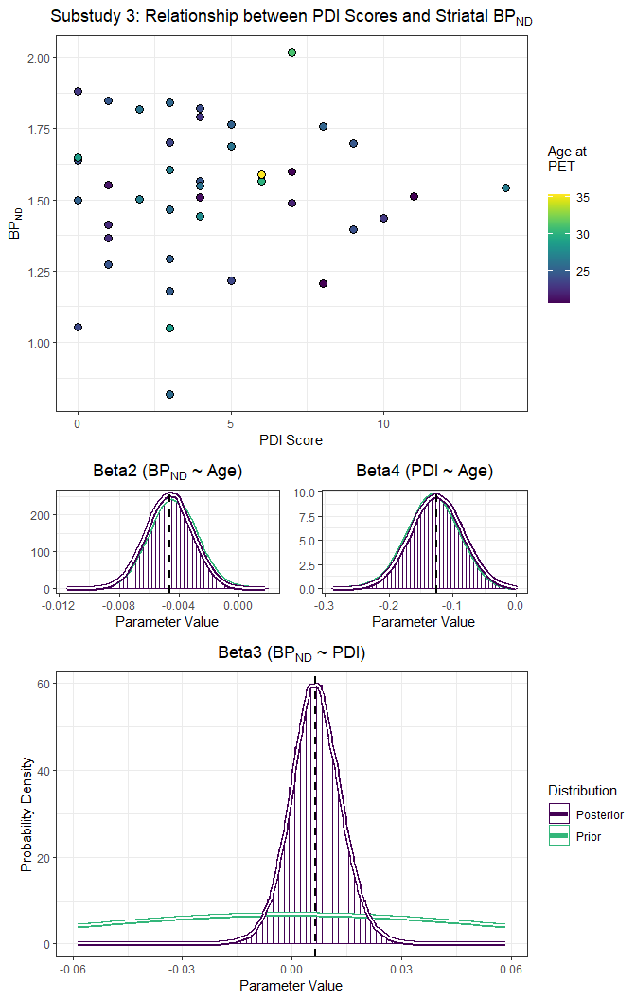

``` r
bayesplot::mcmc_combo(as.mcmc(DLPFC_D1SPDI_model, ), regex_pars='beta')
```

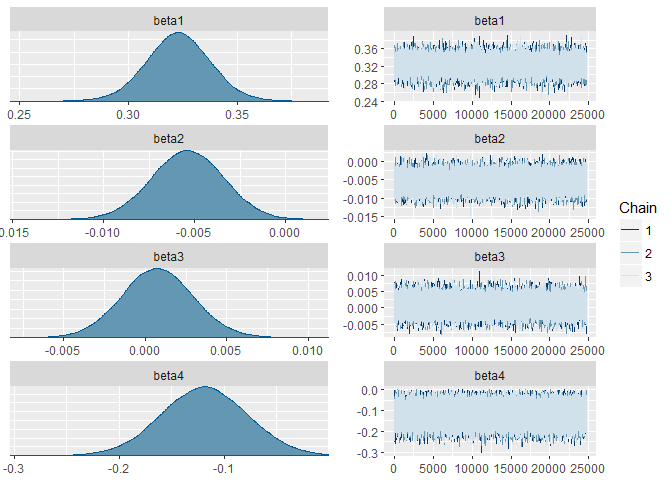

``` r
(mean_dlpfc_beta3_parest <- mean(betas$beta3))
```

    ## [1] 0.0007493616

``` r
(credint_dlpfc_beta3_parest <- coda::HPDinterval(coda::as.mcmc(betas$beta3), prob=0.89))
```

    ##             lower       upper
    ## var1 -0.002860677 0.004188361
    ## attr(,"Probability")
    ## [1] 0.8899933

``` r
(sd_dlpfc_beta3_parest <- sd(betas$beta3))
```

    ## [1] 0.002203843

From this, we can see that the new data has shifted the near-zero association from the previous study even closer towards zero. According to our data, there is a 63.2% chance that the relationship of DLPFC BP<sub>ND</sub> is positive, and a 36.8% chance that it is negative.

We can also visualise the relationship between these BP<sub>ND</sub>, age and PDI scores.

``` r
ggplot(pdi_d1s, aes(x=PDI, y=bp, colour=Age)) + 
  geom_point() +
  viridis::scale_color_viridis(begin=0, option = 'B') +
  labs(title=expression(paste("Relationship of DLPFC ", BP[ND]," and PDI Scores",sep="")),
       y=expression(BP[ND]),
       x='PDI Score')
```

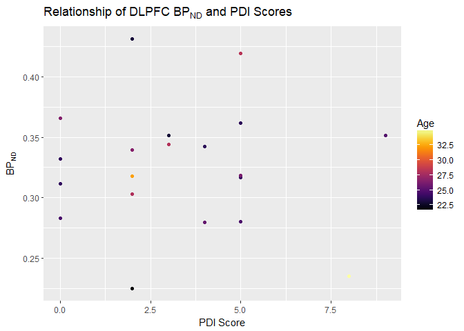

### Publication Figure

``` r
scatter_parest_dlpfc_s6 <- pdi_d1s %>%
  filter(Region=='DLPFC_46') %>%
  mutate(Region = gsub('DLPFC_46', 'DLPFC', Region)) %>%
  ggplot(., aes(x=PDI, y=bp, fill=Age)) + 
  #geom_point() +
  geom_point(shape = 21, colour = "black", size = 3) +
  labs(y=expression(BP[ND]), x='PDI Score') + 
  viridis::scale_fill_viridis('Age at \nPET\n') +
  theme_bw() + labs(title=bquote('Relationship between PDI Scores and DLPFC' ~ BP[ND])) +
  theme(plot.title = element_text(hjust = 0.5))

beta2_parest <- distroplot_norm(DLPFC_D1SPDI_model, 'beta2', 'beta2_dlpfc_mean', 'beta2_dlpfc_sd') +  guides(color=F) +
  labs(title=expression(paste('Beta2 (',BP[ND] ,' ~ Age)'))) + 
  theme_bw() +
   theme(plot.title = element_text(hjust = 0.5),
         axis.title.y=element_blank()) +
  guides(colour=FALSE)
beta3_parest <- distroplot_norm(DLPFC_D1SPDI_model, 'beta3', 'beta3_pdi_mean', 'beta3_pdi_sd', nbin=80) + 
  labs(title=expression(paste('Beta3 (',BP[ND] ,' ~ PDI)'))) + 
   theme_bw() +
   theme(plot.title = element_text(hjust = 0.5))
beta4_parest <- distroplot_norm(DLPFC_D1SPDI_model, 'beta4', 'beta4_mean', 'beta4_sd') + 
  guides(color=F) +
  labs(title=expression(paste('Beta4 (','PDI',' ~ Age)'))) + 
   theme_bw() +
  theme(plot.title = element_text(hjust = 0.5),
        axis.title.y=element_blank()) +
  guides(colour=FALSE)

#   grid.arrange(scatter_parest_dlpfc, 
#              beta2_parest, 
#              beta4_parest, 
#              beta3_parest, 
#              layout_matrix = rbind(c(1,1), c(2,3), c(4,4)), 
#              widths=c(1,1), heights=c(5,2,4))
# 
# ggsave(
#   grid.arrange(scatter_parest_dlpfc_s6, 
#              beta2_parest, 
#              beta4_parest, 
#              beta3_parest, 
#              layout_matrix = rbind(c(1,1), c(2,3), c(4,4)), 
#              widths=c(1,1), heights=c(5,2,4)),
#   filename = '../Figures/Study6_parest_dlpfc.jpg', width = 7, height=11, dpi=600)

mid_l <- cowplot::align_plots(plotlist = list(scatter_parest_dlpfc, beta2_parest, 
                                              beta3_parest), align='v', axis='l')
mid_r <- cowplot::align_plots(plotlist = list(scatter_parest_dlpfc, beta4_parest + 
                                                guides(colour=FALSE),
                                              beta3_parest), align='v', axis='r')
midrow <- cowplot::plot_grid(mid_l[[2]], mid_r[[2]], rel_widths = c(0.9,1.1))

plots <- cowplot::align_plots(plotlist = list(scatter_parest_dlpfc, midrow, beta3_parest), align='v', axis='lr')


study6_dlpfc <- cowplot::plot_grid(plots[[1]], midrow, plots[[3]], ncol=1, rel_heights = c(5, 2, 4))

print(study6_dlpfc)
```

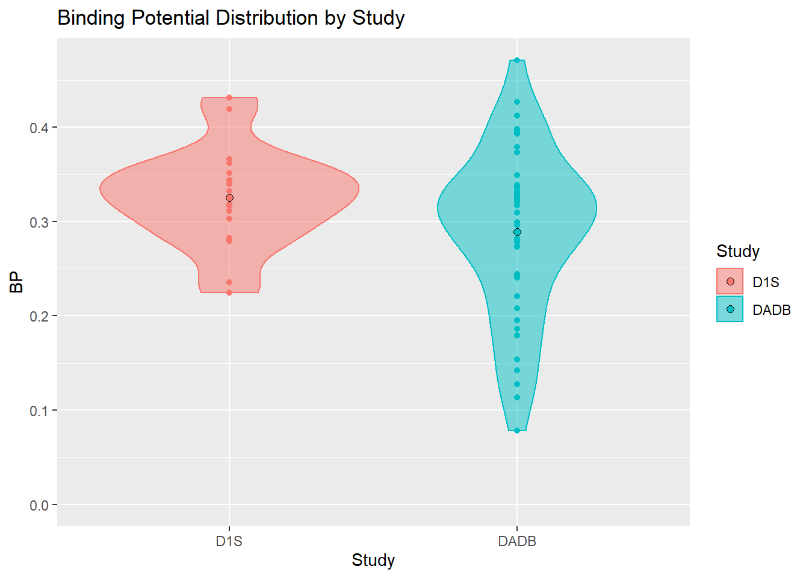

``` r
ggsave(study6_dlpfc,
  filename = '../Figures/Study6_parest_dlpfc.jpg', width = 7, height=11, dpi=600)
```

``` r
dlpfc_study6_summary <- as.data.frame(MCMCvis::MCMCsummary(DLPFC_D1SPDI_model, params = c('beta1', 'beta2', 'beta3', 'beta4'), digits=3)) %>%
  rownames_to_column(var="Parameter") %>%
  select(-`50%`) %>%
  mutate(Parameter=stringr::str_to_title(Parameter))

dlpfc_study6_summarytable <- kable(dlpfc_study6_summary, format='latex', caption='Posterior summaries of unstandardised coefficients from updated parameters', booktab=T)

dlpfc_study6_summarytable
```

Correspondingly, a change of five points on the PDI is associated with a change of 1.5% (-6.1 - 7.7% 95% Credible Interval), and the change across the entire scale of 21 items corresponds with a change of 6.5% (-25.8 - 32.3% Credible Interval)

Summary values of study
=======================

``` r
pets <- alldata %>%
  filter(!is.na(bp))

length(unique(pets$SubjName))
```

    ## [1] 76

``` r
tcipdis <- alldata %>%
  filter(!is.na(TCIPDI_long))

length(unique(tcipdis$SubjName)) + 132
```

    ## [1] 184

``` r
pdis <- alldata %>%
  filter(!is.na(PDI))

length(unique(pdis$SubjName))
```

    ## [1] 69

Distributions of scales
=======================

``` r
tcivalidation_scores <- tibble(Study='TCI Personality Cohort',
                               'TCI-DI' = short_scores*8,
                               PDI=NA)

scaledata <- alldata %>% 
  select(SubjName, Study, 'TCI-DI'=TCIPDI_short, PDI) %>% 
  mutate(Study_Subj = paste(Study, SubjName, sep = '_')) %>% 
  filter(!duplicated(Study_Subj)) %>% 
  select(-Study_Subj, -SubjName) %>% 
  bind_rows(tcivalidation_scores)
```

    ## Warning in bind_rows_(x, .id): binding factor and character vector,
    ## coercing into character vector

    ## Warning in bind_rows_(x, .id): binding character and factor vector,
    ## coercing into character vector

``` r
scale_propdata <- scaledata %>% 
  mutate('TCI-DI' = `TCI-DI`/8,
         PDI = PDI/21) %>% 
  mutate(Study = stringr::str_replace(Study, 'DADB', 'D1R PET Cohort 1'),
         Study = stringr::str_replace(Study, 'D1S', 'D1R PET Cohort 2'))

scale_propdata_long <- gather(scale_propdata, Measure, Score, -Study) %>% 
  mutate(Study = as_factor(Study)) %>% 
  mutate(Study = fct_relevel(Study, 'D1R PET Cohort 2',
                                    'D1R PET Cohort 1', 
                                    'TCI Personality Cohort'))

scale_distroplot <- ggplot(scale_propdata_long, aes(x=Score, y=Study, fill=..x..)) +
  geom_density_ridges_gradient(scale = 3, rel_min_height = 0.01, gradient_lwd = 1.) +
  facet_grid(.~Measure) +
  scale_x_continuous(limits= c(0, 1)) +
  scale_y_discrete(expand = c(0, 0)) +
  scale_fill_viridis(name = "Proportional\nScore\n", option = "C", limits=c(0,1)) +
  labs(title = 'Score Distributions',
       subtitle = "Scores displayed as a proportion of the maximum score on each inventory") +
  theme_ridges(font_size = 13, grid = TRUE) + theme(axis.title.y = element_blank())

ggsave(scale_distroplot, filename = '../Figures/Scale_Distroplot.jpg', width = 11, height=4, dpi=600)
```

    ## Picking joint bandwidth of 0.0571

    ## Picking joint bandwidth of 0.0867
